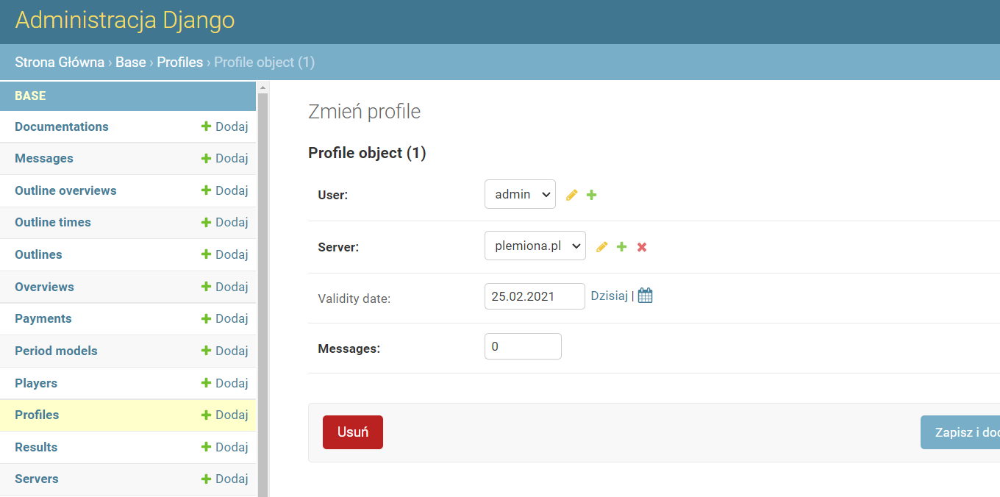

# Official Site and Discord

Production server: [plemiona-planer.pl](https://plemiona-planer.pl/en/)

Discord: [discord.gg/g5pcsCteCT](https://discord.gg/g5pcsCteCT)

> :warning: Please note, this repository is ment to be open since 23.09.2021 (it was private all the time before that date), some notes below are NOT up-to-date (some of them were made long ago) and many important topics, including general deployment flow, is not covered at all. You may use this code however you want under LICENSE, but remember the full support for self-hosting this project or even development guide is not planned ever, although this README file will be probably more helpful in the future.

Feel free to create issues. This README is not yet finished, but first section (Quickstart) should work just fine if you want to test the app locally under `localhost:7999`.

Test coverage 83%, see [Codecov](https://app.codecov.io/gh/rafsaf/Tribal-Wars-Planer)

# Table of contents

- [Quickstart: local usage](#quickstart)
- [Development](#development)
- [Test server](#test-server)

## Quickstart

**STEP 1**

Install [Docker](https://www.docker.com/get-started) and [Git](https://git-scm.com/) on whatever system you work (On linux additionaly install docker-compose, on Windows and Mac it is included in docker installation)

**STEP 2**

In your favourite folder (using Terminal in Linux/Mac, Powershell or CMD on Windows):

```bash
git clone https://github.com/rafsaf/Tribal-Wars-Planer.git
cd Tribal-Wars-Planer

```

```bash
docker-compose up -d
# it may take up to few minutes
```

**STEP 3**

Go to the browser tab and write out `localhost:7999`, fresh instance of site should be up and running.

**STEP 4** (Login `admin`, Passwd `admin`)

You may see all declared variables in `.env.example` but login and password is `admin`, `admin`. The data will not be losed after reboot, it is docker volume (`data_postgres` folder in repository).

**STEP 5**

Activate premium account for admin (default) user you just logged in.

Go to `Administration` tab, then `Profiles` and choose `admin`, change "Validity date" to someting like 01.01.2100, just in case ;)



**STEP 6**

Now you are free to create new worlds, and outlines just like in production server!

GL;)

## Development

If you want to run it in development and make use of `localhost:8000` (the quickstart app runs on `localhost:7999`, you would need also:

- [python](https://www.python.org/downloads/) >= 3.9
- [poetry](https://python-poetry.org/)

In your favourite folder e.g. Desktop:

```bash
git clone https://github.com/rafsaf/Tribal-Wars-Planer.git
cd Tribal-Wars-Planer

```

Then create file `.env` in Tribal-Wars-Planer from template file `.env.example`

> :warning: Change `POSTGRES_HOST` to `localhost`

Then run

```bash
poetry install

# it will be default create virtualenv in ~.cache/pypoetry/virutalenvs/tribal-wars-planer-asod(some random signs)
# You need to activate it.
# Honestly, you can also use just python3.9 -m venv .venv and run pip install -r requirements-dev.txt but above is prefered way
```

Run database with docker and then python dev server

```bash
docker-compose -f docker-compose.dev.yml up -d
# This set up db and cronjobs container
python manage.py migrate
python manage.py createsuperuser --no-input
# Default user will be admin (password admin), you may change this in .env file
python manage.py runserver
# Runs development server at localhost:8000
```

To run tests

```bash
pytest
# old way: python manage.py test
# python manage.py test base
# python manage.py test base.tests.test_views
```

To run makemessages/compilemessages (the project is in English, every string is then translated to Polish)

```bash
# every machine - using dockerfiles
docker compose -f docker-compose.translation.yml up -d

```

Test coverage

```bash
coverage run -m pytest
coverage report --show-missing
# Settings for coverage (also for other tools lives in pyproject.toml)
```

Running Stripe CLI on Windows (docker image)

```bash
# remember you need host.docker.internal as allowed host
# api-key is should be secret key from Stripe

docker run --rm -it stripe/stripe-cli:latest listen --forward-to host.docker.internal:8000/en/api/stripe-webhook/ --skip-verify --api-key sk_test_51IunwoIUoiUFYBGtpnRVBVro4iqXG8pndlUlpeBd1qbMNC9U7I0u6eQuCVjJdWMQoOpJhpyrztp2kUZSHMfi29Zh00TT5Q8yyL
```

## Test server

**Install Docker, docker-compose** eg.

```bash
sudo apt update
sudo apt upgrade
sudo apt install docker.io
sudo apt install docker-compose
sudo usermod -a -G docker ubuntu
# or other username than ubuntu
sudo reboot
# then log in again
docker info
# if ok, proceed
```

````
sudo ssh-keygen -t ed25519 -C "email@example.com"
sudo cat ~/.ssh/id_ed25519.pub

```bash
Copy and add to the:

Github.com -> Settings -> SSH and GPG keys

https://github.com/settings/keys

````

Finally clone repo

```bash
git clone git@github.com:rafsaf/Tribal-Wars-Planer.git
cd Tribal-Wars-Planer
cp .env.example .env
```

> :warning: SET DIFFRENT VALUES FOR:

```
DEBUG
MAIN_DOMAIN
SUB_DOMAIN
SECRET_KEY !!!!!!!!!!!!!
DEFAULT_FROM_EMAIL
POSTGRES_PASSWORD
DJANGO_SUPERUSER_PASSWORD !!!!!!!!!!!!!!!!!!!!!!! !!! !!! !!!!!!
```

**DO NOT LEAVE DJANGO_SUPERUSER_PASSWORD AS "ADMIN", SO ANYONE CAN LOGIN TO THE DASHBOARD**

```
docker-compose -f docker-compose.stg.yml up -d --build
```

## Webhook

on fresh ubuntu

```bash
sudo apt-get install -y webhook
# test http
webhook -hooks /home/ubuntu/Tribal-Wars-Planer/webhook/hooks.json -verbose -hotreload
# test https
sudo openssl req -newkey rsa:4096 -keyout webhook.key -x509 -days 3650 -out webhook.crt -nodes
webhook -hooks /Tribal-Wars-Planer/webhook/hooks.json -verbose -hotreload -secure -cert /webhook.crt -key /webhook.key

# prod
# article
https://willbrowning.me/setting-up-automatic-deployment-and-builds-using-webhooks/

# commands
sudo apt install supervisor
cd /etc/supervisor/conf.d
sudo nano webhooks.conf

edit

[program:webhooks]
command=bash -c "/home/johndoe/go/bin/webhook -hooks /home/johndoe/hooks/hooks.json -verbose"
redirect_stderr=true
autostart=true
autorestart=true
user=johndoe
numprocs=1
process_name=%(program_name)s_%(process_num)s
stdout_logfile=/home/johndoe/hooks/supervisor.log
environment=HOME="/home/johndoe",USER="johndoe"

save and

touch ~/hooks/supervisor.log
sudo supervisorctl reread
sudo supervisorctl update
sudo supervisorctl start webhooks:*
```
