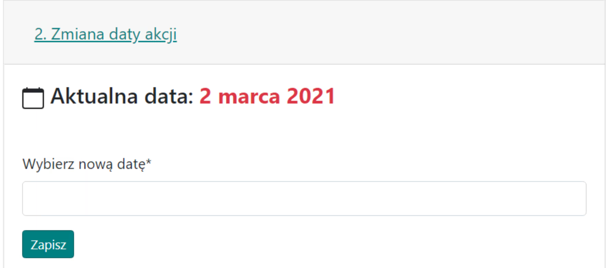

# 2. Nastavení data

Karta je velmi jednoduchá a slouží ke změně data vstupu akce, které bylo původně zadáno na začátku při vytváření přehledu.

Vzhled karty s příkladovým datem:

{ width="600" }

Není a nebude možné naplánovat akci na několik dní. Jedinou možností je naplánovat akci na první den, např. 01.01, poslat výsledky hráčům a poté v {==Kartě výsledků==} po dokončení přehledu naleznete zbývající, nevyužité jednotky v kartě {==Nevyužité jednotky==}. Vytvořením nového přehledu s jiným datem, např. na další den 02.01, a zkopírováním dat o jednotkách tam, můžete naplánovat akci na další den.
