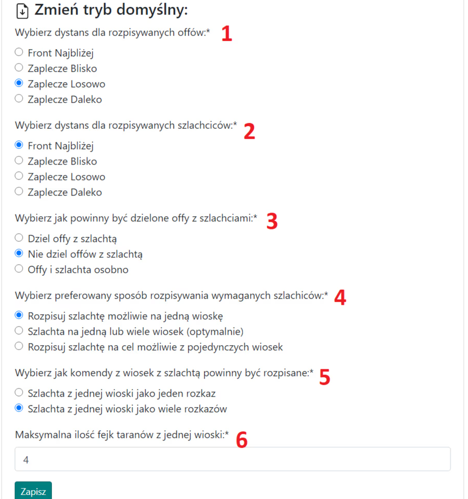
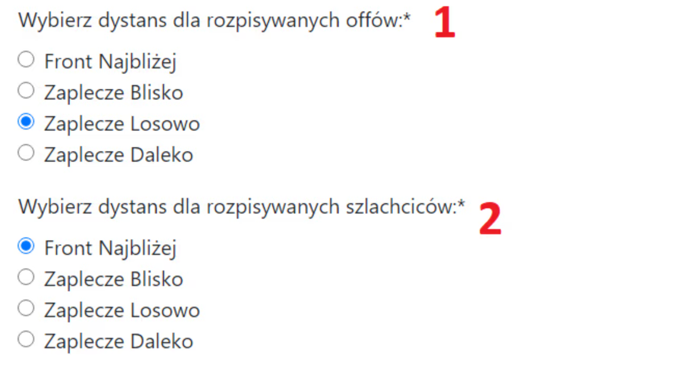
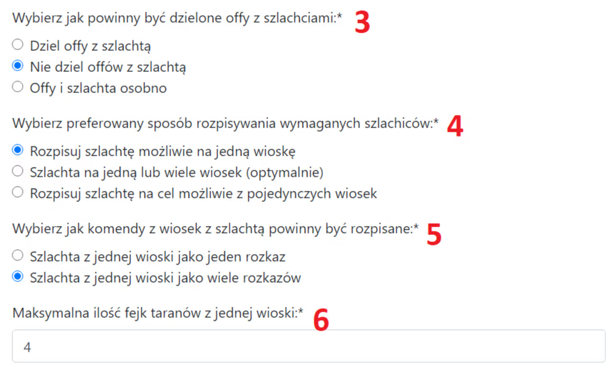

# 3. Parametry přehledu

Tato karta slouží k upřesnění detailů, odkud přesně mají pocházet útočné jednotky pro operaci, a také k dalším obecným nastavením plánu. Připoutejte se.

Vzhled karty s výchozím nastavením:

{ width="600" }

V článku [Dvě oblasti kmene: co jsou Frontová a Týlová linie](./../primary/two_regions_of_the_tribe.md) jste se dozvěděli, jak Plánovač řeší rozdělení na Frontovou, Týlovou a Vnější linii. Nejprve si probereme body 1 a 2 na obrázku výše.

Poznámka, pro všechny níže uvedené úvahy ignorujeme všechny vesnice v oblasti Vnější. Jsou Plánovačem zcela přeskočeny, takže se zaměřujeme pouze na Frontovou a Týlovou linii.

Nastavení 1-2:

{ width="600" }

Můžete přesně definovat, z kterých částí kmene mají standardně pocházet útočné jednotky a šlechtici. Výchozí nastavení je Týlová linie Náhodně pro útočné jednotky a Frontová linie Nejblíže pro šlechtice.

**Frontová linie Nejblíže** znamená co nejblíže. Nemusí to nutně být z vesnic na Frontové linii. Pokud například neexistují žádné frontové vesnice nebo při automatickém plánování zůstanou v oblasti pouze týlové vesnice (protože frontové byly použity), pak budou jednoduše vybrány nejbližší vesnice.

**Týlová linie Blízko** musí pocházet z Týlové linie a mezi nimi jsou vybrány ty nejbližší možné.

**Týlová linie Náhodně** jsou vesnice z Týlové linie, vybrané skutečně náhodně (ne pseudonáhodně) ze všech možných možností. Toto je výchozí nastavení pro útočné jednotky – obvykle nechceme, aby cokoli (vzdálenost, posílající hráč) naznačovalo, že se jedná o útok a mohl by být odlišen od falešných útoků.

**Týlová linie Daleko** jsou vesnice z Týlové linie, seřazené v opačném pořadí než Týlová linie Blízko, tedy ty nejvzdálenější možné.

!!! info

    Pro větší zábavu, kterou obránci akcí naplánovaných na této stránce nepochybně pocítí, mají všechna výše uvedená nastavení minimální míru náhodnosti. To znamená, že nejbližší a nejvzdálenější možné mají mírnou fluktuaci. Je to proto, že teoreticky by Týlová linie Blízko a Týlová linie Daleko mohly být obráncem rozpoznány a tímto způsobem bude o něco těžší je odhadnout, v závislosti na tom, kolik útoků je naplánováno na vesnici. Čím více útoků, tím větší fluktuace.

Přejděme k nastavením 3 až 6, která se zaměřují na obecná nastavení plánu.

Nastavení 3-6:

{ width="600" }

**V bodě 3** rozhodujete, jak mají být rozděleni šlechtici z jedné vesnice. Existují tři obvyklé možnosti: Rozdělit (každý šlechtic se stejným doprovodem), Nerozdělovat (první šlechtic s největším doprovodem, zbytek s minimálním doprovodem – pozor, toto nefunguje dobře například s 5 šlechtici, když jsou rozděleni do několika vesnic), a Samostatně, což znamená, že všichni šlechtici mají minimální doprovod a útoky jdou samostatně před nimi – pouze pro specifické akce a použití.

Nejrozumnější možností, zejména pro větší akce, je obvykle rozdělit, i když výchozí nastavení je nerozdělovat, protože takto to obvykle funguje u menších plánů.

**V bodě 4** máte tři možnosti. V první se Plánovač snaží brát šlechtice pro vesnici z různých vesnic našich hráčů (příklad použití: šlechtici z dálky). Ve druhé možnosti (výchozí) to dělá optimálně, zatímco ve třetí se snaží poslat sadu šlechticů od jednoho hráče na vesnici, nebo střídavě 3 šlechtice od jednoho hráče a 1 šlechtice od jiného, nebo 2 a 2, přičemž pravděpodobně nebudou jednotliví šlechtici z různých vesnic. Třetí možnost je nejméně spolehlivá a může generovat podivné výsledky.

**V bodě 5** si vyberete, jak mají vypadat příkazy na shromaždiště pro naše hráče v případě více šlechticů z jedné vesnice. Předpokládejme, že náš hráč má poslat 20k útoku a 4 šlechtice na vesnici `500|500`.

V první možnosti obdrží JEDEN odkaz na shromaždiště s 20k útoku a 4 šlechtici.

Ve druhé, výchozí možnosti, obdrží ČTYŘI po sobě jdoucí odkazy na shromaždiště pro své cíle, každý šlechtic je považován za samostatný příkaz.

Která možnost v bodě 5 je lepší? Jako obvykle, záleží na situaci. Pro malé akce pravděpodobně druhá, výchozí možnost. Pro velmi velké, masivní akce, kde budou útoky vždy rozděleny, je první možnost pro hráče pohodlnější. Pro ostatní akce si vyberte, co vám nejlépe vyhovuje. Výchozí možnost znamená více detailů pro hráče (protože přesně ví, jaký doprovod má každý šlechtic), zatímco první možnost jako jeden příkaz znamená méně detailů a méně zabraného místa.

**V bodě 6** si vyberete, kolik falešných útoků může být maximálně posláno z jedné naší vesnice.
