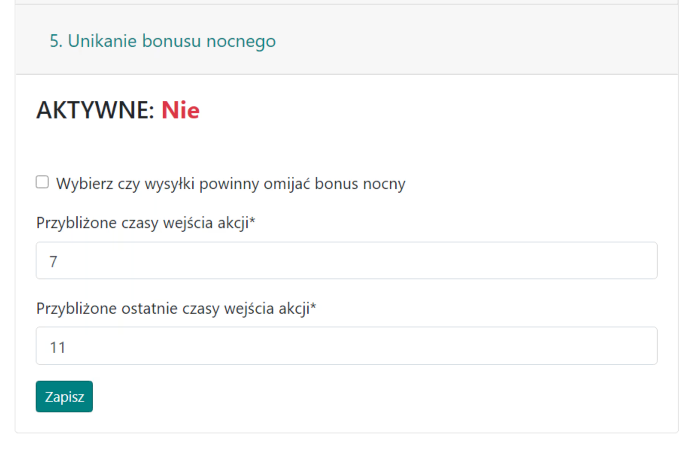
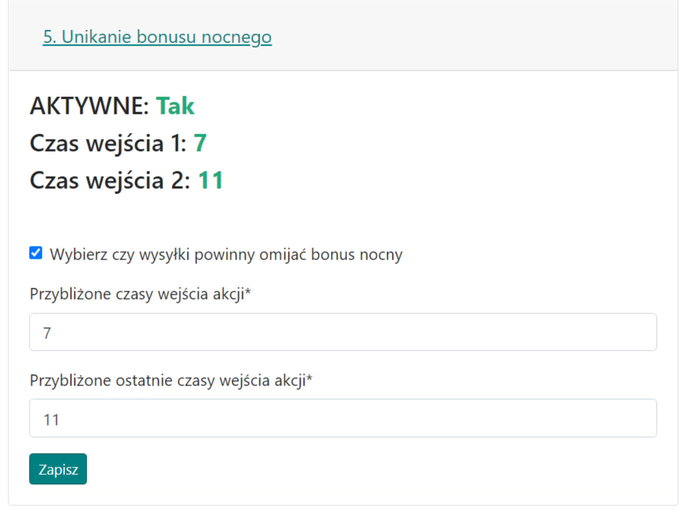

# 5. Vyhnutí se nočnímu bonusu

Karta slouží k volitelnému nastavení možnosti vyhnout se nočnímu bonusu pro generované příkazy pro offy a falešné offy. Šlechtici budou plánováni normálně po celý den! To neznamená úplné vyloučení možnosti nočních odeslání, ale pouze jejich minimalizaci.

Pokud je aktivována, Plánovač se vyhne {==odesláním==} (z pohledu hráče posílajícího útoky, nikoli obránce) během hodin **00:00-07:00** a v aktuální verzi hry není možné tyto hodiny změnit.

Vzhled karty při deaktivaci:

{ width="600" }

Ve výchozím nastavení je tato možnost zakázána; zaškrtněte první políčko pro její povolení. Jelikož přesné časy vstupu pro offy jsou určeny až na samém konci, v kartě Časy, zde uvádíme pouze přibližné hodiny vstupu pro všechny offy nebo jejich většinu. Pro informaci, většina akcí je plánována na ráno, např. offy vstupují mezi 7-11, takže do formuláře zadáme takové dvě hodiny.

Vzhled karty při povolení:

{ width="600" }
