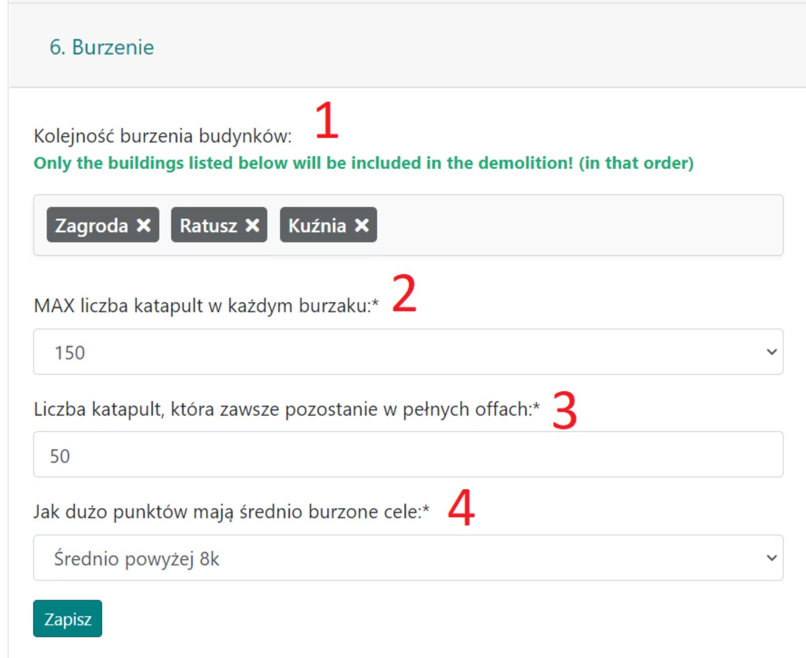

# 6. Ničení

Tato karta obsahuje několik nastavení souvisejících s demoličními akcemi.

Vzhled karty:

{ width="600" }

V možnosti **1.** se nastavuje pořadí budov, které mají být zničeny. Plánovač naplánuje útoky na ně v zadaném pořadí a ignoruje všechny přeskočené budovy.

Pod **2.** nastavíme maximální počet katapultů, které budou naplánovány (a poté postupně menší množství až do 50 katapultů).

V **3.** vybereme počet katapultů v plných útocích, které by měly vždy zůstat ve vesnicích (aby byly poslány spolu s útokem).

V posledním poli **4.** můžeme vybrat velikost vesnic, které mají být zničeny. Ve výchozím nastavení se jedná o velké, plně rozvinuté vesnice s budovami kolem 9k bodů (tudíž je potřeba více katapultů ke zničení struktur jako je farma nebo kovárna ve srovnání s vesnicí s 5k body). Vybíráme na základě specifik naší akce.
