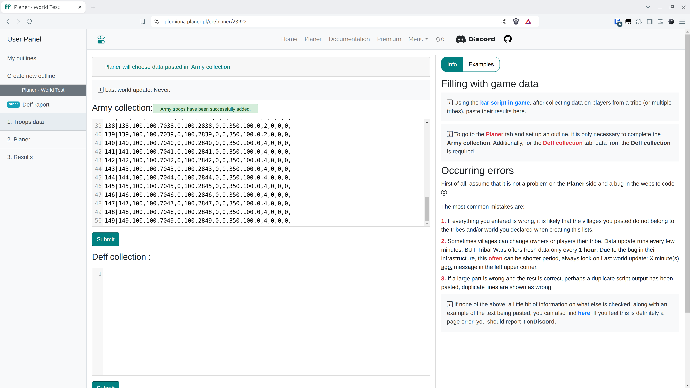

# Krok 3 - Vyplnění Sběru armády

Chcete-li přejít na nově vytvořenou osnovu, klikněte na její název.

<figure markdown="span">
  
  <figcaption>Klikněte na "plánovač"</figcaption>
</figure>


Zde vkládáme výsledky vygenerované skripty. Shromažďují informace o každém hráči v našem kmeni do jednoho textového pole, odkud je kopírujeme a vkládáme do příslušného pole v této záložce. Zde je tento výstup zpracován, aby se zajistilo, že vložené informace dávají smysl. Nejprve se kontroluje, zda všechny vesnice existují ve vybraném světě, zda mají majitele, nebo zda je majitel v jednom z kmenů, které jsme dříve stanovili. Dále se kontroluje délka, počet čárek v každém řádku (domobrana, rytíři, lučištníci ovlivňují délku řádků - pokud se objeví, je více čísel atd.) a zda uprostřed nejsou prázdná místa. Je však dobré vědět, že něco jiného než výsledek skriptu neprojde.

!!! warning

    Pro přechod na další záložky je nutné vložit data do této záložky, bez jejich zadání se nedostanete dál!


Pro účely Testovacího světa vložte následující data do pole Sběr armády.

=== "Sběr armády"

    ```title="army.txt"
    --8<-- "army.txt"
    ```

=== "Sběr obrany"

    ```title="defence.txt"
    --8<-- "defence.txt"
    ```

Poté klikněte na Odeslat.

<figure markdown="span">
  
  <figcaption>Vložte a odešlete</figcaption>
</figure>
