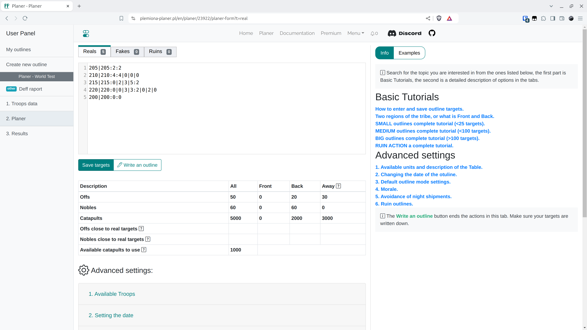

# Krok 4 - Uložte cíle a nastavení a napište osnovu

V záložce Plánovač vložte cíle osnovy, jak je popsáno v záložce, kliknutím na {==Uložit cíle==} aktualizujeme cíle, pro které plánujeme napsat osnovu. Kliknutím na {==Napsat osnovu==} dokončíme tuto část a přejdeme na další záložky. Předtím, než začnete psát vlastní osnovy, přečtěte si popisy typu, který vás zajímá, a nejlepší je experimentovat s nastavením různých vzdáleností od fronty, maximálních vzdáleností pro šlechtice, měnit pokročilé režimy osnovy, poté kliknout na Napsat osnovu a v případě neuspokojivých výsledků se vrátit kliknutím na **Vrátit se**.

Na Testovacím světě vložte níže uvedená data a uložte.

=== "Reálné"

    ```title="targets.txt"
    --8<-- "targets.txt"
    ```

!!! info

    Cíle lze vkládat několika způsoby, nejjednodušší je vkládat další řádky pouze jako souřadnice, pak se ve výchozím nastavení počet offů a šlechticů doplní jako 0. Počet offů a šlechticů se nejsnadněji kóduje jako např. `souřadnice:2:2`, což znamená `souřadnice:dva-offy:dva-šlechtici`, nebo přesněji, záznam `cord:2:1|1|1|1` bude znamenat 2 offy a 1 šlechtice zblízka, 1 z blízkého zázemí, 1 náhodně, 1 z dálky. Falešné útoky a Ruiny zadejte stejným způsobem do příslušných záložek.

Celá záložka slouží hlavně dvěma účelům, je to zadávání cílů a automatické nastavení pro přiřazování osnov. Pro účely seznámení se s Testovacím světem vyplníme pouze tabulku s vesnicemi na frontě a v zázemí, viditelnou pod tlačítky pro ukládání cílů a psaní osnov. Pokud vás zajímají ostatní záložky, můžete se o nich dozvědět více v ostatních částech dokumentace.

<figure markdown="span">
  
  <figcaption>Uložené cíle</figcaption>
</figure>


Rozbalte první záložku {==1. Dostupné jednotky==}. Ponechte všechny výchozí hodnoty. Cílem je rozdělit všechny naše vesnice do tří skupin, Fronta, Zázemí a Daleko (velmi vzdálené) v závislosti na zadaných nepřátelských kmenech (pro každou naši vesnici se počítá vzdálenost k nejbližším nepřátelům). Formulář ověřte kliknutím na Uložit a znovu načíst jednotky.

V tabulce byste měli vidět následující výsledky:

<figure markdown="span">
  
  <figcaption>Vypočítané offy a šlechtici blízko cílů</figcaption>
</figure>

Nyní klikněte na {==Napsat osnovu==}, je čas na další záložku :)

!!! info

    Pro různé osnovy bude jejich rozlišení mírně odlišné. Pro menší akce, např. v počáteční fázi světů, stojí za to každý cíl doladit zvlášť v pohodlné editaci, ale pro obrovské akce je to samozřejmě nemožné, pak byste se měli více zaměřit na záložku Plánovač a nastavení, která jsou tam k dispozici.
