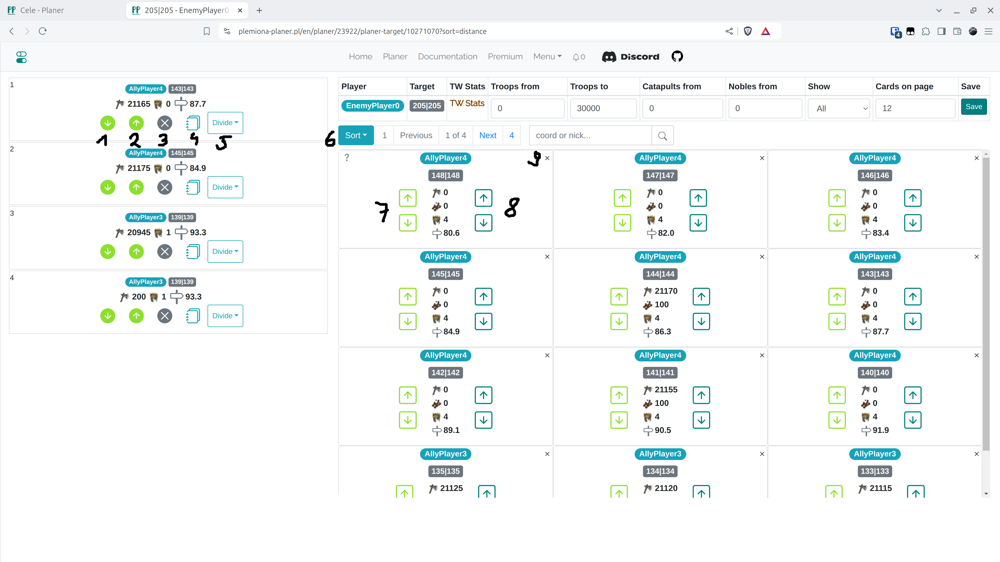

# Krok 5 - Úprava osnovy

Další pohled je akce založená na nastaveních z předchozí záložky. Je zde možnost ruční úpravy jednotlivých cílů, přidávání cílů a vyhledávání.

<figure markdown="span">
  
  <figcaption>Záložka Menu</figcaption>
</figure>

| Číslo | Popis                                                                              |
| ----- | ---------------------------------------------------------------------------------- |
| 1     | Návrat na předchozí záložku, resetování plánu                                      |
| 2     | Ruční přidání nových cílů                                                          |
| 3     | Zobrazení skutečných cílů (aktuální záložka)                                       |
| 4     | Zobrazení falešných cílů                                                           |
| 5     | Zobrazení cílů pro zničení                                                         |
| 6     | Záložka pro nastavení časů, probrána v [dalším kroku](./step_6_set_time_finish.md) |
| 7     | Vyhledávání                                                                        |
| 8     | Navigace mezi stránkami                                                            |
| 9,10  | Úprava jednoho cíle útoku                                                          |

Klikněte na "Upravit" u prvního cíle (číslo 9). Zobrazí se pohled pro úpravu jednoho cíle **v nové záložce prohlížeče**.

<figure markdown="span">
  
  <figcaption>Úprava jednoho cíle</figcaption>
</figure>

| Číslo | Popis                                                                                                                             |
| ----- | --------------------------------------------------------------------------------------------------------------------------------- |
| 1     | Posunout příkaz dolů                                                                                                              |
| 2     | Posunout příkaz nahoru                                                                                                            |
| 3     | Smazat příkaz (jednotky se automaticky vrátí do volného fondu na pravé straně obrazovky)                                          |
| 4     | Upravit počet jednotek v tomto příkazu                                                                                            |
| 5     | Rozdělit na více příkazů                                                                                                          |
| 6     | Seřadit volné, stále dostupné jednotky                                                                                            |
| 7     | Přidat útoky na začátek nebo konec                                                                                                |
| 8     | Přidat útoky spolu se šlechtici na začátek nebo konec                                                                             |
| 9     | Skrýt vesnici. Můžete ji také skrýt pomocí filtru v horní části obrazovky. Chcete-li ji znovu zobrazit, změňte možnost "Zobrazit" |

Po provedení jakýchkoli změn {==zavřete záložku prohlížeče==}.
