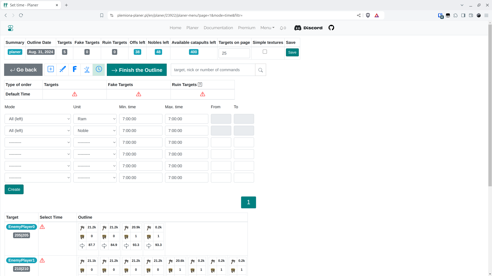
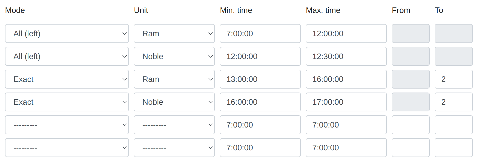

# Krok 6 - Nastavení časů vstupu a dokončení osnovy

!!! info

    Po prohlédnutí všech záložek a případném provedení operací v úpravě jednotlivých cílů nakonec přejděte na poslední záložku s časy, abyste dokončili plán.

<figure markdown="span">
  
  <figcaption>Záložka Časy, můžete použít velmi jednoduchý čas nahoře a kliknout na "Vytvořit"</figcaption>
</figure>

Uživatel má možnost vytvořit v záložce více objektů časů vstupu, ale v praxi může stačit i jeden nebo několik. Zvolíme časové intervaly pro útoky, jednotku a režim ze 3 možných možností. Příklad složitého času by mohl vypadat takto:

<figure markdown="span">
  
  <figcaption>Příklad 1.</figcaption>
</figure>

Což znamená:

- Naplánujte náhodný počet offů mezi 0 a 5 mezi 7:00 a 8:00 (nebo méně, pokud byly použity)

- Naplánujte přesně 3 offy mezi 8:00 a 8:10 (nebo méně, pokud byly použity)

- Naplánujte přesně 4 šlechtice v 8:10 (nebo méně, atd. jako výše)

- Naplánujte všechny zbývající beranidla, pokud nějaké zbyly, mezi 12:00 a 12:30

- Naplánujte všechny zbývající šlechtice v 12:30

Je také podporováno, že {==Všechny zbývající==} mohou být dříve než ostatní režimy. V příkladu níže cíl vždy dostane 2 offy a 2 šlechtice na konci dne a všechny ostatní (množství lze nastavit různě pro různé vesnice) ráno. Zadané časy musí dávat smysl; maximální čas vstupu musí být pozdější nebo stejný jako minimální čas vstupu. Režim Všechny zbývající se musí objevit přesně dvakrát: pro jednotky Beranidlo a Šlechtic, má nejnižší prioritu.

<figure markdown="span">
  
  <figcaption>Příklad 2.</figcaption>
</figure>

Pro účely testovacího světa můžete vytvořit jednoduchý čas z prvního obrázku a nastavit ho pro všechny cíle v horní části záložky. Poté dokončete plán kliknutím na {==Dokončit osnovu==}.

Automaticky přejdete na další záložku s výsledky.
