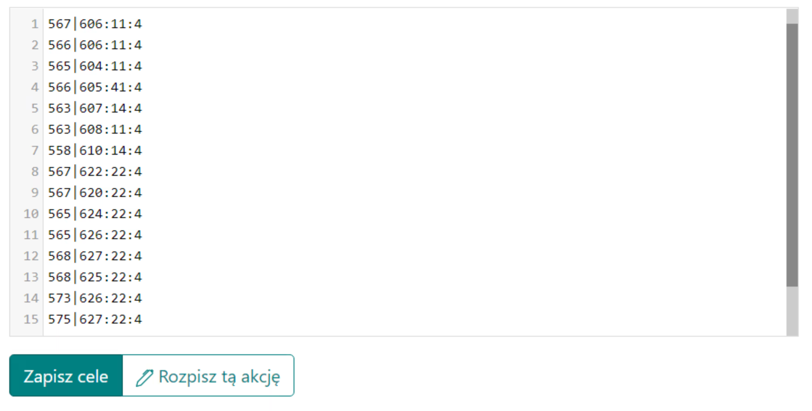
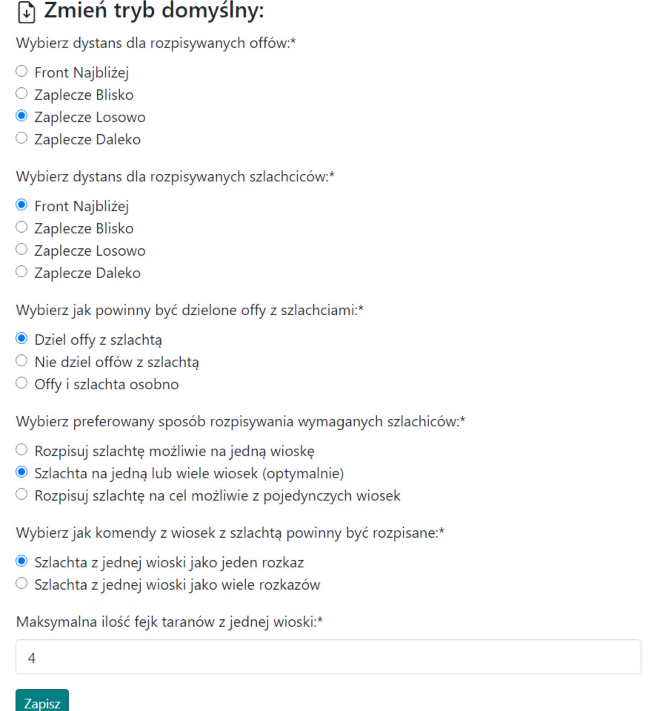

# Velké osnovy - Průvodce

Poznámka, níže uvedený nápad na velké akce není povinný, lze to provést jakýmkoli způsobem.

V tomto průvodci se dozvíte, jak nejefektivněji a nejúčinněji naplánovat velkou akci, nakonec v pozdní fázi světa, pro více/mnohem více než 100 cílů, kde se během akce v kmeni berou v úvahu pouze plné offy. Poznámka, předpokládá se, že již máte všechny znalosti z [Prvních kroků s Plánovačem](./../first_steps/index.md)! a doporučuje se nejprve si přečíst dva krátké předchozí průvodce v této sekci, a to [Jak zadávat a ukládat cíle akce](./two_regions_of_the_tribe.md) a [Dva regiony kmene: Co je fronta a zázemí](./two_regions_of_the_tribe.md).

!!! hint

    Vždy začněte plánování jakékoli akce na této stránce spočítáním všech offů a jejich rozdělením na Frontu a Zázemí podle ducha daného plánu. K tomuto účelu použijte záložku 1. Dostupné jednotky a výsledky jsou prezentovány v tabulce pod cíli.

Akci naplánujeme pomocí automatického plánování kvůli počtu cílů a využijeme všechny dostupné pokročilé možnosti. Nebudeme používat možnosti ruční úpravy cílů; celá akce od A do Z bude vytvořena v první záložce, poté pouze nastavíme časy vstupu a odešleme hotové cíle.

Pro velkou akci může vyplněná záložka vypadat následovně:

{ width="600" }

Nastavte minimální počet v offu na plný off, asi 19k nebo o něco méně, pokud jsou plánované odeslání za několik dní a offy budou mít čas se do té doby plně vyvinout (v tabulce se zobrazí pouze offy nad touto hodnotou), vzdálenost od frontové linie na asi 10-45 v závislosti na tom, jak vypadá fronta. Pokud má soupeř diody na území kmene, vylučte je vložením do pole Nezohledňovat při počítání frontových offů. Klikněte na Uložit a Obnovit dostupné. Tabulka s počtem našich offů bude vyplněna.

Vyplněná tabulka by měla vypadat nějak takto:

{ width="600" }

Poznámka, dva spodní řádky tabulky se objeví až po vyplnění cílů, protože zadaná množství závisí na tom, jaké cíle jsou uloženy (offy a šlechtici se počítají kolem nich). Proto tam na začátku budou nuly. Můžete přistoupit k zadávání cílů v závislosti na počtu offů a šlechticů, které máte. Poté můžete přepočítat Dostupné jednotky.

Příklad zadaných cílů:

{ width="600" }

Pokud některé cíle potřebují jiná nastavení než výchozí, použijte rozšířené kódování offů a šlechticů popsané v článku Jak zadávat a ukládat cíle akce. Poté přejděte na záložku 3. Parametry plánu a nastavte nastavení pro tento plán, podrobný popis všech možností v případě potíží naleznete v tématu věnovaném tomu, tj. 3. Parametry plánu.

Příklad nastavení pro velkou akci:

{ width="600" }

Dále můžete nastavit morálku v [záložce 4](./../advanced/4_morale.md).

Poslední věc, kterou byste měli zvážit, je [záložka 5: Vyhýbání se odesílání v nočním bonusu](./../advanced/5_avoid_night_bonus.md), pravděpodobně to bude prospěšné, alespoň pro hráče a jejich zdraví, kvůli sníženému počtu nebo eliminaci odesílání uprostřed noci :)

Po zadání všech cílů, změně nastavení akce a případně nočního bonusu přejděte k další části plánu kliknutím na Naplánovat tuto akci, poté zkontrolujte, zda je vše v pořádku, a případně se vraťte tlačítkem Zpět a změňte nastavení. Poté jako obvykle přejděte na záložku Časy, nastavte časy vstupu, dokončete plán a odešlete cíle hráčům.
