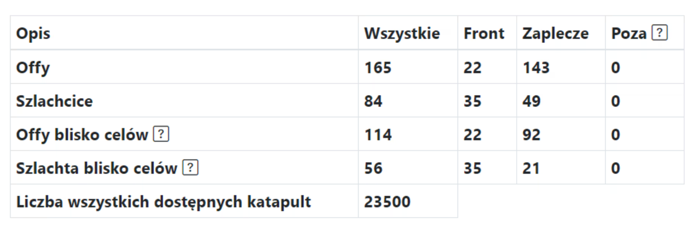
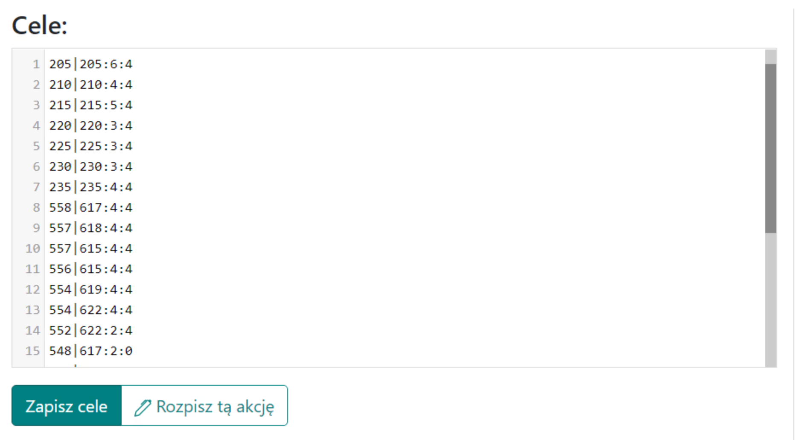

# Střední osnovy - Průvodce

Poznámka, nápad na střední akce prezentovaný níže není povinný, lze je provádět jakýmkoli způsobem, dokonce je považovat za malé nebo velké akce.

V tomto průvodci uvidíte, jak nejefektivněji a nejúčinněji naplánovat střední akci, nakonec v mírně pozdější fázi světa, pro méně než 100 cílů, kde kmen již má většinou plné offy nebo mírně menší během akce. Poznámka, předpokládá se, že již máte veškeré znalosti z [Prvních kroků s Plánovačem](./../first_steps/index.md)! a doporučuje se nejprve si přečíst dva krátké předchozí průvodce v této sekci, konkrétně [Jak zadávat a ukládat cíle akce](./two_regions_of_the_tribe.md) a [Dvě oblasti kmene: Co je fronta a zázemí](./two_regions_of_the_tribe.md).

!!! hint

    Vždy začněte plánovat jakoukoli akci na této stránce spočítáním všech offů a jejich rozdělením na Frontu a Zázemí podle ducha daného plánu. K tomuto účelu použijte záložku 1. Dostupné jednotky a výsledky jsou uvedeny v tabulce pod cíli.

Akci naplánujeme pomocí automatického plánování kvůli počtu cílů a použijeme všechny dostupné pokročilé možnosti. V případě potřeby můžete změnit nastavení jednotlivě pro každý cíl buď v záložce 4 změnou režimu plánování pro něj, nebo nakonec po vytvoření plánu ruční úpravou vybraných cílů, jako v případě malých akcí.

Pro střední akci může vyplněná záložka vypadat následovně:

{ width="600" }

Nastavte minimální počet v offu na odpovídající množství, pravděpodobně více než 10000 (v tabulce se zobrazí pouze offy nad touto hodnotou), vzdálenost od přední linie na asi 5-25, pokud má soupeř diody na území kmene, vylučte je vložením do pole Nezohledňovat při počítání frontových offů. Klikněte na Uložit a Obnovit dostupné. Tabulka s počtem našich offů bude vyplněna.

Vyplněná tabulka by měla vypadat nějak takto:

{ width="600" }

Poznámka, dva spodní řádky tabulky se objeví až po dokončení cílů, protože zadaná množství závisí na tom, jaké cíle jsou uloženy (offy a šlechtici se počítají kolem nich). Proto na začátku budou nuly. Můžete přistoupit k zadávání cílů v závislosti na počtu offů a šlechticů, které máte. Poté můžete přepočítat Dostupné jednotky.

Příklad zadaných cílů:

{ width="600" }

V případě potřeby použijte rozšířené kódování offů a šlechticů popsané v článku Jak zadávat a ukládat cíle akce. Poté přejděte na [záložku 3. Parametry plánu](./../advanced/3_outline_parameters.md) a nastavte parametry pro tento plán, nebo použijte výše zmíněnou rozšířenou syntaxi pro cíle.

Příklad nastavení pro střední akci:

{ width="600" }

Volitelně můžete ponechat výchozí Šlechtice z jedné vesnice jako více příkazů, pokud dáváte přednost tomu, aby hráči dostávali samostatné příkazy pro šlechtice. Nicméně stojí za to změnit Maximální počet falešných beranidel z jedné vesnice na o něco méně než výchozí 4 a nastavit možnost Rozdělit offy se šlechtici, což bude fungovat lépe v mírně větších akcích.

Navíc můžete nastavit morálku v [záložce 4](./../advanced/4_morale.md).

Poslední věc, kterou byste měli zvážit, je [záložka 5: Vyhýbání se nočním bonusovým odesláním](./../advanced/5_avoid_night_bonus.md), pravděpodobně to bude prospěšné, alespoň pro hráče a jejich zdraví, kvůli sníženému počtu nebo eliminaci odeslání uprostřed noci :)

Po zadání všech cílů, změně nastavení akce a případně nočního bonusu přejděte k další části plánu kliknutím na Naplánovat tuto akci, poté zkontrolujte, zda je vše v pořádku a případně se vraťte tlačítkem Zpět, změňte nastavení. Poté, jako obvykle, přejděte na záložku Časy, nastavte časy vstupu, dokončete plán a odešlete cíle hráčům.
