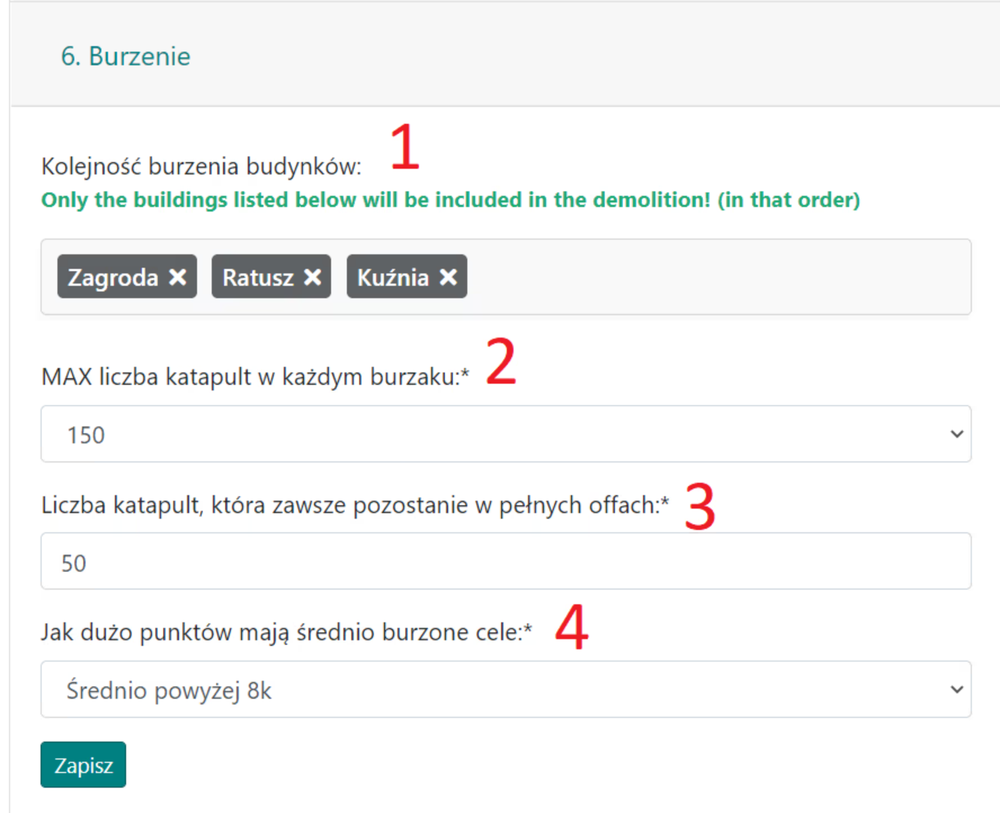

# Ničivé osnovy - Průvodce

V tomto průvodci se dozvíte, jak plánovat ničivé akce, konkrétně zaměřené na pozdější fáze světa. Poznámka: Předpokládá se plná znalost [Prvních kroků s Plánovačem](./../first_steps/index.md)! Doporučuje se také nejprve si přečíst dva krátké předchozí průvodce v této sekci, konkrétně [Jak zadávat a ukládat cíle akce](./two_regions_of_the_tribe.md) a [Dvě oblasti kmene, aneb Co je fronta a zázemí](./two_regions_of_the_tribe.md).

!!! hint

    Vždy začněte plánovat jakoukoli akci na této stránce spočítáním všech jednotek a jejich rozdělením na jednotky Fronty a Zázemí v souladu s povahou konkrétního plánu. K tomuto účelu použijte záložku 1. Dostupné jednotky a výsledky jsou uvedeny v tabulce pod cíli.

Akce bude plně vytvořena v poli **Obléhací jednotky** vedle Cílů. Nastavení v záložce {==6. Obléhací jednotky==} jsou velmi jednoduchá, kde primárně určujeme pořadí budov k zničení a maximální počet katapultů v ničivých útocích (minimum je 50).

Příklad cílů ničení a výsledků v tabulce, s 3 off jednotkami a *50 obléhacími jednotkami:

{ width="600" }

Příklad nastavení ničivé akce, cílící na 3 viditelné budovy v tomto pořadí:

{ width="600" }

(Poznámka: 50 obléhacích jednotek nemusí nutně znamenat, že bude naplánován přesně tento počet!)

Počet dostupných obléhacích jednotek můžete odhadnout pomocí záložky {==1. Dostupné jednotky==} a jednoduché matematiky. Po každém obnovení naleznete celkový počet katapultů připravených k plánování v tabulce pod **Počet všech dostupných katapultů**. Stačí se rozhodnout, na kolik cílů budou stačit.

Příklad naplánované mini-akce s různým počtem katapultů od 200 do 50:

{ width="600" }

## Optimální výběr katapultů pro ničení

Podívejme se, jak se Plánovač chová pro MAX 200 katapultů. Pokud existují vesnice s tímto počtem, budou upřednostněny (nad 100 katapultů), a když budou vyčerpány, zbytek bude doplněn menšími počty – 150, 100, 75, 50. Navíc, když například po několika útocích zbývá 10 úrovní budovy, Plánovač přiřadí poslední útok s 50 katapulty místo většího počtu (i když je k dispozici), aby ušetřil katapulty.

## Off jednotky před obléhacími jednotkami

Co se týče off jednotek, jejichž počet lze specifikovat pro vstup před ničivými útoky, jejich role je omezena na roli standardních off jednotek. Nejsou součástí algoritmu, který jim přiřazuje konkrétní počet katapultů a budovu k zničení – ačkoli teoreticky by stejná vesnice mohla poslat jak off jednotky před obléháním, tak obléhací jednotky v plánovaných útocích. Jedná se o samostatné procesy a v současné verzi není možné, aby off jednotky „působily“ jako jedna z obléhacích jednotek.

## Pořadí ničení budov

V nastavení {==6. Ničení==} můžeme změnit pořadí budov k zničení. Je důležité si pamatovat, že budovy, které nejsou v tomto seznamu, budou přeskočeny a algoritmus se zastaví ve dvou případech – buď již nejsou žádné katapulty k naplánování, nebo všechny uvedené budovy již byly zničeny. To znamená, že i když se rozhodneme napsat `000|000:0:1000`, 1000 obléhacích jednotek pravděpodobně nebude naplánováno – jakmile jsou uvedené budovy zničeny, Plánovač přejde k dalším krokům (např. dalšímu cíli atd.).

## Vidím 10 000 dostupných katapultů. Kolik je to cílů?

Odpověď zní: záleží. Hlavně na zvoleném pořadí budov. Předpokládejme, že je vybrána pouze jedna budova, **[ Kovárna ]**. V tomto případě stačí 200-250 katapultů (např. 200 a 50 nebo 100, 100, nebo 50, 50, 50, 50 atd.) k zničení jedné vesnice, takže můžete naplánovat 40-50 cílů. Pokud jsou vybrány dvě budovy, **[ Kovárna, Farma ]**, budete potřebovat 200-250 katapultů na Kovárnu a 500-700 katapultů na Farmu (např. 14x 50, nebo 5x 100, 4x 150, 3x 200 katapultů nebo mnoho jiných kombinací), což znamená 700-950 katapultů na vesnici, neboli 10-14 cílů. Níže je jednoduchá tabulka pro 30-úrovňové budovy (jako jsou Farmy, Sklady, všechny eko-budovy) a 20-úrovňové budovy (Hlavní budova, Kovárna), která pomůže vypočítat, kolik cílů je možných.

|                    | Počet katapultů potřebných k úplnému zničení budovy |
| ------------------ | --------------------------------------------------- |
| 20-úrovňové budovy | 200-250                                             |
| 30-úrovňové budovy | 500-700                                             |

## Shrnutí

Pamatujte, že v jádru je plánování založeno na jednoduchém chamtivém algoritmu, a tak Plánovač **VŽDY** přiřazuje obléhací jednotky, fejky nebo off jednotky **NÁHODNĚ** velmi podobným způsobem. Pokud chcete, aby off jednotky nebo obléhací jednotky byly nerozeznatelné od fejků, musíte naplánovat hodně fejků. Při plánování ničení stojí za to povolit možnost **Fejky ze všech vesnic** v {==Záložce 3. Výchozí nastavení akce==}, která na rozdíl od výchozího nastavení přiřazuje fejky ze všech zadních vesnic.

Závěrem, zvažte počet katapultů (a kolik budov stojí za to zničit; možná jen Farma + radnice + Kovárna?) a naplánujte hodně fejků. Užijte si demolici!

---

Dejte mi vědět, pokud potřebujete další podrobnosti nebo změny!
