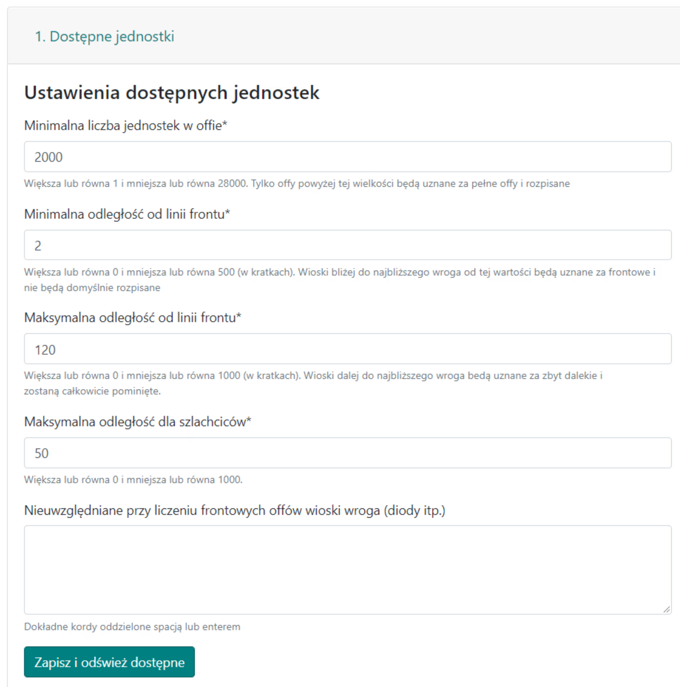
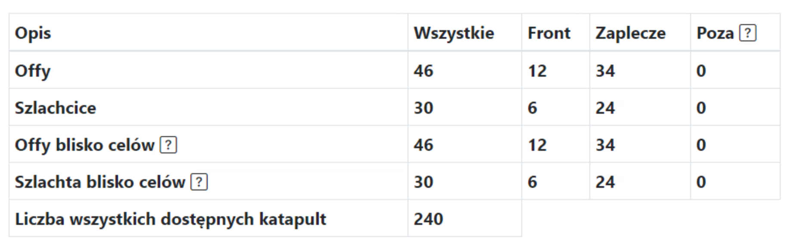

# Malé osnovy - Průvodce

Poznámka, níže uvedený nápad na malé akce není závazný, lze je provádět jakýmkoli způsobem, dokonce je považovat za střední akce.

V tomto průvodci uvidíte, jak nejefektivněji a nejúčinněji naplánovat malou akci, ideálně v počáteční fázi světa, s méně než 25 cíli (v praxi neexistuje žádný limit, ale prezentovaná metoda bude s rostoucím počtem cílů stále časově náročnější). Poznámka, předpokládá se veškerá znalost z [Prvních kroků s Plánovačem](./../first_steps/index.md)!

!!! hint

    Vždy začněte plánovat jakoukoli akci na této stránce spočítáním všech offů a jejich rozdělením na Přední a Zadní podle ducha dané osnovy. K tomuto účelu použijte záložku 1. Dostupné jednotky a výsledky jsou uvedeny v tabulce pod cíli.

Myšlenka spočívá v ručním naplánování příkazů pro všechny cíle a nepoužívání možnosti automatického plánování. Důvodů je několik: když hráči nemají plné offy, mnoho těžké jízdy a vzdálenosti k nepřátelům nejsou rozumné (míchání s nepřítelem není rozumné), automatické plánování akcí postrádá smysl. Lze to provést přesně a rychle ručně - ale ručně s pomocí Plánovače!, který maximálně urychluje tvorbu osnovy a rozdělení cílů. Původně byl vytvořen pro malé akce, ve kterých je nejlepší. Celá nadstavba pro větší akce je pozdějším doplňkem.

Pro malou akci může vyplněná záložka vypadat následovně:

{ width="600" }

Nastavte minimální počet v offu na adekvátní, **malou hodnotu, např. 2000**, (v tabulce se zobrazí pouze offy nad touto hodnotou), vzdálenost od přední linie také malou, tj. **1-10 polí**. Klikněte na Uložit a obnovit dostupné. Tabulka s počtem našich offů bude vyplněna.
Vyplněná tabulka by měla vypadat nějak takto:

{ width="600" }

Poznámka, dva spodní řádky tabulky se objeví až po dokončení cílů, protože zadaná množství závisí na tom, jaké cíle jsou uloženy (kolem nich se počítají tyto offy a šlechtici). Proto na začátku budou nuly. Můžete přistoupit k zadávání cílů v závislosti na počtu offů a šlechticů, které máte. Poté můžete přepočítat Dostupné jednotky.

{ width="600" }

Po zadání souřadnic jako výše a jejich uložení bude každý řádek vypadat podobně jako 000|000:0:0.
Ignorujeme všechna ostatní pokročilá nastavení, v každém řádku necháme 0 offů a 0 šlechticů a klikneme na Naplánovat tuto akci.

Po přechodu na další záložku si všimneme, že všechny cíle jsou prázdné. Postupně upravíme všechny cíle kliknutím na Upravit a naplánujeme příkazy od nejbližších hráčů ve zvoleném pořadí, užitečné budou možnosti řazení kromě výchozího Vzestupně podle vzdálenosti, Nejbližší plné offy a Nejbližší šlechtici.

Výše je ukázáno, jak může cíl vypadat v počáteční fázi hry, 2 offy na začátku, poté 4 šlechtici. Pamatujte, že po přidání jednotek se jejich stav aktualizuje ve všech cílech (jinými slovy, je to dobře naprogramováno, nenaplánujete více jednotek, než je maximální počet vlastněný hráči). Po naplánování všech cílů přejděte na záložku Časy způsobem již známým z Testovacího světa, nastavte časy vstupu, dokončete osnovu a pošlete hráčům jejich cíle.
