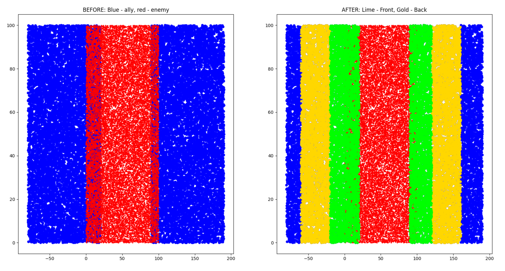
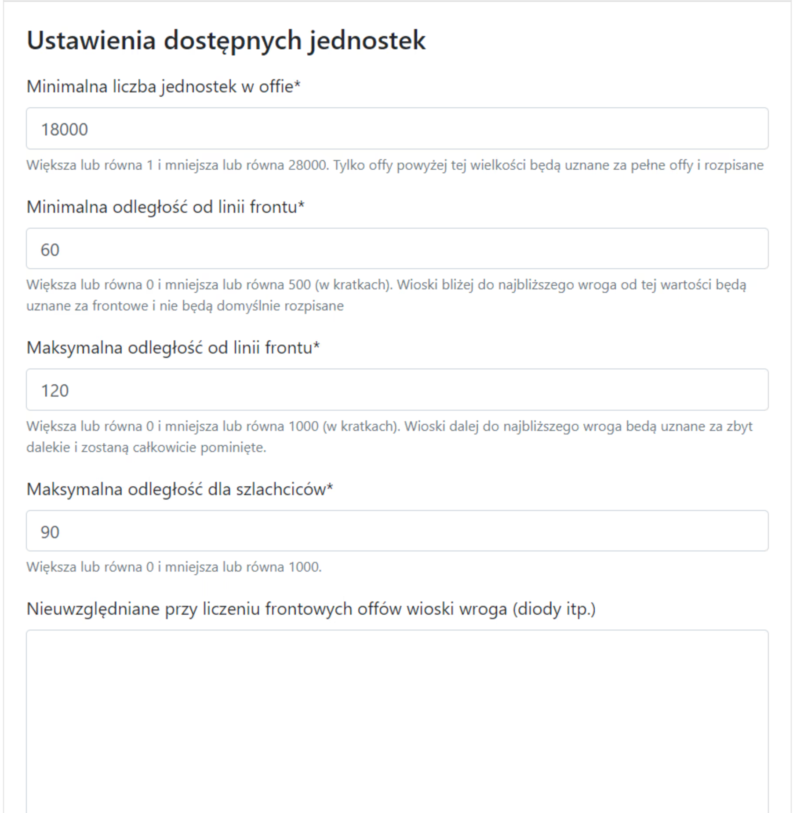

# Dvě oblasti kmene - fronta a zázemí

!!! hint

    Vždy začněte zapisovat jakoukoli akci na této stránce spočítáním všech offů a jejich rozdělením na Frontu, Zázemí a Mimo podle ducha daného seznamu. K tomuto účelu použijte záložku 1. Dostupné jednotky a výsledky jsou uvedeny v tabulce pod cíli.

## Intuice

Odpovědí na to, aby se frontovým offům nepřiřazovali frontmani, kteří by si je měli nechat na dokončování zblízka (nebo je použít jakýmkoli jiným způsobem) během plánování akce, je rozdělení našich vesnic na dvě hlavní skupiny: Fronta, která zahrnuje offy a šlechtu blízko nepřítele, a Zázemí, které zahrnuje offy a šlechtu daleko od nepřítele. Od verze 2.1.0 byla přidána další oblast nazvaná Mimo, intuitivně označující velmi vzdálené vesnice (ale existuje více příkladů použití), což řeší problém offů z velké dálky, které nejsou žádoucí, ale také umožňuje akci s offy v rozmezí například 20 polí - 80 polí. Jak přesně se to děje a jak to ovládat, bude vysvětleno za chvíli.

Celou intuici související s rozdělením lze shrnout na následujících obrázcích:

<figure markdown="span">
  
  <figcaption>Příklad 1. Rozdělení na frontu a zázemí, zelená pro frontu a žlutá pro zázemí</figcaption>
</figure>

<figure markdown="span">
  
  <figcaption>Příklad 2. Rozdělení na frontu a zázemí, červená pro nepřítele a kolem něj náš kmen, zelená pro frontu a žlutá pro zázemí</figcaption>
</figure>

Naše kmeny (modře) obklopují nepřítele (červeně), levý obrázek ukazuje stav PŘED použitím algoritmu a pravý PO jeho použití. Všechny naše vesnice jsme rozdělili na "sektory" v závislosti na vzdálenosti od nepřítele: nejblíže k červené - Fronta, o něco dále, ale ne příliš daleko - Zázemí, a velmi vzdálené vesnice zůstaly modré a označují Mimo.

Jak budou naše offy a šlechta rozděleny, závisí na nastavení v záložce 1. Dostupné jednotky, zvažme několik populárních možností.

!!! info

    Offy blízko cílů a šlechta blízko cílů fungují identicky jako Offy a Šlechta, s tím rozdílem, že místo zvažování "všech" nepřátel a dělení na regiony na základě toho, zvažují pouze cíle zadané Uživatelem v Cílech. To je mnohem přesnější výsledek, protože je známo, kolik jednotek máme k dispozici poblíž cílů (to se může velmi lišit od toho, co máme v celém kmeni).

## Příklad 1

Příklad výsledku pro min. 0 polí a max. 500 polí - což znamená, že nechceme ŽÁDNÉ "Fronty" a žádné "Mimo", vše je zázemí a vše lze zapsat.

<figure markdown="span">
  { width="600" }
  <figcaption>0 polí fronta a max. 500 polí zázemí</figcaption>
</figure>

<figure markdown="span">
  { width="600" }
  <figcaption>0 polí fronta a max. 500 polí zázemí</figcaption>
</figure>

## Příklad 2

Příklad výsledku pro min. 15 polí a max. 100 polí - což znamená, že chceme, aby si hráči, kteří jsou méně než 15 polí od nepřítele, ponechali offy jako frontmani a nechceme, aby žádný off byl dále od cíle než 100 polí (což znamená, že by letěl déle než 2 dny atd.).

<figure markdown="span">
  { width="600" }
  <figcaption>15 polí fronta a max. 100 polí zázemí</figcaption>
</figure>

<figure markdown="span">
  { width="600" }
  <figcaption>15 polí fronta a max. 100 polí zázemí</figcaption>
</figure>

## Příklad 3

Příklad výsledku pro min. 60 polí a max. 120 polí - když chceme, aby zázemí bylo nad 60 polí od nepřítele a pod 120, např. pro akci nebo demolici z dálky (a děláme samostatnou zblízka).

<figure markdown="span">
  { width="600" }
  <figcaption>60 polí fronta a max. 120 polí zázemí</figcaption>
</figure>

<figure markdown="span">
  { width="600" }
  <figcaption>60 polí fronta a max. 120 polí zázemí</figcaption>
</figure>

Zobrazí se pouze offy větší než zvolený minimální počet jednotek v offu. V aktuální verzi budou také rozpoznány a odlišeny ck z offů od ck z obranných vesnic a započítány. Výsledek závisí hlavně na Nepřátelských kmenech, které byly vybrány na samém začátku při vytváření seznamu. Algoritmus je velmi jednoduchý, kolem každé nepřátelské vesnice se vypočítá region ve vzdálenosti udané jako vzdálenost od přední linie. Sečtením všech těchto regionů jako celku můžeme pro každou spojeneckou vesnici určit, zda je blízko těchto nepřátelských vesnic (pak je fronta), nebo ne (pak je zázemí). Proto do pole Nezohledňovat při počítání frontových offů vkládáme všechny nepřátelské diody, abychom nenarušili výsledek.

Dva spodní řádky také zohledňují danou maximální vzdálenost pro šlechtu, kde z menší než uvedené vzdálenosti nebude žádný šlechtic zapsán. Navíc počítají počet offů a šlechty KOLEM zadaných cílů, takže pokud ještě nejsou zadány žádné cíle, dostaneme tam 0.

!!! hint

    Vždy se vyplatí vybrat všechny naše blízké nepřátelské kmeny do seznamu, nejen ten, na který plánujeme akci. Pokud má náš kmen dvě fronty s kmeny A a B a chceme naplánovat akci na A, stále chceme ponechat frontové offy u B pro použití tamních frontmanů, takže přidáme oba kmeny do nepřátelských kmenů (jinak, pokud je tam pouze kmen A, může se stát, že frontové offy z B budou zapsány do akce).
