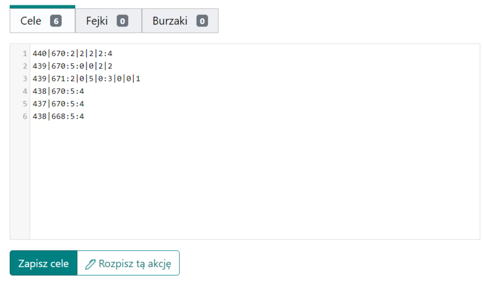

# Zapsání cílů osnovy

Konvence: další cíle akce musí být zadány v po sobě jdoucích řádcích Cílů. Minimálně stačí samotné souřadnice, v takovém případě bude příkladový řádek `000|000` doplněn na `000|000:0:0`. Později se naučíte, jak kódovat počet útoků a šlechticů. Pro uložení cílů klikněte na Uložit cíle.

<figure markdown="span">
  { width="600" }
  <figcaption>Příklad 1, útoky a šlechtici kódováni výchozím způsobem</figcaption>
</figure>

`440|670:5:4` v prvním řádku je příkladem, jak standardně zakódovat počet útoků a šlechticů pro daný cíl. První číslo označuje počet útoků a druhé číslo počet šlechticů.

Plánovač podporuje tři typy cílů: skutečné, falešné a demoliční. Skutečné cíle vkládejte do Cílů, falešné do Falešných a demoliční do Demolic. U Falešných cílů místo útoků a šlechticů kódujte počet falešných útoků a falešných šlechticů a v záložce Demolice kódujte počet útoků a počet demolic (které následují po útocích).

<figure markdown="span">
  { width="600" }
  <figcaption>Příklad 2, rozšířené kódování útoků a šlechticů</figcaption>
</figure>

Standardně cíle jako v Příkladu 1 dědí režim odesílání ze záložky 3. Parametry plánu, jako jsou útoky náhodně ze zálohy a šlechtici z nejbližší fronty. Pokud chceme poslat například 5 útoků náhodně ze zálohy, 2 útoky z blízké zálohy, 1 šlechtice z dálky a poslední 3 šlechtice zblízka na daný cíl, např. řádek číslo 3 v Příkladu 2, což je `439|671`, můžeme použít rozšířenou syntaxi zadáním:

```
439|671:2|0|5|0:3|0|0|1
```


V tomto případě jsme místo jednoho čísla útoků zadali 2|0|5|0 a místo jednoho čísla šlechticů jsme zadali 3|0|0|1. Rozšířenou syntaxi používáme, když chceme některé příkazy z dálky a jiné zblízka; na výběr jsou 4 regiony našeho kmene.

!!! info

    **A|B|C|D** se překládá jako:
    A zblízka|B z blízké zálohy|C náhodně ze zálohy|D z dálky

Chyby se objeví ve standardních případech, především když daná vesnice neexistuje v deklarovaném světě v plánu, nebo když je vesnice barbarská, a když zadané znaky za souřadnicemi nepatří mezi výše uvedené možnosti. Nejsou žádné překážky pro to, aby cíle byly vesnice členů kmene nebo aby byly stejné vesnice zadány vícekrát (i když v tomto případě se nahoře objeví zpráva, že byly zjištěny duplikáty). Duplikáty nejsou zakázány; každý zadaný cíl, i když se objeví vícekrát, bude zpracován samostatně. To však může způsobit chaos mezi hráči, protože bude například několik stejných cílů s různými příkazy pro ně (?). Duplikáty v různých záložkách (Cíle, Falešné, Demolice) se nepočítají.

<figure markdown="span">
  { width="600" }
  <figcaption>Příklad 3, chyby při ukládání</figcaption>
</figure>
