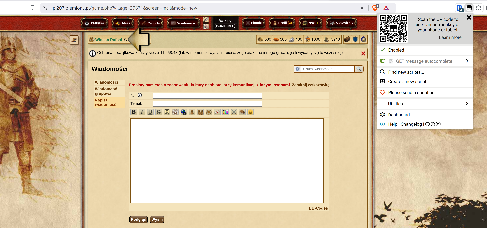
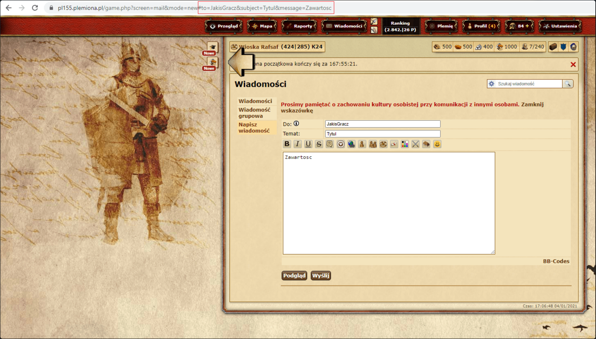

# Skript pro odesílání zpráv

| Server          | Fórum Tribal Wars                                                                                                                                                                        | Povoleno             | Kód                                                                                                                                   |
| --------------- | ---------------------------------------------------------------------------------------------------------------------------------------------------------------------------------------- | -------------------- | ------------------------------------------------------------------------------------------------------------------------------------- |
| plemiona.pl     | [https://forum.plemiona.pl/index.php?threads/auto-uzupe%C5%82nianie-wiadomo%C5%9Bci.128461/](https://forum.plemiona.pl/index.php?threads/auto-uzupe%C5%82nianie-wiadomo%C5%9Bci.128461/) | ANO                  | [Kód na GitHubu (v2.0)](https://github.com/rafsaf/scripts_tribal_wars/blob/2024-09-01/public/GET_message_autocomplete.js)             |
| ostatní servery | -                                                                                                                                                                                        | NE (nelze detekovat) | [Kód na GitHubu (v2.2)](https://github.com/rafsaf/scripts_tribal_wars/blob/2025-09-22/public/GET_message_autocomplete_v2.2_global.js) |

!!! warning

    Používání na jiných jazykových verzích hry, **kde skript není povolen**, je na vlastní nebezpečí. Skript je povolen na polské jazykové verzi a jeho provoz je zcela nedetekovatelný, ale pro jiné jazykové verze hry (např. českou, globální) jsou vždy nelegální.

=== "plemiona.pl"

    ```title="Skript pro automatické doplňování zpráv"
    --8<-- "sending_messages_script_plemiona_pl.txt"
    ```

=== "ostatní servery"

    ```title="Skript pro automatické doplňování zpráv"
    --8<-- "sending_messages_script_global.txt"
    ```

## Instalace

Chcete-li používat skripty, musíte si nejprve nainstalovat příslušné rozšíření prohlížeče (monkey):

- [Tampermonkey](https://www.tampermonkey.net/) (Chrome, Opera, Microsoft Edge, Safari, Firefox)
- [Greasemonkey](https://addons.mozilla.org/pl/firefox/addon/greasemonkey/) (Firefox)

Poté vytvořte nový uživatelský skript a vložte níže uvedený kód.

Chcete-li použít skript v Tampermonkey, musíte pro něj povolit přepínač "Povolit uživatelské skripty" nebo povolit režim pro vývojáře.
Viz [https://www.tampermonkey.net/faq.php#Q209](https://www.tampermonkey.net/faq.php#Q209).

## Jak zkontrolovat, zda rozšíření funguje

Přejděte na "Pošta" -> "Napsat zprávu" na jakémkoli světě.

Ujistěte se, že je povoleno rozšíření Tampermonkey a že je aktivní rozšíření "GET message autocomplete".



## Návod k použití

1. Přejděte na kartu Výsledky dokončeného plánu, [viz tuto kapitolu o kartě výsledků](./../first_steps/step_7_results_tab.md)
2. Klikněte na {==Odeslat==} pro otevření nových karet ve hře
3. Odešlete zprávu ve hře
4. Na stránce se text změní na "Odesláno!", pokračujte

## Popis

Jednoduchý a krátký skript pro prohlížeč, který vyplní pole **"Komu"**, **"Předmět"** a **"Obsah zprávy"** v nové zprávě, pokud jsou uvedeny v odkazu. Automatizuje odesílání zpráv hráčům po naplánování na webu, detekuje skript a jeho spuštění pouze v nové kartě zprávy. Příklad použití naleznete níže.

- to - příjemce
- subject - předmět
- message - zpráva

Příklad:

```
https://pl155.plemiona.pl/game.php?screen=mail&mode=new#to=NějakýHráč&subject=Titul&message=Obsah
```




