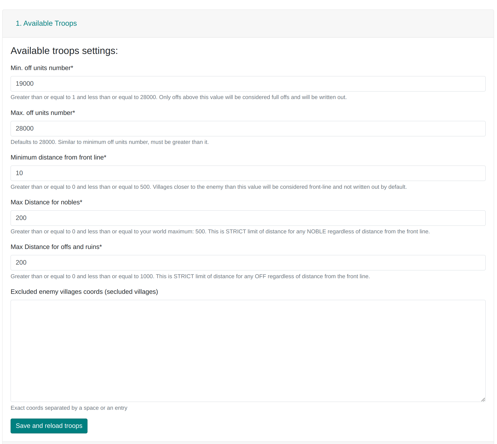

# 1. Verfügbare Truppen und Tabellenbeschreibung

Diese Registerkarte dient dazu, die Dörfer unseres Stammes in Front- und Hinterland aufzuteilen. Da das Verständnis dieser Aufteilung für die Nutzung der Seite von grundlegender Bedeutung ist, findet sich ein Teil der Beschreibung auch in anderen Registerkarten, einschließlich dieses Artikels:
[Die zwei Regionen des Stammes: Was sind Front- und Hinterland](./../primary/two_regions_of_the_tribe.md).

- **Min. Anzahl Off-Einheiten** und **Max. Anzahl Off-Einheiten**

    Geben Sie den Größenbereich der Offensiven (in Bezug auf die Bevölkerung im Bauernhof) an, die geplant werden sollen.

    Wenn der Bereich beispielsweise 10.000-12.000 beträgt, überspringt der Planer sowohl Offensiven, die größer als 12.000 sind, als auch solche, die kleiner als 10.000 sind. Die maximale Anzahl der berücksichtigten Späher beträgt 200; mehr werden ignoriert. Die Adelsgeschlechter werden nur dann als x6 Einheiten gezählt, wenn **mehr offensive als defensive Einheiten vorhanden sind**. Der genaue Code findet sich [hier](https://github.com/rafsaf/Tribal-Wars-Planer/blob/ecc7ff31ed122928a7aea6199af4a0f9ce4718fd/utils/basic/army.py#L242-L250).

- **Mindestabstand von der Frontlinie**

    Der Wert in Feldern, der zur Berechnung der Frontlinie verwendet wird, auf deren Grundlage die Frontdörfer bestimmt werden. Der genaue Code für die Aufteilung in Front-/Hinterland/Außerhalb findet sich [hier](https://github.com/rafsaf/Tribal-Wars-Planer/blob/ecc7ff31ed122928a7aea6199af4a0f9ce4718fd/utils/basic/cdist_brute.py#L83-L99). Die gesamte Intuition hinter dieser Aufteilung findet sich in der Anleitung [Die zwei Regionen des Stammes: Was sind Front- und Hinterland](./../primary/two_regions_of_the_tribe.md).

- **Max. Entfernung für Adelsgeschlechter**

    Standardmäßig ist dies der maximale Wert der Entfernung in Feldern für die jeweilige Welt. Es ist nicht möglich, einen höheren Wert einzustellen (solche Angriffe könnten nicht gesendet werden).

- **Max. Entfernung für Offs und Ruinen**

    Der Planer wird keine Angriffe von Dörfern zuweisen, die weiter vom Feind entfernt sind als dieser Wert. Er wird auch verwendet, um eine ungefähre Anzahl von Dörfern in der Region "Außerhalb" anzugeben, d.h. solche, die übersprungen werden.

- **Ausgeschlossene feindliche Dorfkoordinaten (abgelegene Dörfer)**

    Geben Sie alle feindlichen toten Accounts innerhalb des Territoriums unseres Stammes ein. **Es lohnt sich**, dies zu tun, denn mit einem **Mindestabstand von der Frontlinie** von beispielsweise 10 Feldern wird alles um 10 Felder von den feindlichen toten Accounts natürlich als Frontlinie betrachtet, und Offensiven aus diesem Bereich werden im Plan übersprungen. Manchmal ist es jedoch eine bessere Entscheidung, Offensiven um Inseln für den lokalen Gebrauch zu behalten und feindliche tote Accounts hier nicht einzutragen.
