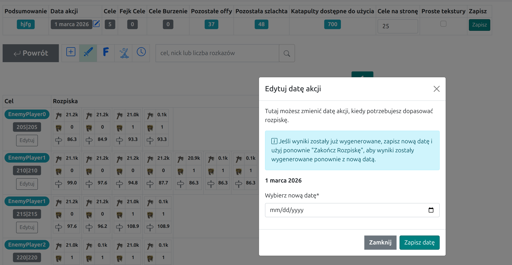

Die Registerkarte dient zum Einstellen des Plan-Datums. Sie können es beim Erstellen des Plans auswählen und später weiterhin über die Spalte {==Plan-Datum==} in der Zusammenfassung oben auf der Planer-Menü-Seite ändern.

Aussehen der Registerkarte mit einem Beispieldatum:

{ width="600" }

Wenn Sie bereits Ergebnisse erzeugt haben, speichern Sie das neue Datum und verwenden Sie erneut {==Den Plan abschließen==}, damit die Ergebnisse mit dem aktualisierten Datum neu erzeugt werden.

{ width="600" }

Es ist weiterhin nicht möglich, einen einzelnen Plan für mehrere verschiedene Tage zu schreiben. Für mehrtägige Aktionen schließen Sie den ersten Tag ab, senden die Ergebnisse und verwenden dann die verbleibenden ungenutzten Truppen aus der {==Ergebnis-Registerkarte==}, um einen neuen Plan für den nächsten Tag vorzubereiten.
