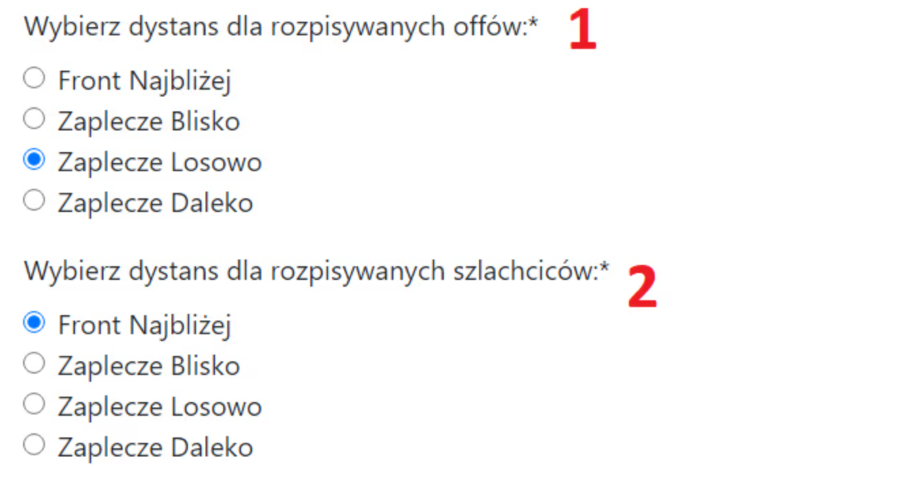

# 3. Plan-Parameter

Diese Registerkarte dient dazu, die Details festzulegen, woher genau die Offensivtruppen für eine Operation kommen sollen, sowie andere allgemeine Zeitplaneinstellungen. Schnallen Sie sich an.

Das Aussehen der Registerkarte mit den Standardeinstellungen:

{ width="600" }

Im Artikel [Die zwei Regionen des Stammes: Was sind Front- und Hinterland](./../primary/two_regions_of_the_tribe.md) haben Sie gelernt, wie der Planer die Aufteilung in Front, Hinterland und Außerhalb handhabt. Lassen Sie uns zunächst die Punkte 1 und 2 im obigen Bild besprechen.

Beachten Sie, dass wir für alle nachfolgenden Überlegungen alle Dörfer in der Region Außerhalb ignorieren. Sie werden vom Planer vollständig übersprungen, also konzentrieren wir uns nur auf Front und Hinterland.

Einstellungen 1-2:

{ width="600" }

Sie können genau festlegen, aus welchen Teilen des Stammes die Offensivtruppen und Adelsgeschlechter standardmäßig kommen sollen. Die Standardeinstellung ist Hinterland Zufällig für Offensivtruppen und Front Nächste für Adelsgeschlechter.

**Front Nächste** bedeutet so nah wie möglich. Es muss nicht einmal unbedingt aus Dörfern an der Front sein. Wenn es zum Beispiel keine Frontdörfer gibt oder bei der automatischen Planung nur Hinterlanddörfer in einer Region übrig bleiben (weil die Frontdörfer verbraucht wurden), werden einfach die nächstgelegenen Dörfer ausgewählt.

**Hinterland Nah** muss aus dem Hinterland kommen, und unter diesen werden die nächstmöglichen ausgewählt.

**Hinterland Zufällig** sind Dörfer aus dem Hinterland, die wirklich zufällig (nicht pseudo-zufällig) aus allen möglichen Optionen ausgewählt werden. Dies ist die Standardeinstellung für Offensivtruppen – normalerweise möchten wir nicht, dass irgendetwas (Entfernung, sendender Spieler) darauf hindeutet, dass es sich um eine Offensive handelt und von Fälschungen unterschieden werden könnte.

**Hinterland Fern** sind Dörfer aus dem Hinterland, die in umgekehrter Reihenfolge zu Hinterland Nah sortiert sind, also die am weitesten entfernten.

!!! info

    Zur zusätzlichen Unterhaltung, die die Verteidiger von auf dieser Seite geplanten Aktionen zweifellos spüren werden, haben alle oben genannten Einstellungen einen minimalen Grad an Zufälligkeit. Das bedeutet, dass die nächstmöglichen und am weitesten entfernten eine leichte Schwankung aufweisen. Dies liegt daran, dass theoretisch Hinterland Nah und Hinterland Fern von einem Verteidiger erkannt werden könnten, und auf diese Weise wird es etwas schwieriger zu erraten sein, je nachdem, wie viele Angriffe für ein Dorf geplant sind. Je mehr Angriffe, desto größer die Schwankung.

Kommen wir nun zu den Einstellungen 3 bis 6, die sich auf die allgemeinen Einstellungen des Zeitplans konzentrieren.

Einstellungen 3-6:

{ width="600" }

**In Punkt 3** entscheiden Sie, wie die Adelsgeschlechter aus einem Dorf aufgeteilt werden sollen. Es gibt drei übliche Optionen: Teilen (jedes Adelsgeschlecht mit der gleichen Eskorte), Nicht teilen (das erste Adelsgeschlecht mit der größten Eskorte, der Rest mit minimaler Eskorte – beachten Sie, dass dies bei z.B. 5 Adelsgeschlechtern nicht gut funktioniert, wenn sie auf mehrere Dörfer aufgeteilt sind), und Separat, was bedeutet, dass alle Adelsgeschlechter eine minimale Eskorte haben und die Offensiven separat vor ihnen gehen – nur für spezifische Aktionen und Verwendungen.

Die vernünftigste Option, insbesondere bei größeren Aktionen, ist normalerweise das Teilen, obwohl die Standardeinstellung Nicht teilen ist, da dies typischerweise bei kleineren Zeitplänen der Fall ist.

**In Punkt 4** haben Sie drei Optionen. In der ersten versucht der Planer, Adelsgeschlechter für ein Dorf aus verschiedenen Dörfern unserer Spieler zu nehmen (Anwendungsfall: Adelsgeschlechter von weit her). In der zweiten Option (Standard) macht er dies optimal, während er in der dritten Option versucht, einen Satz Adelsgeschlechter von einem Spieler pro Dorf zu senden oder abwechselnd 3 Adelsgeschlechter von einem Spieler und 1 Adelsgeschlecht von einem anderen, oder 2 und 2, während es wahrscheinlich keine einzelnen Adelsgeschlechter aus verschiedenen Dörfern geben wird. Die dritte Option ist die am wenigsten zuverlässige und kann seltsame Ergebnisse liefern.

**In Punkt 5** wählen Sie, wie die Befehle zum Versammlungsplatz für unsere Spieler im Falle mehrerer Adelsgeschlechter aus einem Dorf aussehen sollen. Angenommen, unser Spieler soll 20k Offensive und 4 Adelsgeschlechter zum Dorf `500|500` schicken.

In der ersten Option erhalten sie EINEN Versammlungsplatz-Link mit 20k Offensive und 4 Adelsgeschlechtern.

In der zweiten, Standardoption, erhalten sie VIER aufeinanderfolgende Versammlungsplatz-Links für ihre Ziele, wobei jedes Adelsgeschlecht als separater Befehl behandelt wird.

Welche Option in Punkt 5 ist besser? Wie üblich, es kommt darauf an. Bei kleinen Aktionen wahrscheinlich die zweite, Standardoption. Bei sehr großen, massiven Aktionen, bei denen die Offensiven immer aufgeteilt werden, ist die erste Option für die Spieler bequemer. Bei anderen Aktionen wählen Sie, was Ihnen am besten passt. Die Standardoption bedeutet mehr Details für den Spieler (da er genau weiß, welche Eskorte jedes Adelsgeschlecht hat), während die erste Option als einzelner Befehl weniger Details und weniger belegten Platz bedeutet.

**In Punkt 6** wählen Sie, wie viele Fälschungen höchstens von einem unserer Dörfer gesendet werden können.
