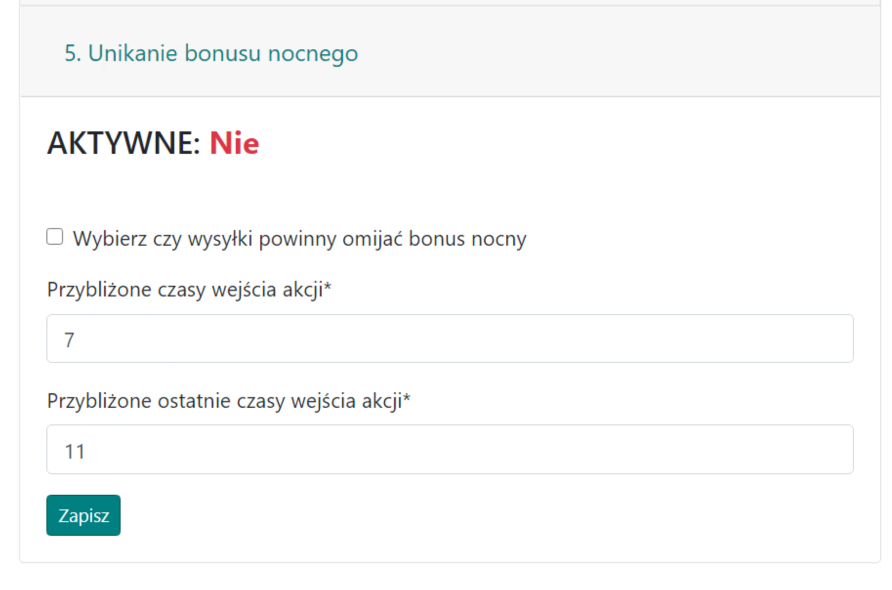
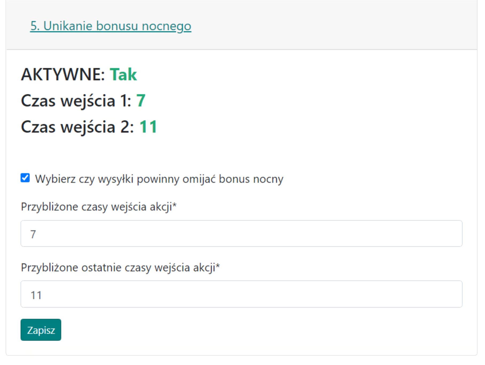

# 5. Nachtbonus vermeiden

Die Registerkarte dient dazu, optional die Option zum Vermeiden des Nachtbonus für generierte Befehle für Offs und Fake-Offs einzustellen. Adelsgeschlechter werden normal über den ganzen Tag geplant! Dies bedeutet nicht die vollständige Eliminierung der Möglichkeit von nächtlichen Entsendungen, sondern nur deren Minimierung.

Wenn aktiviert, vermeidet der Planer {==Entsendungen==} (aus der Perspektive des Spielers, der Angriffe sendet, nicht des Verteidigers) während der Stunden **00:00-07:00**, und es ist nicht möglich, diese Stunden in der aktuellen Version des Spiels zu ändern.

Aussehen der Registerkarte bei Deaktivierung:

{ width="600" }

Standardmäßig ist diese Option deaktiviert; aktivieren Sie das erste Kontrollkästchen, um sie zu aktivieren. Da die genauen Eingabezeiten für Offs ganz am Ende in der Registerkarte Zeiten festgelegt werden, geben wir hier nur ungefähre Eingabestunden für alle Offs oder die Mehrheit von ihnen an. Zur Orientierung: Die meisten Aktionen werden für den Morgen geplant, z.B. Offs treffen zwischen 7-11 Uhr ein, also geben wir solche zwei Stunden im Formular ein.

Aussehen der Registerkarte bei Aktivierung:

{ width="600" }
