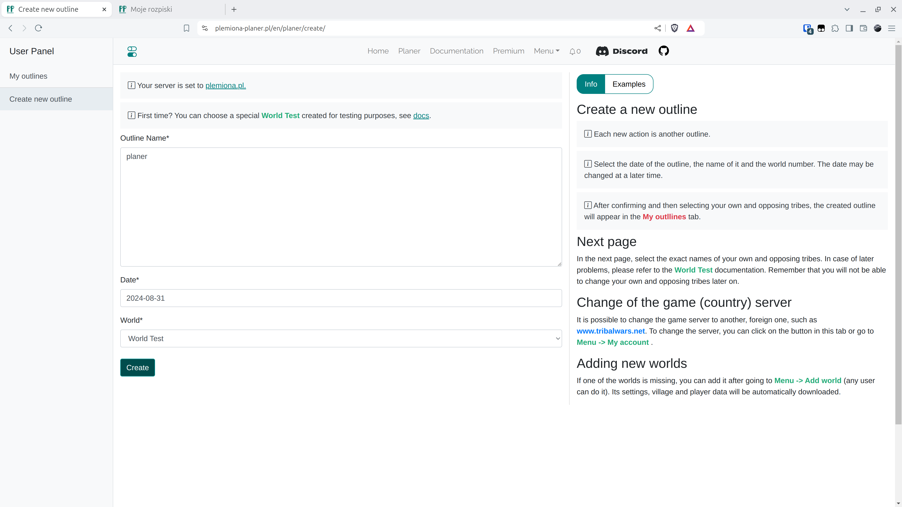

# Schritt 1 - Einen Plan erstellen

Nachdem Sie ein Konto erstellt oder sich angemeldet haben, sollten Sie einen neuen Plan unter {==Neuen Plan erstellen==} erstellen und dabei darauf achten, dass die ausgewählte Spielwelt die Testwelt ist. In der aktuellen Version kann das Datum zu einem späteren Zeitpunkt frei geändert werden.

<figure markdown="span">
  
  <figcaption>Wählen Sie Welt Test</figcaption>
</figure>

!!! info

    Nachdem Sie auf Erstellen geklickt haben, werden Sie direkt zur nächsten Seite weitergeleitet.
