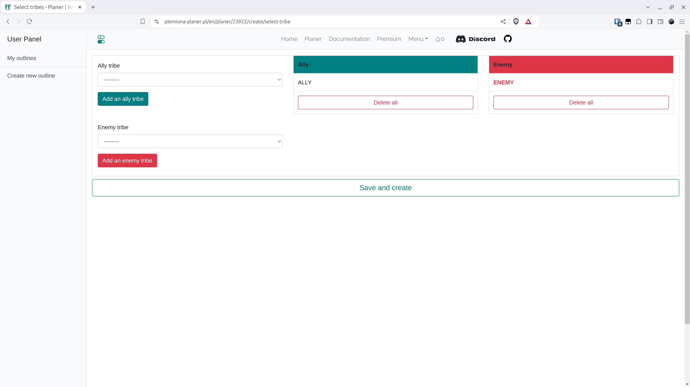

# Schritt 2 - Stämme auswählen

In jedem Plan sollten Sie den genauen Stamm oder die Stämme auswählen, die unsere (angreifende) und die gegnerische (angegriffene) Seite repräsentieren. Im Falle mehrerer Stämme wählen wir einige aus. In der Welt Test gibt es genau zwei Stämme, {==ALLY==} und {==ENEMY==}. Wir legen unseren Stamm als ALLY und den gegnerischen als ENEMY fest und denken daran, auf HINZUFÜGEN zu klicken. Wir werden dies bestätigen. Es ist wichtig zu wissen, dass wir, wenn wir den Stamm hier nicht eingeben und seine Übersicht in der nächsten Registerkarte in die Armeesammlung einfügen, eine Wand von Fehlern erhalten werden - der Planer prüft immer, ob das, was der Benutzer einfügt, Sinn ergibt - einschließlich der Überprüfung, ob alle eingefügten Dörfer in einem der angegebenen Stämme sind.

<figure markdown="span">
  
  <figcaption>Verbündete und feindliche Stämme auswählen</figcaption>
</figure>
