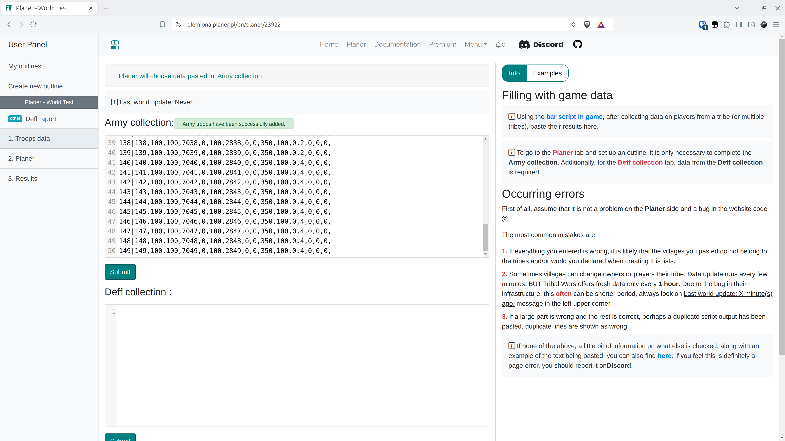

# Schritt 3 - Die Armeesammlung ausfüllen

Um zum neu erstellten Plan zu gelangen, klicken Sie auf seinen Namen.

<figure markdown="span">
  
  <figcaption>Klicken Sie auf "Planer"</figcaption>
</figure>


Hier fügen wir die von den Skripten generierten Ergebnisse ein. Sie sammeln Informationen über jeden Spieler in unserem Stamm in einem Textfeld, von wo aus wir sie kopieren und in das entsprechende Feld in dieser Registerkarte einfügen. Hier wird diese Ausgabe verarbeitet, um sicherzustellen, dass die eingefügten Informationen Sinn ergeben. Zunächst wird geprüft, ob alle Dörfer in der ausgewählten Welt existieren, ob sie einen Besitzer haben oder ob der Besitzer in einem der Stämme ist, die wir zuvor festgelegt haben. Als Nächstes werden die Länge, die Anzahl der Kommas in jeder Zeile (Miliz, Ritter, Bogenschützen beeinflussen die Länge der Zeilen - wenn sie erscheinen, gibt es mehr Zahlen usw.) und ob es keine Leerzeichen in der Mitte gibt, überprüft. Es ist jedoch wissenswert, dass etwas anderes als das Skriptergebnis nicht durchgehen wird.

!!! warning

    Um zu den nächsten Registerkarten zu gelangen, ist es notwendig, die Daten in dieser Registerkarte einzufügen. Ohne sie einzugeben, können Sie nicht weitermachen!


Für die Zwecke der Welt Test fügen Sie die folgenden Daten in das Feld Armeesammlung ein.

=== "Armeesammlung"

    ```title="army.txt"
    --8<-- "army.txt"
    ```

=== "Deff-Sammlung"

    ```title="defence.txt"
    --8<-- "defence.txt"
    ```

Klicken Sie dann auf Senden.

<figure markdown="span">
  
  <figcaption>Einfügen und senden</figcaption>
</figure>
