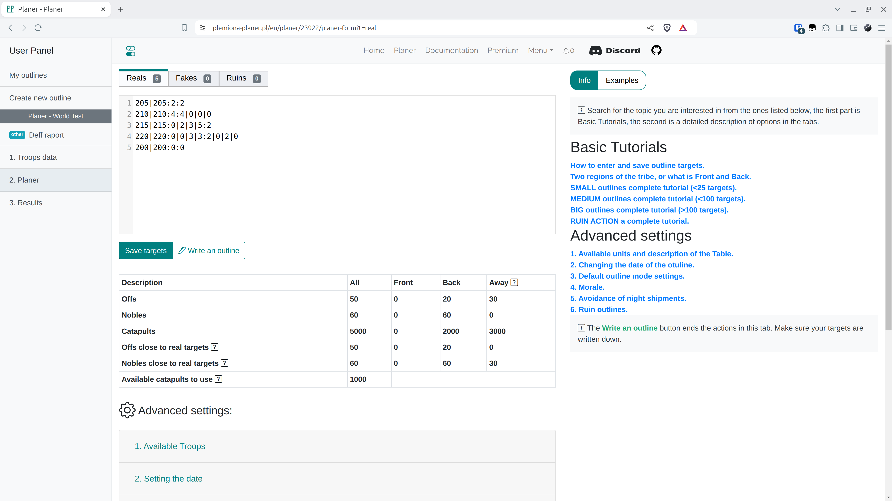

# Schritt 4 - Ziele und Einstellungen speichern und einen Plan schreiben

Platzieren Sie in der Registerkarte Planer die Ziele des Plans wie in der Registerkarte beschrieben. Durch Klicken auf {==Ziele speichern==} aktualisieren wir die Ziele, für die wir einen Plan schreiben möchten. Durch Klicken auf {==Einen Plan schreiben==} beenden wir diesen Teil und gehen zu den nächsten Registerkarten. Bevor Sie mit dem Schreiben Ihrer eigenen Pläne beginnen, lesen Sie die Beschreibungen des für Sie interessanten Typs und experimentieren Sie am besten mit der Einstellung verschiedener Entfernungen von der Front, maximalen Entfernungen für Adelsgeschlechter, ändern Sie die erweiterten Modi des Plans, klicken Sie dann auf Plan schreiben und kehren Sie bei unbefriedigenden Ergebnissen durch Klicken auf **Zurück** zurück.

Fügen Sie in der Welt Test die folgenden Daten ein und speichern Sie sie.

=== "Reals"

    ```title="targets.txt"
    --8<-- "targets.txt"
    ```

!!! info

    Ziele können auf verschiedene Arten eingefügt werden. Der einfachste Weg ist, die nächsten Zeilen nur als Koordinaten einzufügen, dann werden standardmäßig die Anzahl der Offs und Adelsgeschlechter als 0 eingetragen. Die Anzahl der Offs und Adelsgeschlechter wird am einfachsten als z.B. `Koordinaten:2:2` codiert, was `Koordinaten:zwei-offs:zwei-adelsgeschlechter` bedeutet, oder genauer gesagt, der Eintrag `kord:2:1|1|1|1` bedeutet 2 Offs und 1 Adelsgeschlecht von nah, 1 nah hinten, 1 zufällig, 1 von weit weg. Geben Sie Fakes und Ruinen auf die gleiche Weise in die entsprechenden Registerkarten ein.

Die gesamte Registerkarte dient hauptsächlich zwei Zwecken: der Eingabe von Zielen und den automatischen Einstellungen für die Zuweisung von Plänen. Zum Zweck der Einarbeitung in die Welt Test werden wir nur die Tabelle mit den Front- und Hinterlanddörfern ausfüllen, die unter den Schaltflächen zum Speichern von Zielen und zum Schreiben von Plänen sichtbar ist. Wenn Sie an den anderen Registerkarten interessiert sind, können Sie in den anderen Teilen der Dokumentation mehr darüber erfahren.

<figure markdown="span">
  
  <figcaption>Gespeicherte Ziele</figcaption>
</figure>


Erweitern Sie die erste Registerkarte {==1. Verfügbare Truppen==}. Belassen Sie alle Standardwerte. Das Ziel ist es, alle unsere Dörfer in drei Gruppen aufzuteilen: Front, Hinten und Weg (sehr weit entfernt), abhängig von den eingegebenen feindlichen Stämmen (die Entfernung zu den nächsten Feinden wird für jedes unserer Dörfer berechnet). Validieren Sie das Formular, indem Sie auf Speichern und Truppen neu laden klicken.

Sie sollten die folgenden Ergebnisse in der Tabelle sehen:

<figure markdown="span">
  
  <figcaption>Berechnete Offs und Adelsgeschlechter in der Nähe von Zielen</figcaption>
</figure>

Klicken Sie jetzt auf {==Einen Plan schreiben==}, es ist Zeit für die nächste Registerkarte :)

!!! info

    Bei verschiedenen Plänen wird ihre Auflösung leicht unterschiedlich sein. Bei kleineren Aktionen, z.B. in der Anfangsphase von Welten, lohnt es sich, jedes Ziel separat in einer bequemen Bearbeitung zu verfeinern, aber bei riesigen Aktionen ist dies natürlich unmöglich. Dann sollten Sie sich mehr auf die Registerkarte Planer und die dort verfügbaren Einstellungen konzentrieren.
