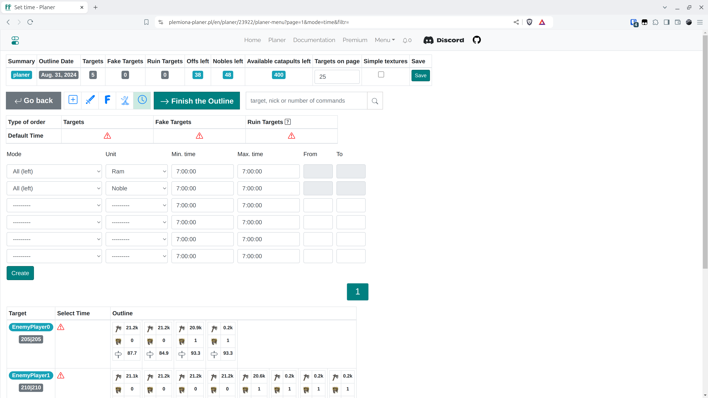
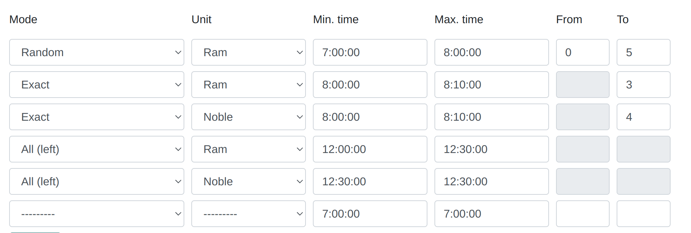
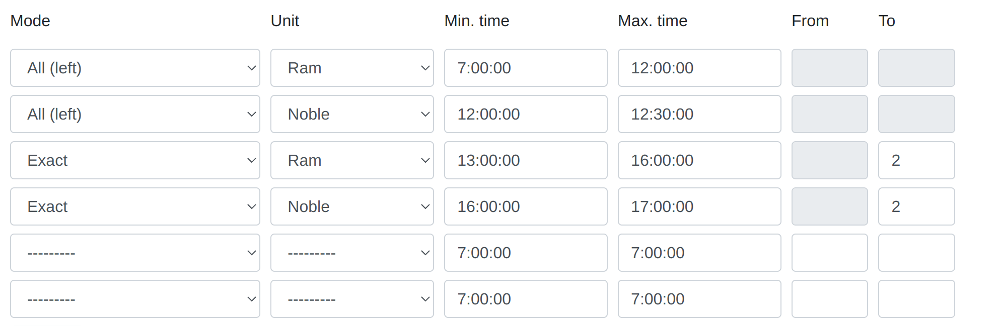

# Schritt 6 - Eingabezeiten festlegen und den Plan abschließen

!!! info

    Nachdem Sie alle Registerkarten überprüft und möglicherweise Operationen bei der Bearbeitung einzelner Ziele durchgeführt haben, gehen Sie schließlich zur letzten Registerkarte mit den Zeiten, um den Zeitplan abzuschließen.

<figure markdown="span">
  
  <figcaption>Registerkarte Zeiten, Sie können die sehr einfache Zeit oben verwenden und auf "Erstellen" klicken</figcaption>
</figure>

Der Benutzer hat die Möglichkeit, mehrere Eingabezeitobjekte in der Registerkarte zu erstellen, aber in der Praxis können auch eines oder wenige ausreichen. Wir wählen die Zeitintervalle für die Angriffe, die Einheit und den Modus aus 3 möglichen Optionen. Ein Beispiel für eine komplexe Zeit könnte so aussehen:

<figure markdown="span">
  
  <figcaption>Beispiel 1.</figcaption>
</figure>

Was bedeutet:

- Planen Sie eine zufällige Anzahl von Offs zwischen 0 und 5 zwischen 7:00 und 8:00 Uhr (oder weniger, wenn sie bereits verwendet wurden)

- Planen Sie genau 3 Offs zwischen 8:00 und 8:10 Uhr (oder weniger, wenn sie bereits verwendet wurden)

- Planen Sie genau 4 Adelsgeschlechter um 8:10 Uhr (oder weniger, usw. wie oben)

- Planen Sie alle verbleibenden Rammböcke, falls noch welche vorhanden sind, zwischen 12:00 und 12:30 Uhr

- Planen Sie alle verbleibenden Adelsgeschlechter um 12:30 Uhr

Es wird auch unterstützt, dass {==Alle übrig==} früher als die anderen Modi sein kann. Im folgenden Beispiel erhält das Ziel immer 2 Offs und 2 Adelsgeschlechter am Ende des Tages und alle übrigen (die Menge kann für verschiedene Dörfer unterschiedlich eingestellt werden) am Morgen. Die angegebenen Zeiten müssen sinnvoll sein; die maximale Eingabezeit muss später oder gleich der minimalen Eingabezeit sein. Der Modus "Alle übrig" muss genau zweimal vorkommen: für die Einheiten Rammbock und Adelsgeschlecht, er hat die niedrigste Priorität.

<figure markdown="span">
  
  <figcaption>Beispiel 2.</figcaption>
</figure>

Für die Zwecke der Testwelt können Sie eine einfache Zeit aus dem ersten Bild erstellen und sie für alle Ziele oben in der Registerkarte festlegen. Beenden Sie dann den Zeitplan, indem Sie auf {==Den Plan abschließen==} klicken.

Sie gelangen automatisch zur nächsten Registerkarte mit den Ergebnissen.
