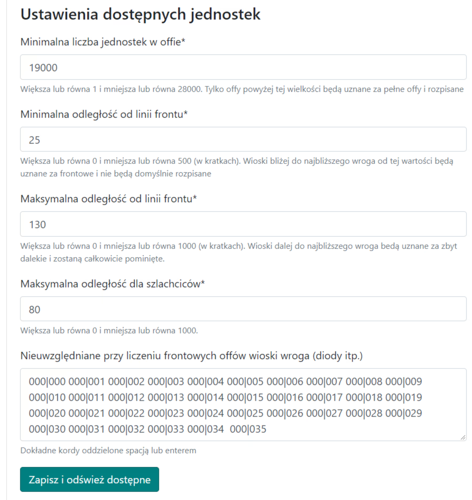
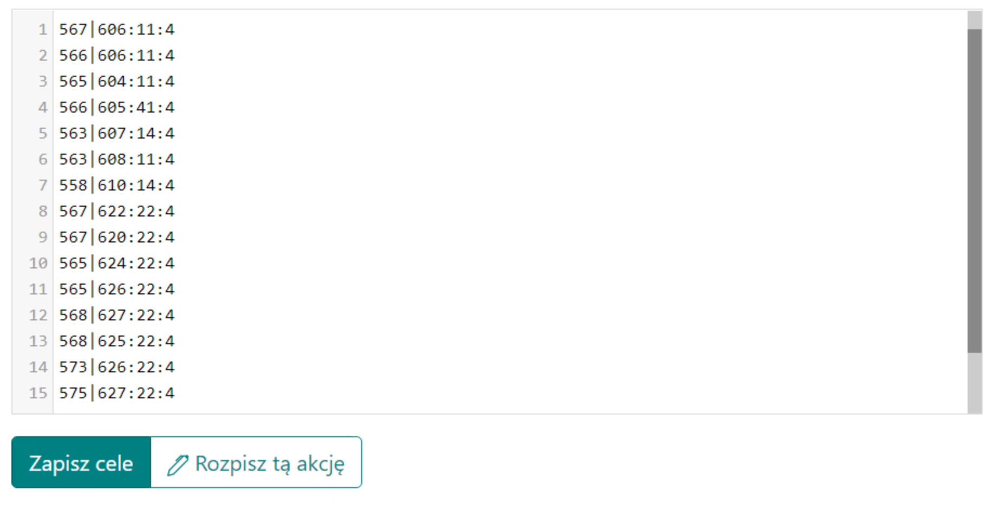

# Große Pläne - Anleitung

Hinweis: Die unten vorgestellte Idee für große Aktionen ist nicht zwingend, sie kann auf beliebige Weise umgesetzt werden.

In dieser Anleitung erfahren Sie, wie Sie eine große Aktion am effektivsten und effizientesten planen, letztendlich in der späten Phase der Welt, für mehr/viel mehr als 100 Ziele, bei denen während der Aktion im Stamm nur volle Offs berücksichtigt werden. Hinweis: Es wird davon ausgegangen, dass Sie bereits alle Kenntnisse aus [Erste Schritte mit dem Planer](./../first_steps/index.md) haben! und es wird empfohlen, zuerst die beiden kurzen vorherigen Anleitungen in diesem Abschnitt zu lesen, nämlich [Wie man Aktionsziele eingibt und speichert](./two_regions_of_the_tribe.md) und [Zwei Regionen des Stammes: Was ist Front und Heck](./two_regions_of_the_tribe.md).

!!! hint

    Beginnen Sie die Planung jeder Aktion auf dieser Seite immer damit, alle Offs zu zählen und sie gemäß dem Geist des jeweiligen Plans in Front und Heck zu unterteilen. Verwenden Sie dazu die Registerkarte 1. Verfügbare Einheiten, und die Ergebnisse werden in der Tabelle unter den Zielen dargestellt.

Wir werden die Aktion aufgrund der Anzahl der Ziele automatisch planen und alle verfügbaren erweiterten Optionen nutzen. Wir werden keine manuellen Zielbearbeitungsoptionen verwenden; die gesamte Aktion von A-Z wird in der ersten Registerkarte erstellt, dann werden nur die Eingabezeiten festgelegt und die fertigen Ziele gesendet.

Für eine große Aktion kann die ausgefüllte Registerkarte wie folgt aussehen:

{ width="600" }

Stellen Sie die Mindestanzahl im Off auf ein volles Off ein, etwa 19k oder etwas weniger, wenn die geplanten Sendungen in einigen Tagen stattfinden und die Offs bis dahin Zeit haben, sich vollständig zu entwickeln (nur Offs darüber werden in der Tabelle angezeigt), die Entfernung von der Frontlinie auf etwa 10-45, je nachdem, wie die Front aussieht. Wenn der Gegner Dioden im Stammesgebiet hat, schließen Sie sie aus, indem Sie sie in das Feld Nicht berücksichtigt bei der Zählung der Front-Offs einfügen. Klicken Sie auf Speichern und Verfügbare aktualisieren. Die Tabelle mit der Anzahl unserer Offs wird ausgefüllt.

Die ausgefüllte Tabelle sollte etwa so aussehen:

{ width="600" }

Hinweis: Die beiden unteren Zeilen der Tabelle werden erst angezeigt, nachdem wir die Ziele ausgefüllt haben, da die dort eingegebenen Mengen davon abhängen, welche Ziele gespeichert sind (die Offs und Adelsgeschlechter werden um sie herum gezählt). Daher stehen dort am Anfang Nullen. Sie können mit der Eingabe von Zielen fortfahren, je nachdem, wie viele Offs und Adelsgeschlechter Sie haben. Dann können Sie die verfügbaren Einheiten neu zählen.

Beispiel für eingegebene Ziele:

{ width="600" }

Wenn einige Ziele andere Einstellungen als die Standardeinstellungen benötigen, verwenden Sie die erweiterte Kodierung von Offs und Adelsgeschlechtern, die im Artikel Wie man Aktionsziele eingibt und speichert beschrieben ist. Gehen Sie dann zu Registerkarte 3. Planparameter, um die Einstellungen für diesen Plan festzulegen. Eine detaillierte Beschreibung aller Optionen bei Schwierigkeiten finden Sie im entsprechenden Thema, d.h. 3. Planparameter.

Beispieleinstellungen für eine große Aktion:

{ width="600" }

Zusätzlich können Sie die Moral in [Registerkarte 4](./../advanced/4_morale.md) einstellen.

Das Letzte, was Sie berücksichtigen sollten, ist [Registerkarte 5: Vermeidung von Nachtbonus-Sendungen](./../advanced/5_avoid_night_bonus.md). Dies wird wahrscheinlich von Vorteil sein, zumindest für die Spieler und ihre Gesundheit, aufgrund der reduzierten Anzahl oder Eliminierung von Sendungen mitten in der Nacht :)

Nachdem Sie alle Ziele eingegeben, die Aktionseinstellungen und möglicherweise den Nachtbonus geändert haben, fahren Sie mit dem nächsten Teil des Plans fort, indem Sie auf Diese Aktion planen klicken, überprüfen Sie dann, ob alles in Ordnung ist, und kehren Sie möglicherweise mit der Zurück-Schaltfläche zurück, um die Einstellungen zu ändern. Gehen Sie dann wie gewohnt zur Registerkarte Zeiten, legen Sie die Eingabezeiten fest, schließen Sie den Plan ab und senden Sie die Ziele an die Spieler.
