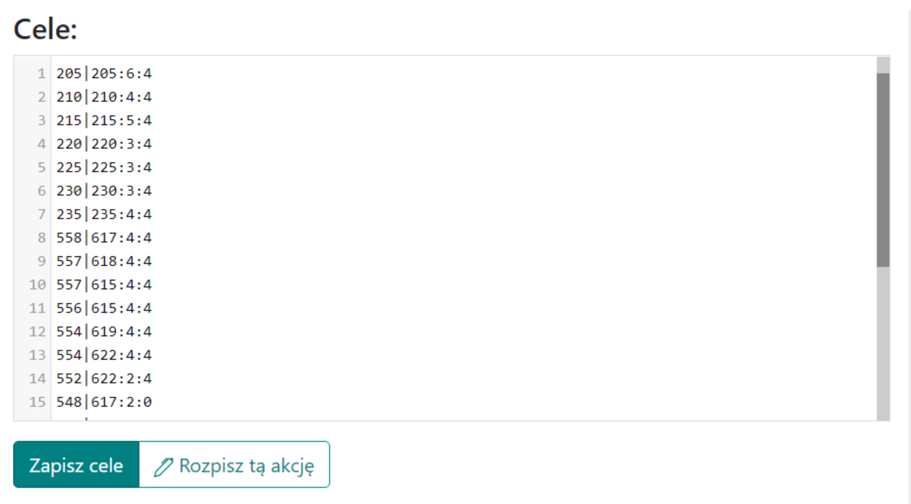

# Mittlere Pläne - Anleitung

Hinweis: Die unten vorgestellte Idee für mittlere Aktionen ist nicht zwingend, sie kann auf beliebige Weise umgesetzt werden, auch indem man sie als kleine oder große Aktionen behandelt.

In dieser Anleitung erfahren Sie, wie Sie eine mittlere Aktion am effektivsten und effizientesten planen, letztendlich in einer etwas späteren Phase der Welt, für weniger als 100 Ziele, bei denen der Stamm während der Aktion bereits meist volle oder etwas kleinere Offs hat. Hinweis: Es wird davon ausgegangen, dass Sie bereits alle Kenntnisse aus [Erste Schritte mit dem Planer](./../first_steps/index.md) haben! und es wird empfohlen, zuerst die beiden kurzen vorherigen Anleitungen in diesem Abschnitt zu lesen, nämlich [Wie man Aktionsziele eingibt und speichert](./two_regions_of_the_tribe.md) und [Zwei Regionen des Stammes: Was ist Front und Heck](./two_regions_of_the_tribe.md).

!!! hint

    Beginnen Sie die Planung jeder Aktion auf dieser Seite immer damit, alle Offs zu zählen und sie gemäß dem Geist des jeweiligen Plans in Front und Heck zu unterteilen. Verwenden Sie dazu die Registerkarte 1. Verfügbare Einheiten, und die Ergebnisse werden in der Tabelle unter den Zielen dargestellt.

Wir werden die Aktion aufgrund der Anzahl der Ziele automatisch planen und alle verfügbaren erweiterten Optionen nutzen. Bei Bedarf können Sie die Einstellungen für jedes Ziel einzeln ändern, entweder in Registerkarte 4, indem Sie den Planungsmodus dafür ändern, oder schließlich nach Erstellung des Plans durch manuelle Bearbeitung ausgewählter Ziele, wie bei kleinen Aktionen.

Für eine mittlere Aktion kann die ausgefüllte Registerkarte wie folgt aussehen:

{ width="600" }

Stellen Sie die Mindestanzahl im Off auf einen angemessenen Betrag ein, wahrscheinlich mehr als 10000 (nur Offs darüber werden in der Tabelle angezeigt), die Entfernung von der Frontlinie auf etwa 5-25. Wenn der Gegner Dioden im Stammesgebiet hat, schließen Sie sie aus, indem Sie sie in das Feld Nicht berücksichtigt bei der Zählung der Front-Offs einfügen. Klicken Sie auf Speichern und Verfügbare aktualisieren. Die Tabelle mit der Anzahl unserer Offs wird ausgefüllt.

Die ausgefüllte Tabelle sollte etwa so aussehen:

{ width="600" }

Hinweis: Die beiden unteren Zeilen der Tabelle werden erst angezeigt, nachdem wir die Ziele ausgefüllt haben, da die dort eingegebenen Mengen davon abhängen, welche Ziele gespeichert sind (die Offs und Adelsgeschlechter werden um sie herum gezählt). Daher stehen dort am Anfang Nullen. Sie können mit der Eingabe von Zielen fortfahren, je nachdem, wie viele Offs und Adelsgeschlechter Sie haben. Dann können Sie die verfügbaren Einheiten neu zählen.

Beispiel für eingegebene Ziele:

{ width="600" }

Verwenden Sie bei Bedarf die erweiterte Kodierung von Offs und Adelsgeschlechtern, die im Artikel Wie man Aktionsziele eingibt und speichert beschrieben ist. Gehen Sie dann zu [Registerkarte 3. Planparameter](./../advanced/3_outline_parameters.md), um die Einstellungen für diesen Plan festzulegen, oder verwenden Sie die oben erwähnte erweiterte Syntax für Ziele.

Beispieleinstellungen für eine mittlere Aktion:

{ width="600" }

Optional können Sie die Standardeinstellung Adelsgeschlechter aus einem Dorf als mehrere Befehle beibehalten, wenn Sie es vorziehen, dass die Spieler separate Befehle für Adelsgeschlechter erhalten. Es lohnt sich jedoch, die Maximale Anzahl von gefälschten Rammböcken aus einem Dorf auf etwas weniger als die standardmäßigen 4 zu ändern und die Option Offs mit Adelsgeschlechtern aufteilen zu aktivieren, was bei etwas größeren Aktionen besser funktioniert.

Zusätzlich können Sie die Moral in [Registerkarte 4](./../advanced/4_morale.md) einstellen.

Das Letzte, was Sie berücksichtigen sollten, ist [Registerkarte 5: Vermeidung von Nachtbonus-Sendungen](./../advanced/5_avoid_night_bonus.md). Dies wird wahrscheinlich von Vorteil sein, zumindest für die Spieler und ihre Gesundheit, aufgrund der reduzierten Anzahl oder Eliminierung von Sendungen mitten in der Nacht :)

Nachdem Sie alle Ziele eingegeben, die Aktionseinstellungen und möglicherweise den Nachtbonus geändert haben, fahren Sie mit dem nächsten Teil des Plans fort, indem Sie auf Diese Aktion planen klicken, überprüfen Sie dann, ob alles in Ordnung ist, und kehren Sie möglicherweise mit der Zurück-Schaltfläche zurück, um die Einstellungen zu ändern. Gehen Sie dann wie gewohnt zur Registerkarte Zeiten, legen Sie die Eingabezeiten fest, schließen Sie den Plan ab und senden Sie die Ziele an die Spieler.
