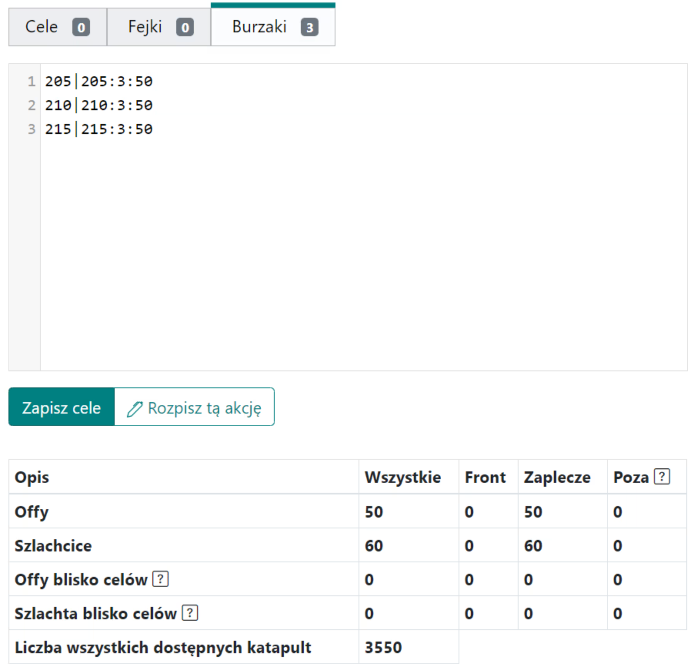
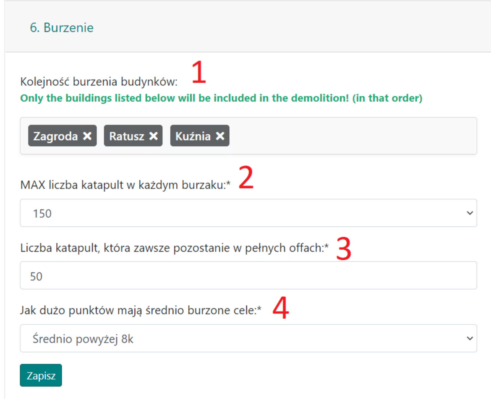
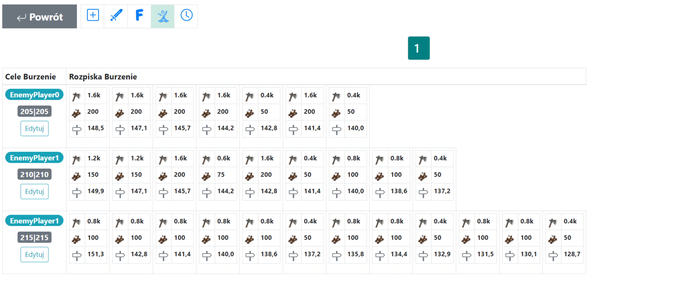

# Zerstörungspläne - Anleitung

In dieser Anleitung erfahren Sie, wie Sie Zerstörungsaktionen planen, die speziell auf die späteren Phasen der Welt abzielen. Hinweis: Dies setzt vollständige Kenntnisse von [Erste Schritte mit dem Planer](./../first_steps/index.md) voraus! Es wird auch empfohlen, zuerst die beiden kurzen vorherigen Anleitungen in diesem Abschnitt zu lesen, nämlich [Wie man Aktionsziele eingibt und speichert](./two_regions_of_the_tribe.md) und [Die zwei Regionen des Stammes, d.h. was ist die Front und das Hinterland](./two_regions_of_the_tribe.md).

!!! hint

    Beginnen Sie die Planung jeder Aktion auf dieser Seite immer damit, alle Truppen zu zählen und sie gemäß der Art des jeweiligen Plans in Front- und Hinterlandtruppen zu unterteilen. Verwenden Sie dazu die Registerkarte 1. Verfügbare Einheiten, und die Ergebnisse werden in einer Tabelle unter den Zielen dargestellt.

Die Aktion wird vollständig im Feld **Belagerungseinheiten** neben den Zielen erstellt. Die Einstellungen in Registerkarte {==6. Belagerungseinheiten==} sind sehr einfach, wo wir hauptsächlich die Reihenfolge der zu zerstörenden Gebäude und die maximale Anzahl von Katapulten bei Zerstörungsangriffen festlegen (das Minimum ist 50).

Beispiel für Zerstörungsziele und Tabellenergebnisse, mit 3 Off-Einheiten und *50 Belagerungseinheiten:

{ width="600" }

Beispiel für die Einstellungen einer Zerstörungsaktion, die auf 3 sichtbare Gebäude in dieser Reihenfolge abzielt:

{ width="600" }

(Hinweis: 50 Belagerungseinheiten bedeuten nicht unbedingt, dass genau diese Anzahl geplant wird!)

Sie können die Anzahl der verfügbaren Belagerungseinheiten schätzen, indem Sie die Registerkarte {==1. Verfügbare Einheiten==} und einfache Mathematik verwenden. Nach jeder Aktualisierung finden Sie die Gesamtzahl der zur Planung bereiten Katapulte in der Tabelle unter **Anzahl aller verfügbaren Katapulte**. Sie müssen nur entscheiden, für wie viele Ziele sie ausreichen werden.

Beispiel für eine geplante Mini-Aktion mit verschiedenen Anzahlen von Katapulten von 200 bis 50:

{ width="600" }

## Optimale Katapultauswahl zur Zerstörung

Schauen wir uns an, wie sich der Planer bei einem MAX von 200 Katapulten verhält. Wenn es Dörfer mit dieser Menge gibt, werden sie priorisiert (über 100 Katapulte), und wenn sie aufgebraucht sind, wird der Rest mit kleineren Mengen gefüllt – 150, 100, 75, 50. Wenn beispielsweise nach mehreren Angriffen noch 10 Gebäudestufen übrig sind, weist der Planer den letzten Angriff mit 50 Katapulten anstelle einer größeren Menge zu (auch wenn verfügbar), um Katapulte zu sparen.

## Off-Einheiten vor Belagerungseinheiten

Was die Off-Einheiten betrifft, deren Anzahl vor den Zerstörungsangriffen angegeben werden kann, ist ihre Rolle auf die von Standard-Off-Einheiten beschränkt. Sie sind nicht Teil des Algorithmus, der ihnen eine bestimmte Anzahl von Katapulten und ein zu zerstörendes Gebäude zuweist – obwohl theoretisch dasselbe Dorf sowohl Off-Einheiten vor der Belagerung als auch Belagerungseinheiten in den geplanten Angriffen senden könnte. Dies sind separate Prozesse, und in der aktuellen Version ist es nicht möglich, dass Off-Einheiten als eine der Belagerungseinheiten "agieren".

## Reihenfolge der Gebäudezerstörung

In den Einstellungen {==6. Zerstörung==} können wir die Reihenfolge der zu zerstörenden Gebäude ändern. Es ist wichtig zu bedenken, dass Gebäude, die nicht in dieser Liste enthalten sind, übersprungen werden und der Algorithmus in zwei Fällen stoppt – entweder gibt es keine Katapulte mehr zu planen oder alle aufgelisteten Gebäude wurden bereits zerstört. Das bedeutet, dass selbst wenn wir uns entscheiden, `000|000:0:1000` zu schreiben, 1000 Belagerungseinheiten wahrscheinlich nicht geplant werden – sobald die aufgelisteten Gebäude zerstört sind, geht der Planer zu den nächsten Schritten über (z.B. dem nächsten Ziel usw.).

## Ich sehe 10.000 verfügbare Katapulte. Wie viele Ziele sind das?

Die Antwort lautet: Es kommt darauf an. Hauptsächlich auf die gewählte Gebäudereihenfolge. Nehmen wir an, es wird nur ein Gebäude gewählt, **[ Schmiede ]**. In diesem Fall reichen 200-250 Katapulte (z.B. 200 und 50 oder 100, 100 oder 50, 50, 50, 50 usw.) aus, um ein Dorf zu zerstören, sodass Sie 40-50 Ziele planen können. Wenn zwei Gebäude gewählt werden, **[ Schmiede, Bauernhof ]**, benötigen Sie 200-250 Katapulte für die Schmiede und 500-700 Katapulte für den Bauernhof (z.B. 14x 50 oder 5x 100, 4x 150, 3x 200 Katapulte oder viele andere Kombinationen), was 700-950 Katapulte pro Dorf oder 10-14 Ziele bedeutet. Unten finden Sie eine einfache Tabelle für 30-stufige Gebäude (wie Bauernhöfe, Speicher, alle Öko-Gebäude) und 20-stufige Gebäude (Hauptgebäude, Schmiede), um zu berechnen, wie viele Ziele möglich sind.

|                    | Anzahl der für die vollständige Zerstörung des Gebäudes erforderlichen Katapulte |
| ------------------ | -------------------------------------------------------------------------------- |
| 20-stufige Gebäude | 200-250                                                                          |
| 30-stufige Gebäude | 500-700                                                                          |

## Zusammenfassung

Denken Sie daran, dass die Planung im Kern auf einem einfachen gierigen Algorithmus basiert, und so weist der Planer **IMMER** Belagerungseinheiten, Fälschungen oder Off-Einheiten **ZUFÄLLIG** auf sehr ähnliche Weise zu. Wenn Sie möchten, dass Off-Einheiten oder Belagerungseinheiten nicht von Fälschungen zu unterscheiden sind, müssen Sie viele Fälschungen planen. Bei der Planung von Zerstörungen lohnt es sich, die Option **Fälschungen aus allen Dörfern** in {==Registerkarte 3. Standard-Aktionseinstellungen==} zu aktivieren, die im Gegensatz zur Standardeinstellung Fälschungen aus allen hinteren Dörfern zuweist.

Zusammenfassend lässt sich sagen, dass Sie die Anzahl der Katapulte berücksichtigen (und wie viele Gebäude es wert sind, zerstört zu werden; vielleicht nur der Bauernhof + Rathaus + Schmiede?) und viele Fälschungen planen sollten. Viel Spaß beim Zerstören!

---

Lassen Sie mich wissen, wenn Sie weitere Details oder Änderungen benötigen!
