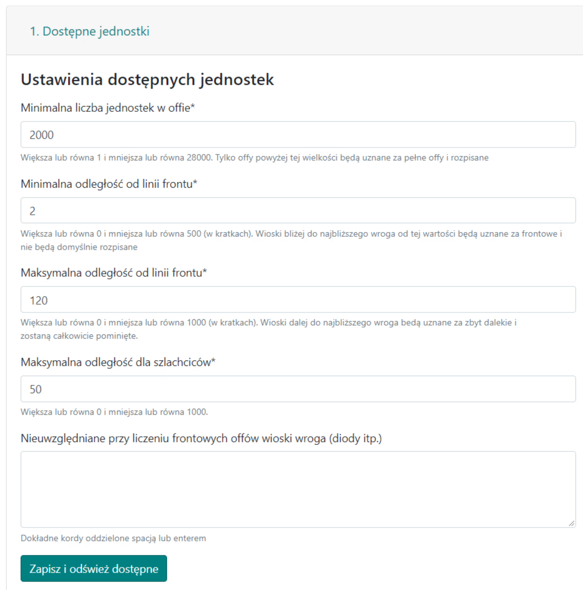
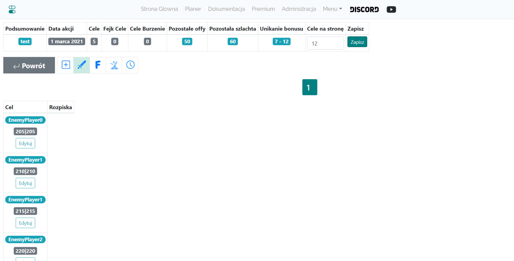
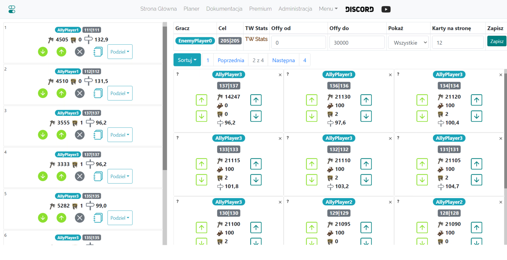

# Kleine Pläne - Anleitung

Hinweis: Die unten stehende Idee für kleine Aktionen ist nicht bindend, sie kann auf beliebige Weise umgesetzt werden, auch indem man sie als mittlere Aktionen behandelt.

In dieser Anleitung erfahren Sie, wie Sie eine kleine Aktion am effektivsten und effizientesten planen, idealerweise in der Anfangsphase der Welt, mit weniger als 25 Zielen (in der Praxis gibt es keine Begrenzung, aber die vorgestellte Methode wird mit zunehmender Anzahl von Zielen immer zeitaufwändiger). Hinweis: Es wird vorausgesetzt, dass Sie alle Kenntnisse aus [Erste Schritte mit dem Planer](./../first_steps/index.md) haben!

!!! hint

    Beginnen Sie die Planung jeder Aktion auf dieser Seite immer damit, alle Offs zu zählen und sie gemäß dem Geist des jeweiligen Plans in Front und Heck zu unterteilen. Verwenden Sie dazu die Registerkarte 1. Verfügbare Einheiten, und die Ergebnisse werden in einer Tabelle unter den Zielen dargestellt.

Die Idee ist, Befehle für alle Ziele manuell zu planen und nicht die automatische Planungsoption zu verwenden. Dafür gibt es mehrere Gründe: Wenn Spieler keine vollen Offs haben, viele Schwere, und die Entfernungen zu den Feinden nicht vernünftig sind (eine Vermischung mit dem Feind ist nicht sinnvoll), verfehlt die automatische Planung von Aktionen ihren Zweck. Es kann genau und schnell manuell erledigt werden - aber manuell mit Hilfe des Planers!, was die Erstellung des Plans und die Verteilung der Ziele maximal beschleunigt. Er wurde ursprünglich für kleine Aktionen entwickelt, bei denen er am besten ist. Der gesamte Überbau für größere Aktionen ist eine spätere Ergänzung.

Für eine kleine Aktion kann die ausgefüllte Registerkarte wie folgt aussehen:

{ width="600" }

Stellen Sie die Mindestanzahl im Off auf einen angemessenen, **kleinen Wert, z.B. 2000**, ein (nur Offs darüber werden in der Tabelle angezeigt), die Entfernung von der Frontlinie ebenfalls klein, d.h. **1-10 Felder**. Klicken Sie auf Speichern und verfügbare aktualisieren. Die Tabelle mit der Anzahl unserer Offs wird ausgefüllt.
Die ausgefüllte Tabelle sollte etwa so aussehen:

{ width="600" }

Hinweis: Die beiden unteren Zeilen der Tabelle werden erst angezeigt, nachdem wir die Ziele ausgefüllt haben, da die dort eingegebenen Mengen davon abhängen, welche Ziele gespeichert sind (um sie herum werden diese Offs und Adelsgeschlechter gezählt). Daher stehen dort am Anfang Nullen. Sie können mit der Eingabe von Zielen fortfahren, je nachdem, wie viele Offs und Adelsgeschlechter Sie haben. Dann können Sie die verfügbaren Einheiten neu zählen.

{ width="600" }

Nachdem Sie die Koordinaten wie oben eingegeben und gespeichert haben, sieht jede Zeile ähnlich wie 000|000:0:0 aus.
Wir ignorieren alle anderen erweiterten Einstellungen, lassen 0 Offs und 0 Adelsgeschlechter in jeder Zeile und klicken auf Diese Aktion planen.

Nach dem Wechsel zur nächsten Registerkarte werden wir feststellen, dass alle Ziele leer sind. Wir fahren mit der Bearbeitung aller Ziele nacheinander fort, indem wir auf Bearbeiten klicken und Befehle von den nächstgelegenen Spielern in der gewählten Reihenfolge planen. Sortieroptionen neben der standardmäßigen Aufsteigend nach Entfernung, Nächste volle Offs und Nächste Adelsgeschlechter werden hilfreich sein.

Oben ist dargestellt, wie ein Ziel in der Anfangsphase des Spiels aussehen könnte, 2 Offs am Anfang, dann 4 Adelsgeschlechter. Denken Sie daran, dass nach dem Hinzufügen von Truppen ihr Status in allen Zielen aktualisiert wird (mit anderen Worten, es ist gut programmiert, Sie werden nicht mehr Truppen planen, als die Spieler maximal besitzen). Nachdem Sie alle Ziele geplant haben, gehen Sie zur Registerkarte Zeiten auf die bereits aus der Testwelt bekannte Weise, legen Sie die Eingabezeiten fest, schließen Sie den den Plan ab und senden Sie den Spielern ihre Ziele.
