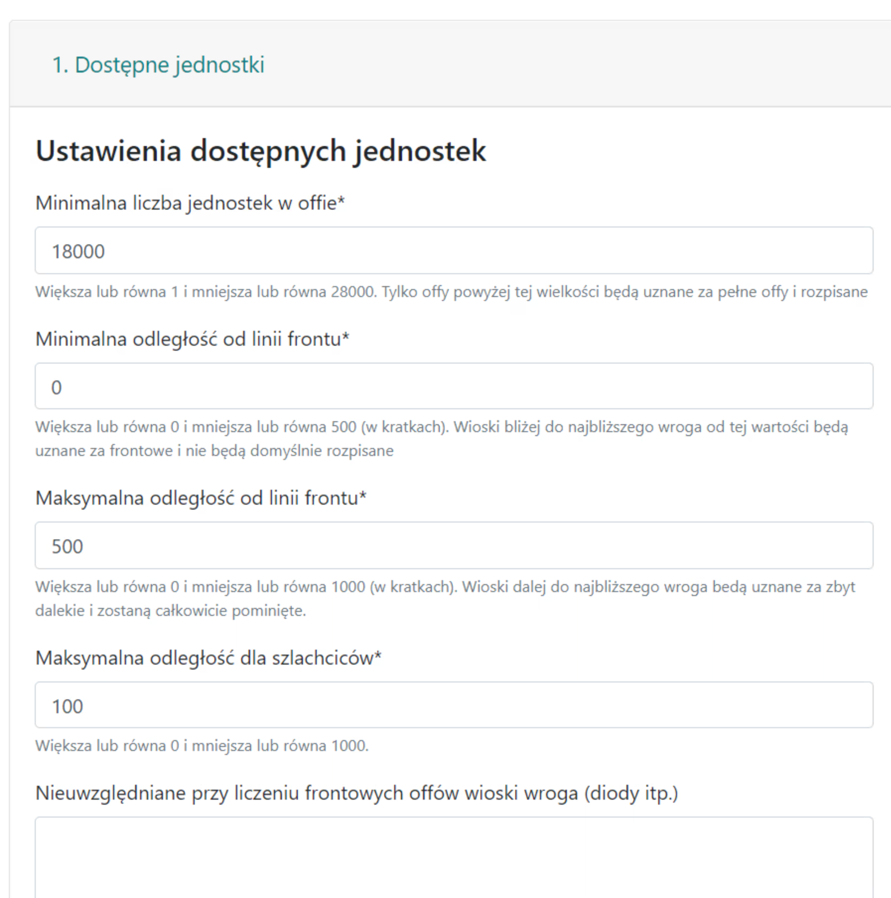

# Zwei Regionen des Stammes - Front und Hinterland

!!! hint

    Beginnen Sie das Aufschreiben jeder Aktion auf dieser Seite immer damit, alle Offs zu zählen und sie gemäß dem Geist der jeweiligen Liste in Front, Hinterland und Darüber hinaus zu unterteilen. Verwenden Sie dazu die Registerkarte 1. Verfügbare Einheiten, und die Ergebnisse werden in der Tabelle unter den Zielen dargestellt.

## Intuition

Die Antwort darauf, Front-Offs nicht Frontmännern zuzuweisen, die sie für den Nahkampf aufbewahren sollten (oder sie auf andere Weise verwenden), während der Aktionsplanung, ist die Aufteilung unserer Dörfer in zwei Hauptgruppen: Front, die Offs und Adelsgeschlechter in der Nähe des Feindes umfasst, und Hinterland, das Offs und Adelsgeschlechter weit vom Feind entfernt umfasst. Ab Version 2.1.0 wurde eine weitere Region namens Darüber hinaus hinzugefügt, die intuitiv sehr weit entfernte Dörfer anzeigt (es gibt aber mehr Anwendungsbeispiele), was das Problem von Offs aus sehr weiter Entfernung löst, die nicht erwünscht sind, aber auch Aktionen mit Offs im Bereich von z.B. 20 Kacheln - 80 Kacheln ermöglicht. Wie genau dies geschieht und wie man es steuert, wird in Kürze erklärt.

Die gesamte Intuition im Zusammenhang mit der Aufteilung kann in den folgenden Bildern zusammengefasst werden:

*Beispiel 1. Aufteilung in Front und Hinterland, grün für Front und gelb für Hinterland*

*Beispiel 2. Aufteilung in Front und Hinterland, rot für den Feind und um ihn herum unser Stamm, grün für Front und gelb für Hinterland*

Unsere Stämme (in blau) umgeben den Feind (in rot), das linke Bild zeigt den Zustand VOR der Anwendung des Algorithmus und das rechte NACH seiner Anwendung. Wir haben alle unsere Dörfer in "Sektoren" unterteilt, abhängig von der Entfernung zum Feind: am nächsten zum Roten - Front, etwas weiter, aber nicht zu weit - Hinterland, und sehr weit entfernte Dörfer blieben blau und zeigen Darüber hinaus an.

Wie unsere Offs und Adelsgeschlechter aufgeteilt werden, hängt von den Einstellungen in Registerkarte 1. Verfügbare Einheiten ab. Betrachten wir einige beliebte Möglichkeiten.

!!! info

    Offs in der Nähe von Zielen und Adelsgeschlechter in der Nähe von Zielen funktionieren identisch mit Offs und Adelsgeschlechtern, außer dass anstatt "alle" Feinde zu berücksichtigen und die Regionen darauf basierend aufzuteilen, nur die vom Benutzer in Ziele eingegebenen Ziele berücksichtigt werden. Dies ist ein viel genaueres Ergebnis, da bekannt ist, wie viele Einheiten wir in der Nähe der Ziele zur Verfügung haben (dies kann stark von dem abweichen, was wir im gesamten Stamm haben).

## Beispiel 1

Beispielergebnis für min. 0 Kacheln und max. 500 Kacheln - was bedeutet, dass wir KEINE "Fronten" und kein "Darüber hinaus" wollen, alles ist Hinterland und alles kann aufgeschrieben werden.

{ width="600" }
*0 Kacheln Front und max. 500 Kacheln Hinterland*

{ width="600" }
*0 Kacheln Front und max. 500 Kacheln Hinterland*

## Beispiel 2

Beispielergebnis für min. 15 Kacheln und max. 100 Kacheln - was bedeutet, dass wir wollen, dass Spieler, die weniger als 15 Kacheln vom Feind entfernt sind, Offs als Frontmänner behalten und wir wollen nicht, dass ein Off weiter vom Ziel entfernt ist als 100 Kacheln (was bedeutet, dass er länger als 2 Tage fliegen würde usw.).

{ width="600" }
*15 Kacheln Front und max. 100 Kacheln Hinterland*

{ width="600" }
*15 Kacheln Front und max. 100 Kacheln Hinterland*

## Beispiel 3

Beispielergebnis für min. 60 Kacheln und max. 120 Kacheln - wenn wir wollen, dass das Hinterland über 60 Kacheln vom Feind und unter 120 Kacheln entfernt ist, z.B. für Aktionen oder Zerstörungen aus der Ferne (und wir machen eine separate aus der Nähe).

{ width="600" }
*60 Kacheln Front und max. 120 Kacheln Hinterland*

{ width="600" }
*60 Kacheln Front und max. 120 Kacheln Hinterland*

Es werden nur Offs angezeigt, die größer als die ausgewählte Mindestanzahl von Einheiten im Off sind. In der aktuellen Version wird auch ck aus Offs erkannt und von ck aus Verteidigungsdörfern unterschieden und gezählt. Das Ergebnis hängt hauptsächlich von den gegnerischen Stämmen ab, die ganz am Anfang bei der Erstellung der Liste ausgewählt wurden. Der Algorithmus ist sehr einfach, um jedes feindliche Dorf wird eine Region in der als Entfernung von der Frontlinie angegebenen Entfernung berechnet. Nimmt man die Summe all dieser Regionen als Ganzes, können wir für jedes verbündete Dorf angeben, ob es sich in der Nähe dieser feindlichen Dörfer befindet (dann ist es Front) oder nicht (dann ist es Hinterland). Daher fügen wir in das Feld Nicht berücksichtigt bei der Zählung der Front-Offs alle feindlichen Dioden ein, um das Ergebnis nicht zu stören.

Die beiden unteren Zeilen berücksichtigen auch die angegebene maximale Entfernung für Adelsgeschlechter, wobei von weniger als der angegebenen Anzahl von Kacheln kein Adelsgeschlecht aufgeschrieben wird. Zusätzlich zählen sie die Anzahl der Offs und Adelsgeschlechter UM die eingegebenen Ziele, also wenn noch keine Ziele eingegeben sind, erhalten wir dort 0.

!!! hint

    Es lohnt sich immer, alle unsere nahegelegenen feindlichen Stämme für die Liste auszuwählen, nicht nur den, auf den wir die Aktion planen. Wenn unser Stamm zwei Fronten mit den Stämmen A und B hat und wir eine Aktion auf A planen wollen, wollen wir trotzdem Front-Offs bei B für den Gebrauch der Frontmänner dort behalten, also fügen wir beide Stämme zu den feindlichen Stämmen hinzu (andernfalls, wenn nur Stamm A da ist, kann es sich herausstellen, dass Front-Offs von B für die Aktion aufgeschrieben werden).
