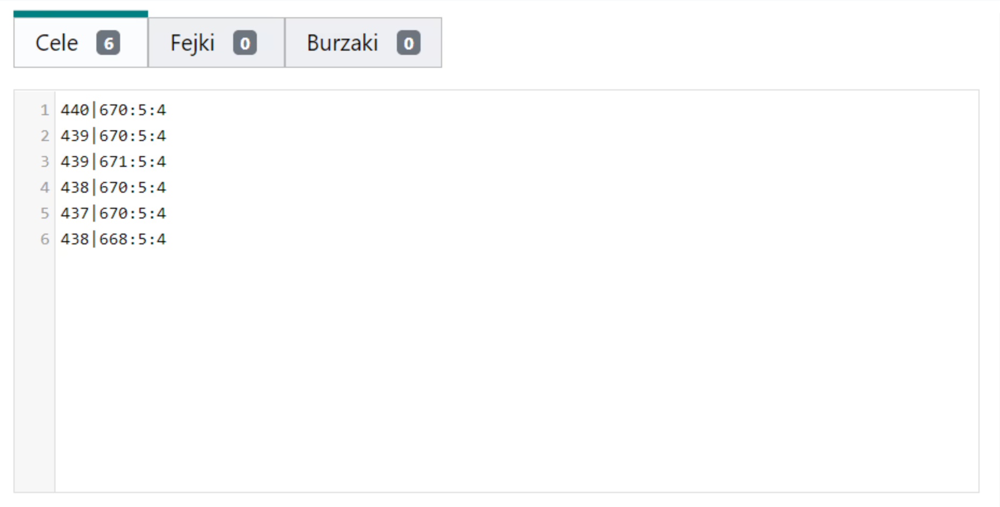
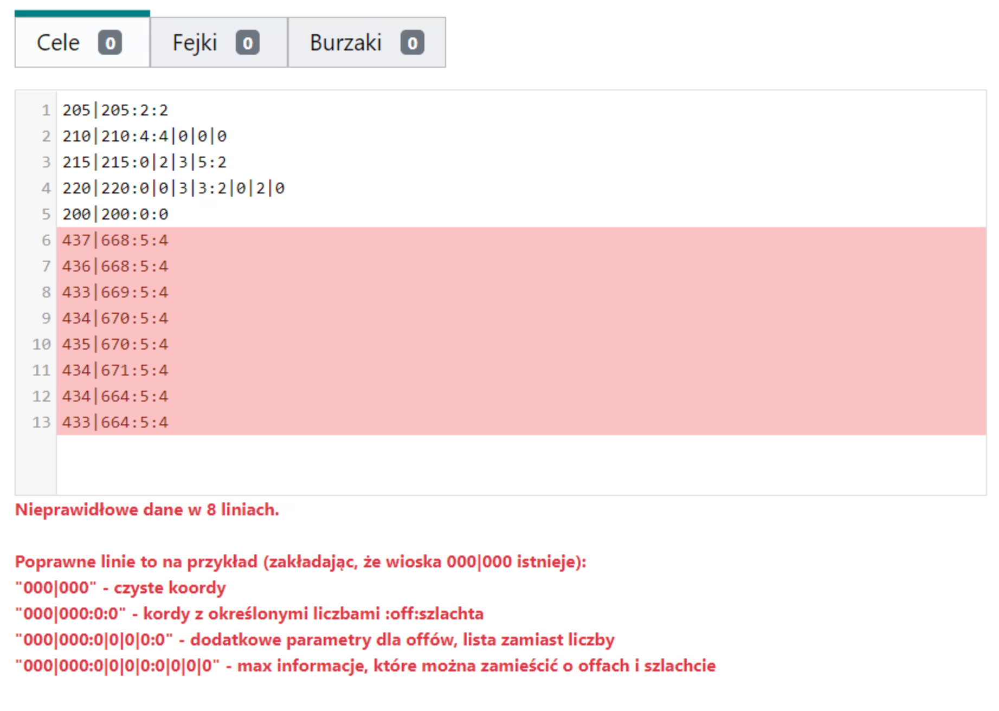

# Die Angriffsziele aufschreiben

Konvention: nachfolgende Aktionsziele müssen in aufeinanderfolgenden Zeilen von Ziele eingegeben werden. Mindestens sind nur die Koordinaten ausreichend, in diesem Fall wird eine Beispielzeile `000|000` zu `000|000:0:0` vervollständigt. Später erfahren Sie, wie Sie die Anzahl der Offensiven und Adligen kodieren. Um die Ziele zu speichern, klicken Sie auf Ziele speichern.

{ width="600" }
*Beispiel 1, Offensiven und Adlige standardmäßig kodiert*

`440|670:5:4` in der ersten Zeile ist ein Beispiel dafür, wie die Anzahl der Offensiven und Adligen für ein bestimmtes Ziel standardmäßig kodiert wird. Die erste Zahl gibt die Anzahl der Offensiven an, und die zweite Zahl gibt die Anzahl der Adligen an.

Der Planer unterstützt drei Arten von Zielen: echt, gefälscht und Abriss. Platzieren Sie echte Ziele in Ziele, gefälschte Ziele in Fälschungen und Abrissziele in Abrisse. Für Fälschungen kodieren Sie anstelle von Offensiven und Adligen die Anzahl der Fälschungen und gefälschten Adligen, und in der Registerkarte Abrisse kodieren Sie die Anzahl der Offensiven und die Anzahl der Abrisse (die den Offensiven folgen).

{ width="600" }
*Beispiel 2, erweiterte Kodierung von Offensiven und Adligen*

Standardmäßig erben Ziele wie in Beispiel 1 den Sendemodus aus Registerkarte 3. Zeitplanparameter, wie z.B. Offensiven zufällig aus dem Hinterland und Adlige von der nächsten Front. Wenn wir zum Beispiel 5 Offensiven zufällig aus dem Hinterland, 2 Offensiven aus dem nahen Hinterland, 1 Adligen von weitem und die letzten 3 Adligen von nah an ein bestimmtes Ziel senden möchten, z.B. Zeile Nummer 3 in Beispiel 2, was `439|671` ist, können wir die erweiterte Syntax verwenden, indem wir eingeben:

```
439|671:2|0|5|0:3|0|0|1
```

In diesem Fall haben wir anstelle einer einzelnen Anzahl von Offensiven 2|0|5|0 und anstelle einer einzelnen Anzahl von Adligen 3|0|0|1 eingegeben. Wir verwenden die erweiterte Syntax, wenn wir einige Befehle von weitem und andere von nah haben möchten; es stehen 4 Regionen unseres Stammes zur Auswahl.

!!! info

    **A|B|C|D** bedeutet: 
A von nah|B aus dem nahen Hinterland|C zufällig aus dem Hinterland|D von weitem

Fehler treten in Standardfällen auf, hauptsächlich wenn das angegebene Dorf in der deklarierten Welt im Zeitplan nicht existiert, oder wenn das Dorf barbarisch ist, und wenn die nach den Koordinaten eingegebenen Zeichen nicht zu den oben aufgeführten Möglichkeiten gehören. Es gibt keine Hindernisse dafür, dass Ziele Dörfer von Stammesmitgliedern sind oder dass dieselben Dörfer mehrmals eingegeben werden (obwohl in diesem Fall oben eine Meldung erscheint, die darauf hinweist, dass Duplikate erkannt wurden). Duplikate sind nicht verboten; jedes eingegebene Ziel, auch wenn es mehrmals erscheint, wird separat behandelt. Dies kann jedoch zu Chaos unter den Spielern führen, da es beispielsweise mehrere gleiche Ziele mit unterschiedlichen Befehlen für sie geben wird (?). Duplikate in verschiedenen Registerkarten (Ziele, Fälschungen, Abrisse) werden nicht gezählt.

{ width="600" }
*Beispiel 3, Fehler beim Speichern*
