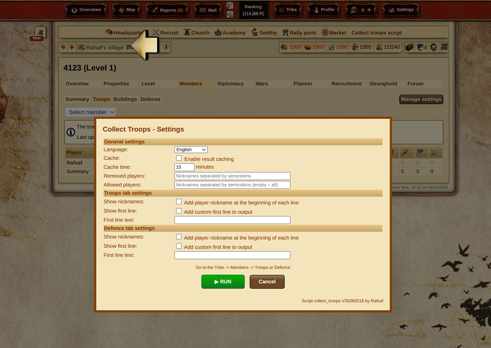

## Installation

Derzeit ist die einzige unterstützte Installationsmethode die Verwendung der **offiziellen Skriptbibliothek** (Einstellungen -> Skriptbibliothek). Suchen Sie danach nach Autor – Rafsaf oder nach dem Namen.


| Server             | Name in der Skriptbibliothek   | Autor  | Code                                                                                                                            |
| ------------------ | ------------------------------ | ------ | ------------------------------------------------------------------------------------------------------------------------------- |
| plemiona.pl        | Zbiórka Wojska i Obrony        | Rafsaf | [Code auf GitHub (v20260218)](https://github.com/rafsaf/scripts_tribal_wars/blob/2026-02-18/public/collect_troops_v20260218.js) |
| tribalwars.net     | Collect troops script          | Rafsaf | [Code auf GitHub (v20260218)](https://github.com/rafsaf/scripts_tribal_wars/blob/2026-02-18/public/collect_troops_v20260218.js) |
| guerretribale.fr   | Script de collecte des troupes | Rafsaf | [Code auf GitHub (v20260218)](https://github.com/rafsaf/scripts_tribal_wars/blob/2026-02-18/public/collect_troops_v20260218.js) |
| tribals.it         | Raccolta delle truppe          | Rafsaf | [Code auf GitHub (v20260218)](https://github.com/rafsaf/scripts_tribal_wars/blob/2026-02-18/public/collect_troops_v20260218.js) |
| guerrastribales.es | Script de colector de tropas   | Rafsaf | [Code auf GitHub (v20260218)](https://github.com/rafsaf/scripts_tribal_wars/blob/2026-02-18/public/collect_troops_v20260218.js) |
| andere Server      | -                              | -      | [Code auf GitHub (v20260218)](https://github.com/rafsaf/scripts_tribal_wars/blob/2026-02-18/public/collect_troops_v20260218.js) |

!!! warning

    Das Skript ist auf vielen Sprachversionen verfügbar – melden Sie das Problem über den Support auf Ihrem Server, damit es dort hinzugefügt werden kann, falls es nicht oben aufgeführt ist. Die Verwendung auf anderen Sprachversionen des Spiels, **wo das Skript nicht erlaubt ist**, kann zur Sperrung des Kontos führen. Benutzung auf eigene Gefahr.

=== "Unterstützte Server"

    Installation nur über die Skriptbibliothek!

=== "Andere Server"

    ```title="Armee- und Verteidigungssammelskript"
    --8<-- "army_script_latest.txt"
    ```

## Gebrauchsanweisung

1. Erstellen Sie ein Skript für die Leiste, gehen Sie zur Stammsicht und klicken Sie darauf
2. Ändern Sie die Einstellungen (optional) und klicken Sie auf Ausführen
3. Warten Sie auf das Ergebnis
4. Gehen Sie zum ausgewählten Zeitplan
5. Fügen Sie die Daten ein und bestätigen Sie

Einstellungen:



Ergebnis:


## Beschreibung

Nach dem Klicken erscheint in der Mitte des Bildschirms ein "Zähler" mit Fortschritt, danach das Ergebnis in einem Fenster. Es funktioniert sowohl in den Registerkarten Armee als auch Verteidigung. Die Standardeinstellungen zum Kopieren haben `Cache` aktiviert und `Cache time` auf 5 Minuten gesetzt. Während dieser Zeit gibt das Skript das im Browser gespeicherte Ergebnis aus, anstatt alle Mitglieder erneut zu durchlaufen und Daten neu zu sammeln. Im Zweifelsfall, ob es sich um ein neues oder altes Ergebnis handelt, erscheint das Sammeldatum unten.

Die durch Ausführen des Skripts generierten Daten sollten in den Zeitplan auf der Website eingefügt werden.

Optionen:

- **Zwischenspeicher**: <boolean> (Standard: `true`) ist für das Speichern des Ergebnisses im Browser verantwortlich, damit Sie nicht versehentlich mehrfach hintereinander klicken und die Spieleserver unnötig belasten. Wenn Sie `false` setzen, speichert das Skript das Ergebnis nicht im Browser (nützlich, z. B. wenn Sie Daten von zwei Stämmen sammeln und sofort zum anderen springen möchten). Hinweis: Wenn der Stamm eine sehr große Anzahl von Dörfern hat, kann dies zu viel Speicherplatz im `localStorage` belegen (~max 5MB), daher beträgt das Limit 1MB. Wenn die Ausgabe > 1MB ist, wird das Speichern in `localStorage` übersprungen.

- **Cache-Zeit**: <number> (Standard: `5`) ist die Zeit, für die das erzeugte Ergebnis im Browser gespeichert wird, in Minuten.

- **Entfernte Spieler**: <string> (Standard: `""`) hier geben Sie die Nicknamen der Spieler ein, von denen Sie keine Überblicksdaten sammeln möchten, getrennt durch Semikolons wie in Nachrichten, z. B. "Rafsaf;kmic;jemand anders".

- **Erlaubte Spieler**: <string> (Standard: `""`) hier geben Sie die Nicknamen der Spieler ein, von denen Sie NUR Überblicksdaten sammeln möchten. Die übrigen werden übersprungen, mit Nicknamen getrennt durch Semikolons wie in Nachrichten, z. B. "Rafsaf;kmic;jemand anders". Hinweis: Der Standardwert `""` hat eine besondere Bedeutung und bedeutet, dass Sie Überblicksdaten von allen Spielern sammeln möchten.

- **Nicknamen anzeigen**: <boolean> (Standard: `false`) wenn der Wert `true` ist, wird dem Ergebnis der Armee-Sammlung in jeder Zeile der Spielernickname hinzugefügt, ähnlich wie auf der Registerkarte Verteidigung.

- **Erste Zeile anzeigen**: <boolean> (Standard: `false`) wenn der Wert `true` ist, wird dem Ergebnis der Armee-Sammlung eine Kopfzeile hinzugefügt, deren Wert im nächsten Parameter, `Text der ersten Zeile`, festgelegt wird.

- **Text der ersten Zeile**: <string> (Standard: `""`) der Wert, der der Kopfzeile im Ergebnis der Armee-Sammlung hinzugefügt wird, wenn `Erste Zeile anzeigen` auf `true` gesetzt ist.

- **Nicknamen anzeigen**: <boolean> (Standard: `false`) wenn der Wert `true` ist, wird dem Ergebnis der Verteidigungs-Sammlung in jeder Zeile der Spielernickname hinzugefügt, ähnlich wie auf der Registerkarte Armee.

- **Erste Zeile anzeigen**: <boolean> (Standard: `false`) wenn der Wert `true` ist, wird dem Ergebnis der Verteidigungs-Sammlung eine Kopfzeile hinzugefügt, deren Wert im nächsten Parameter, `Text der ersten Zeile`, festgelegt wird.

- **Text der ersten Zeile**: <string> (Standard: `""`) der Wert, der der Kopfzeile im Ergebnis der Verteidigungs-Sammlung hinzugefügt wird, wenn `Erste Zeile anzeigen` auf `true` gesetzt ist.
