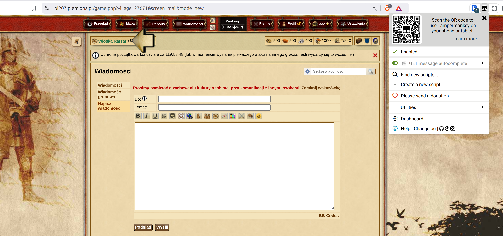
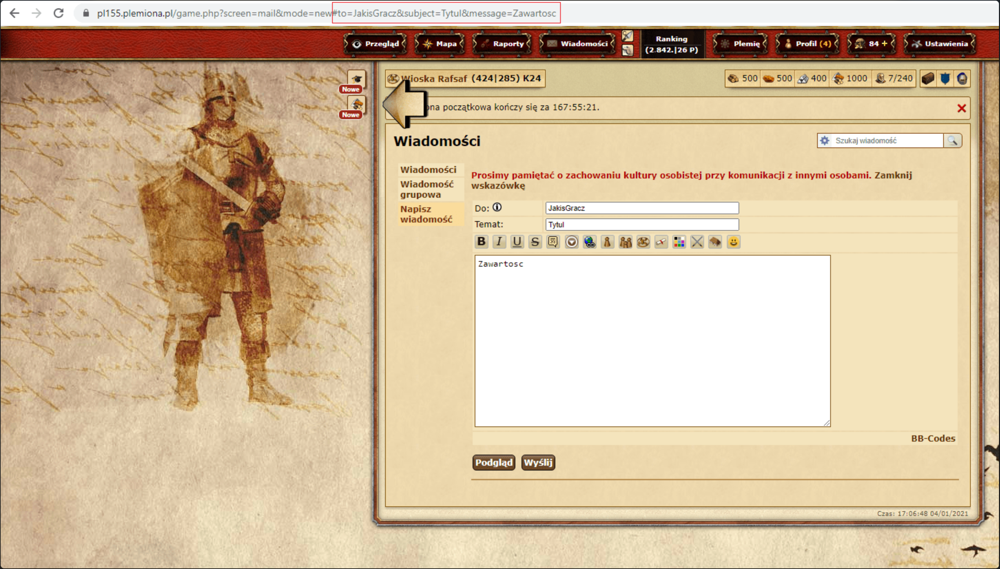

# Skript zum Senden von Nachrichten

| Server        | Die Stämme Forum                                                                                                                                                                         | Erlaubt                          | Code                                                                                                                                   |
| ------------- | ---------------------------------------------------------------------------------------------------------------------------------------------------------------------------------------- | -------------------------------- | -------------------------------------------------------------------------------------------------------------------------------------- |
| plemiona.pl   | [https://forum.plemiona.pl/index.php?threads/auto-uzupe%C5%82nianie-wiadomo%C5%9Bci.128461/](https://forum.plemiona.pl/index.php?threads/auto-uzupe%C5%82nianie-wiadomo%C5%9Bci.128461/) | JA                               | [Code auf GitHub (v2.0)](https://github.com/rafsaf/scripts_tribal_wars/blob/2024-09-01/public/GET_message_autocomplete.js)             |
| andere Server | -                                                                                                                                                                                        | NEIN (kann nicht erkannt werden) | [Code auf GitHub (v2.2)](https://github.com/rafsaf/scripts_tribal_wars/blob/2025-09-22/public/GET_message_autocomplete_v2.2_global.js) |

!!! warning

    Die Verwendung auf anderen Sprachversionen des Spiels, **wo das Skript nicht erlaubt ist**, erfolgt auf eigene Gefahr. Das Skript ist in der polnischen Sprachversion erlaubt und seine Funktionsweise ist völlig unauffindbar, aber für andere Sprachversionen des Spiels (z.B. tschechisch, global) sind sie immer illegal.

=== "plemiona.pl"

    ```title="Auto-Nachrichtenvervollständigungs-Skript"
    --8<-- "sending_messages_script_plemiona_pl.txt"
    ```

=== "andere Server"

    ```title="Auto-Nachrichtenvervollständigungs-Skript"
    --8<-- "sending_messages_script_global.txt"
    ```

## Installation

Um die Skripte zu verwenden, müssen Sie zuerst die entsprechende Browser-Erweiterung (Monkey) installieren:

- [Tampermonkey](https://www.tampermonkey.net/) (Chrome, Opera, Microsoft Edge, Safari, Firefox)
- [Greasemonkey](https://addons.mozilla.org/pl/firefox/addon/greasemonkey/) (Firefox)

Erstellen Sie dann ein neues Benutzerskript und fügen Sie den folgenden Code ein.

Um das Skript in Tampermonkey zu verwenden, müssen Sie den Schalter "Benutzerskripte zulassen" dafür aktivieren oder den Entwicklermodus aktivieren.
Siehe [https://www.tampermonkey.net/faq.php#Q209](https://www.tampermonkey.net/faq.php#Q209).

## Wie man überprüft, ob die Erweiterung funktioniert

Gehen Sie zu "Nachrichten" -> "Nachricht schreiben" auf einer beliebigen Welt.

Stellen Sie sicher, dass die Tampermonkey-Erweiterung aktiviert ist und die Erweiterung "GET message autocomplete" aktiv ist.



## Gebrauchsanweisung

1. Gehen Sie zur Registerkarte Ergebnisse des abgeschlossenen Zeitplans, [siehe dieses Kapitel zur Registerkarte Ergebnisse](./../first_steps/step_7_results_tab.md)
2. Klicken Sie auf {==Senden==}, um neue Registerkarten im Spiel zu öffnen
3. Senden Sie die Nachricht im Spiel
4. Auf der Seite ändert sich der Text in "Gesendet!", fahren Sie fort

## Beschreibung

Ein einfaches und kurzes Browser-Skript, das die Felder **"An"**, **"Betreff"** und **"Nachrichteninhalt"** in einer neuen Nachricht ausfüllt, wenn sie im Link angegeben sind. Es automatisiert das Senden von Nachrichten an Spieler nach der Planung auf der Website und erkennt das Skript und seine Ausführung nur in der neuen Nachrichten-Registerkarte. Ein Anwendungsbeispiel finden Sie unten.

- to - Empfänger
- subject - Betreff
- message - Nachricht

Beispiel:

```text
https://de155.die-staemme.de/game.php?screen=mail&mode=new#to=JakisGracz&subject=Tytul&message=Zawartosc
```




