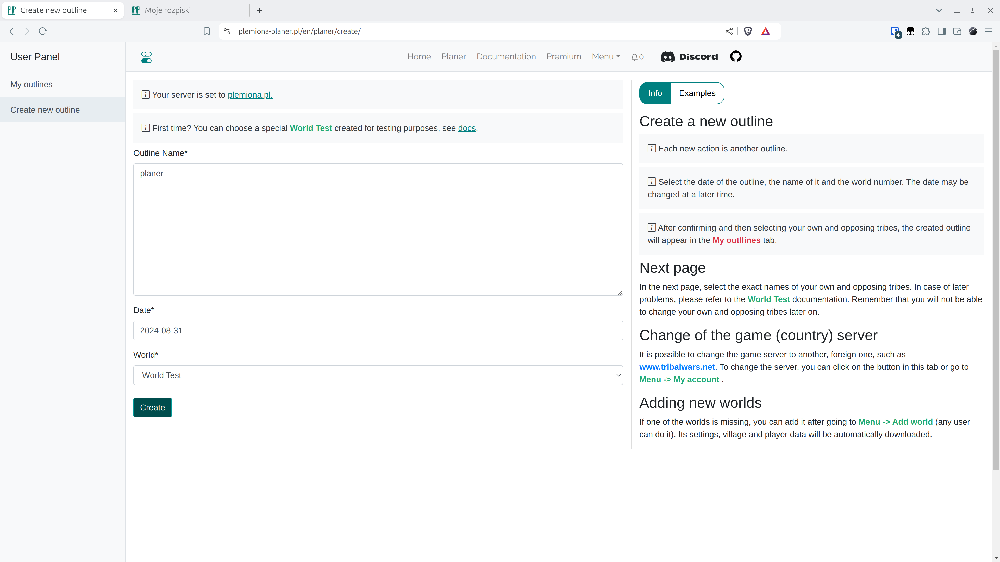

# Step 1 - Create an outline

After creating an account or logging in, you should create a new outline in the {==Create new outline==}, remembering that the selected world of the game would be the test world. In the current version, the date can be freely changed at a later time.

<figure markdown="span">
  
  <figcaption>Choose World Test</figcaption>
</figure>

!!! info

    After clicking Create you will be taken directly to the next page.