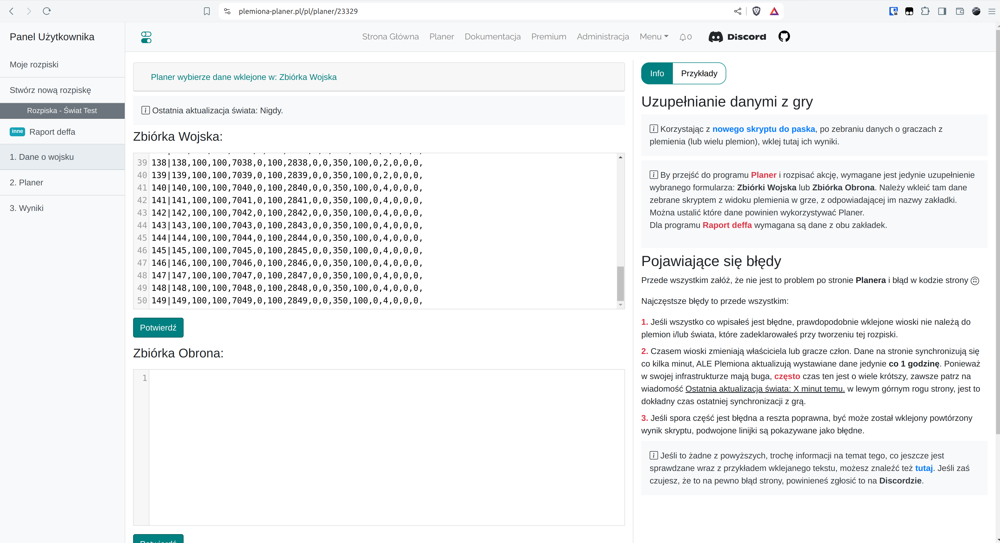

# Step 3 - Filling the Army Collection

To go to the newly created outline, click on its name.

<figure markdown="span">
  
  <figcaption>Click on "planer"</figcaption>
</figure>


Here we paste the results generated by the scripts. They collect information about each player in our tribe into one text field, from where we copy and paste them into the appropriate field in this tab. Here, this output is processed to make sure the pasted information makes sense. First of all, it is checked whether all villages exist in the selected world, whether they have an owner, or whether the owner is in one of the tribes that we have established earlier. Next, the length, the number of commas in each line (militia, knights, archers affect the length of the lines - if they appear, there are more numbers, etc.) and if there are no empty spaces in the middle. However, it is worth knowing that something other than the script result will not pass.

!!! warning

    To go to the next tabs it is necessary to paste the data in this tab, without entering it, you cannot go any further!


For the purposes of the World Test, paste the following data into the Army collection field.

=== "Army collection"

    ```title="army.txt"
    --8<-- "army.txt"
    ```

=== "Deff collection"

    ```title="defence.txt"
    --8<-- "defence.txt"
    ```

Then click on Submit.

<figure markdown="span">
  
  <figcaption>Paste and submit</figcaption>
</figure>
