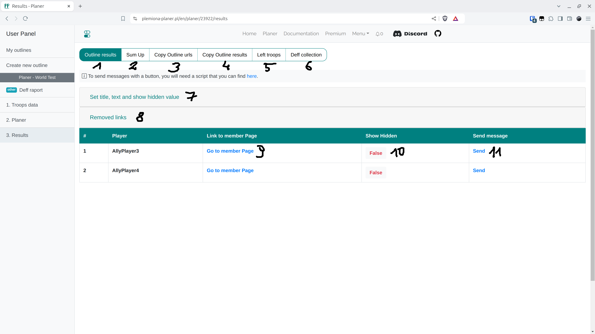

# Step 7 - Results Tab

<figure markdown="span">
  
  <figcaption>Results Tab.</figcaption>
</figure>

| Number | Description                                                                                                        |
| ------ | ------------------------------------------------------------------------------------------------------------------ |
| 1      | Table with links to player targets and links for sending, as well as a form to change the content of sent messages |
| 2      | Short text summary of nicknames and targets                                                                        |
| 3      | Text field with links that can be manually sent to players                                                         |
| 4      | Outline results as a full text to be sent (all players)                                                            |
| 5      | Unused troops for the next outline (PREMIUM)                                                                       |
| 6      | Results of the defense collection from the DEFENSE COLLECTION tab                                                  |
| 7      | Form for the content of the sent message and hiding orders of other players                                        |
| 8      | Table with old links available for this outline                                                                    |
| 9      | This link takes you to a unique page with the player's targets                                                     |
| 10     | Manual option to change the visibility of other players' orders                                                    |
| 11     | Link to send a message in the game, requires [Script for sending messages](./../scripts/sending_messages.md)       |

!!! info

    A {==UNIQUE URL==} has been created for each player where only their targets are presented along with text to paste into notes, and a graphical presentation of their orders. You can access them by clicking on button 9 in the above image. After entering their link, the player has everything they need to send the troops planned in the outline.

By expanding the {==Set title, text and show hidden value==}, which is number 7, you specify the content of the message sent to players and whether players should see the orders of other players in the details of their individual targets. By default, Show hidden - False means they only see their orders and the orders of others only if they are attacking that village with nobles from close by. Setting Show hidden - True allows players to see all orders of others. Under number 8, you will find a table with all created links; after each outline confirmation, new ones are created while the old ones go to this tab (but they remain active!).

Note! Over time and with the development of the application, removable links have been changed (and will remain) to non-removable links, which the user cannot change or block access to, for example, after sending to the wrong person. This convention ensures that the scheduler does not accidentally delete already sent links, which would cause great misunderstandings. Links are active for 30 days, regardless of whether the outline still exists or has been deleted.