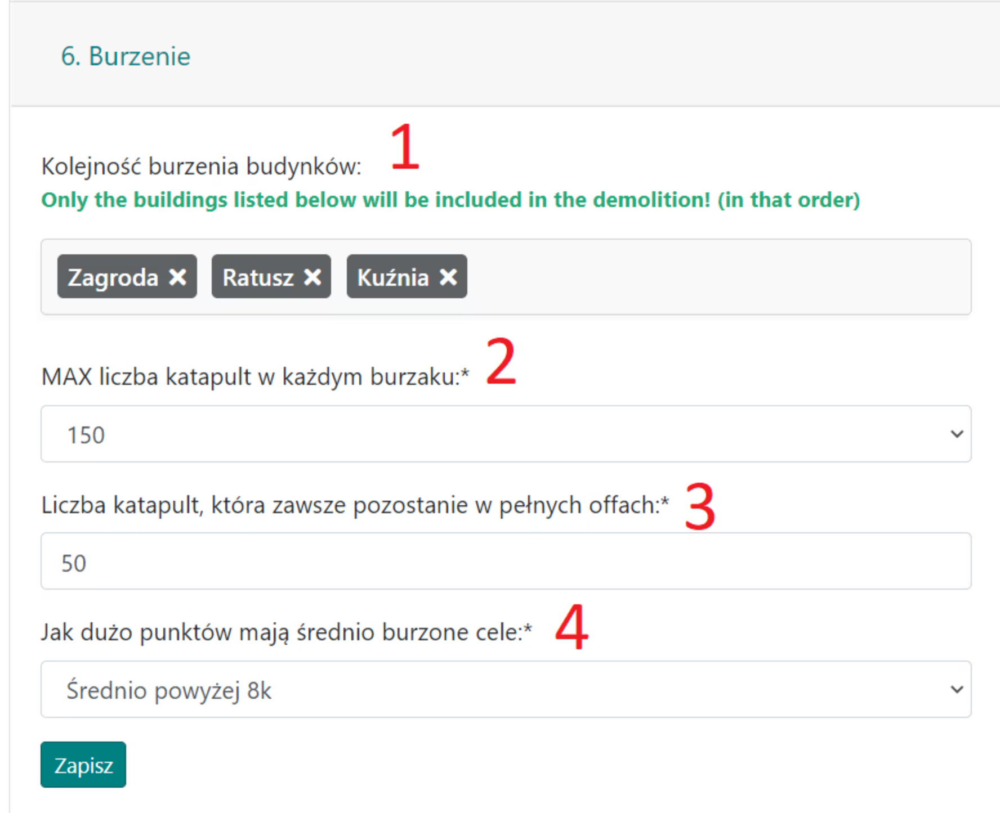
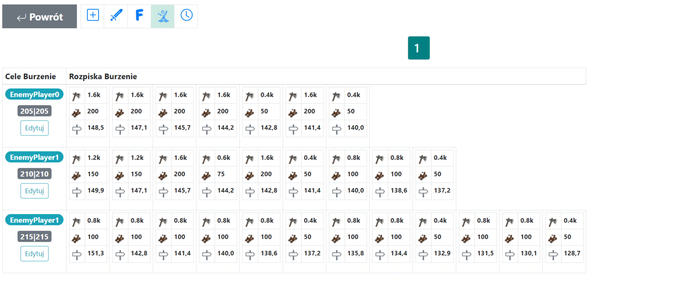

# Ruin Outlines - Guide

In this guide, you will learn how to plan destruction actions, specifically aimed at the later stages of the world. Note: This assumes full knowledge of [First Steps with the Planer](./../first_steps/index.md)! It is also recommended to first read the two short previous guides in this section, namely [How to Input and Save Action Goals](./two_regions_of_the_tribe.md) and [The Two Regions of the Tribe, i.e., What is the Front and the Rear](./two_regions_of_the_tribe.md).

!!! hint

    Always start planning any action on this page by counting all the troops and dividing them into Front and Rear troops in accordance with the nature of the specific plan. For this purpose, use tab 1. Available Units, and the results are presented in a table below the goals.

The action will be fully created in the **Siege Units** field next to the Goals. The settings in tab {==6. Siege Units==} are very simple, where we primarily determine the order of buildings to be destroyed and the maximum number of catapults in destruction attacks (the minimum is 50).

Example of Destruction Goals and Table Results, with 3 off units and *50 siege units:

{ width="600" }

Example of Destruction Action Settings, targeting 3 visible buildings in this order:

{ width="600" }

(Note: 50 siege units do not necessarily mean that this exact number will be planned!)

You can estimate the number of available siege units by using tab {==1. Available Units==} and simple math. After each refresh, you can find the total number of catapults ready for planning in the table under **Number of All Available Catapults**. You just need to decide how many targets they will be sufficient for.

Example of a planned mini-action, with various numbers of catapults from 200 to 50:

{ width="600" }

## Optimal Catapult Selection for Destruction

Let's look at how the Planer behaves for a MAX of 200 catapults. If there are villages with that amount, they will be prioritized (over 100 catapults), and when they are used up, the rest will be filled with smaller amounts—150, 100, 75, 50. Additionally, when, for example, 10 levels of a building remain after several attacks, the Planer will assign the last attack with 50 catapults instead of a larger amount (even if available) to save catapults.

## Off Units Before Siege Units

As for off units, whose number can be specified to enter before the destruction attacks, their role is limited to that of standard off units. They are not part of the algorithm that assigns them a specific number of catapults and a building to destroy—though theoretically, the same village could send both off units before the siege and siege units in the planned attacks. These are separate processes, and in the current version, it is not possible for off units to "act" as one of the siege units.

## Building Destruction Order

In settings {==6. Destruction==}, we can change the order of buildings to be destroyed. It's important to remember that buildings not included in this list will be skipped, and the algorithm stops in two cases—either there are no more catapults to plan or all listed buildings have already been destroyed. This means that even if we decide to write `000|000:0:1000`, 1000 siege units will likely not be planned—once the listed buildings are destroyed, the Planer moves on to the next steps (e.g., the next goal, etc.).

## I See 10,000 Available Catapults. How Many Targets Is That?

The answer is: it depends. Mainly on the chosen building order. Let’s assume only one building is chosen, **[ Smithy ]**. In this case, 200-250 catapults (e.g., 200 and 50 or 100, 100, or 50, 50, 50, 50, etc.) are enough to destroy one village, so you can plan 40-50 targets. If two buildings are chosen, **[ Smithy, Farm ]**, you will need 200-250 catapults for the Smithy, and 500-700 catapults for the Farm (e.g., 14x 50, or 5x 100, 4x 150, 3x 200 catapults or many other combinations), meaning 700-950 catapults per village, or 10-14 targets. Below is a simple table for 30-level buildings (such as Farms, Warehouses, all eco-buildings) and 20-level buildings (Headquarters, Smithy) to help calculate how many targets are possible.

|                    | Number of Catapults Required for Complete Building Destruction |
| ------------------ | -------------------------------------------------------------- |
| 20-level Buildings | 200-250                                                        |
| 30-level Buildings | 500-700                                                        |

## Summary

Remember that at its core, the planning is based on a simple greedy algorithm, and so the Planer **ALWAYS** assigns siege units, fakes, or off units **RANDOMLY** in a very similar way. If you want off units or siege units to be indistinguishable from fakes, you need to plan a lot of fakes. When planning destruction, it’s worth enabling the **Fakes from All Villages** option in {==Tab 3. Default Action Settings==}, which, unlike the default setting, assigns fakes from all rear villages.

In conclusion, consider the number of catapults (and how many buildings are worth destroying; perhaps only the Farm + town hall + Smithy?) and plan a lot of fakes. Enjoy the demolishing!

---

Let me know if you need any other details or changes!