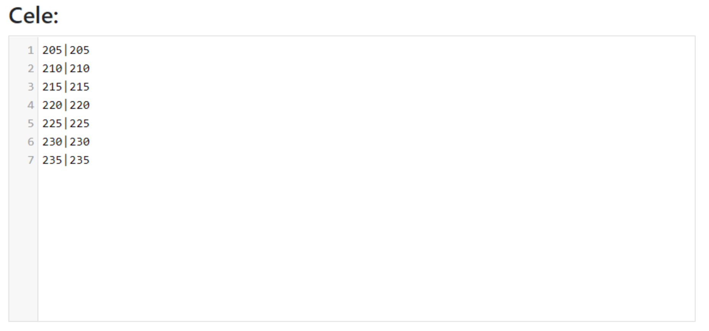
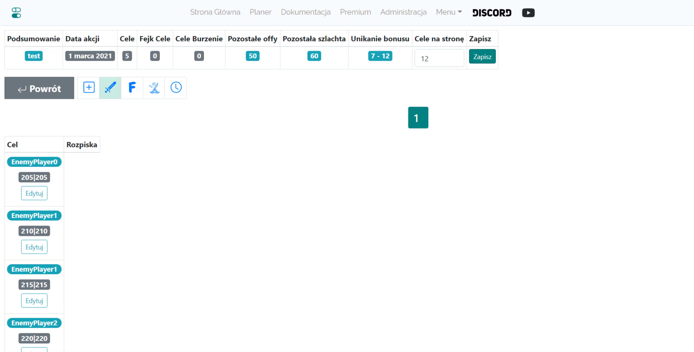

# Small Outlines - Guide

Note, the idea for small actions below is not binding, it can be done in any way, even treating them as medium actions.

In this guide, you will see how to most effectively and efficiently outline a small action, ideally at the initial stage of the world, with fewer than 25 targets (in practice, there is no limit, but the presented method will become increasingly time-consuming as the number of targets increases). Note, all knowledge from [First steps with the Planer](./../first_steps/index.md) is assumed!

!!! hint

    Always start outlining any action on this page by counting all offs and dividing them into Front and Back according to the spirit of the given outline. For this purpose, use tab 1. Available units, and the results are presented in a table under the targets.

The idea is to manually outline orders for all targets and not use the automatic outlining option. There are several reasons for this: when players do not have full offs, many heavies, and the distances to enemies are not reasonable (mixing with the enemy is not reasonable), automatic outlining of actions misses the point. It can be done accurately and quickly manually - but manually with the help of the Planer!, which speeds up the creation of the outline and the distribution of targets to the maximum. It was initially created for small actions, in which it is the best. The entire overlay for larger actions is a later addition.

For a small action, the completed tab may look as follows:

{ width="600" }

Set the minimum number in the off to an adequate, **small value, e.g., 2000**, (only offs above this will be shown in the table), the distance from the front line also small, i.e., **1-10 fields**. Click Save and refresh available. The table with the number of our offs will be completed.
The completed table should look something like this:

{ width="600" }

Note, the two bottom rows of the table will appear only after we complete the targets, as the quantities entered there depend on what targets are saved (it is around them that these offs and nobles are counted). Hence, at the beginning, there will be zeros there. You can proceed to enter targets depending on the number of offs and nobles you have. Then you can recount Available units.

{ width="600" }

After entering the coordinates as above and saving them, each line will look similar to 000|000:0:0.
We ignore all other advanced settings, leaving 0 offs and 0 nobles in each line and click Outline this action.

After moving to the next tab, we will notice that all targets are empty. We proceed to edit all targets sequentially by clicking Edit and outline orders from the nearest players in the chosen order, sorting options besides the default Ascending by distance, Nearest full offs, and Nearest nobles will be helpful.

Above is shown how a target might look like in the initial stage of the game, 2 offs at the beginning, then 4 nobles. Remember that after adding troops, their status is updated in all targets (in other words, it is well programmed, you will not outline more troops than the maximum owned by players). After outlining all targets, proceed to the Times tab in the way already known from the Test World, set entry times, complete the outline, and send players their targets.