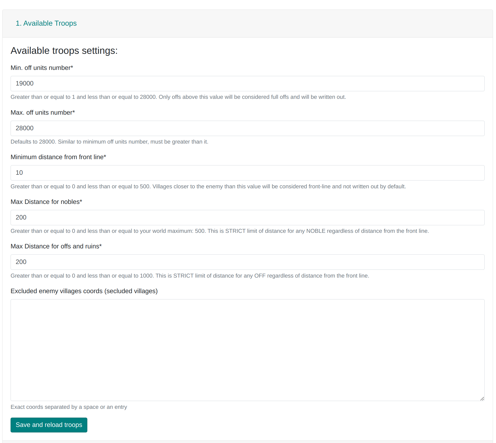

# 1. Elérhető csapatok és a táblázat leírása

Ez a fül a klánunk falvainak Frontvonalra és Hátországra való felosztására szolgál. Mivel ennek megértése alapvető a webhely használatához, leírásának egy része más füleken is megtalálható, beleértve ezt a cikket is:
[A klán két régiója: mi a Frontvonal és a Hátország](./../primary/two_regions_of_the_tribe.md).

- **Min. támadó egységek száma** és **Max. támadó egységek száma**

  Adja meg a támadások mérettartományát (a tanyában lévő népesség szempontjából), amelyeket tervezni kell.

  Például, ha a tartomány 10 000-12 000, a Tervező kihagyja a 12 000-nél nagyobb és a 10 000-nél kisebb támadásokat is. A figyelembe vett kémek maximális száma 200; a többit figyelmen kívül hagyja. A nemesek x6 egységként számítanak, csak ha **több a támadó egység, mint a védekező**. A pontos kód [itt](https://github.com/rafsaf/Tribal-Wars-Planer/blob/ecc7ff31ed122928a7aea6199af4a0f9ce4718fd/utils/basic/army.py#L242-L250) található.

- **Minimális távolság a frontvonaltól**

  A mezőkben megadott érték a frontvonal kiszámításához, amely alapján a frontvonalbeli falvak meghatározásra kerülnek. A Frontvonal/Hátország/Külső felosztás pontos kódja [itt](https://github.com/rafsaf/Tribal-Wars-Planer/blob/ecc7ff31ed122928a7aea6199af4a0f9ce4718fd/utils/basic/cdist_brute.py#L83-L99) található. A felosztás mögötti teljes intuíció megtalálható az [A klán két régiója: mi a Frontvonal és a Hátország](./../primary/two_regions_of_the_tribe.md) útmutatóban.

- **Max távolság a nemeseknek**

  Alapértelmezés szerint ez a maximális távolságérték mezőkben az adott világra. Nagyobb értéket nem lehet beállítani (ilyen támadásokat nem lehetne küldeni).

- **Max távolság a támadóknak és rombolásoknak**

  A Tervező nem rendel támadásokat olyan falvakból, amelyek távolabb vannak az ellenségtől, mint ez az érték. Ezt használják a "Külső" régióban lévő falvak hozzávetőleges számának megadására is, vagyis azokéra, amelyeket kihagynak.

- **Kizárt ellenséges falvak koordinátái (elszigetelt falvak)**

  Adja meg az összes ellenséges inaktív fiókot a klánunk területén. **Érdemes** ezt megtenni, mert például 10 mezős **Minimális távolság a frontvonaltól** esetén az ellenséges inaktív fiókok körüli 10 mezős terület természetesen frontvonalnak minősül, és az erről a területről származó támadásokat a terv kihagyja. Azonban néha jobb döntés a szigetek körüli támadásokat helyi használatra tartani, és itt nem megadni az ellenséges inaktív fiókokat.
