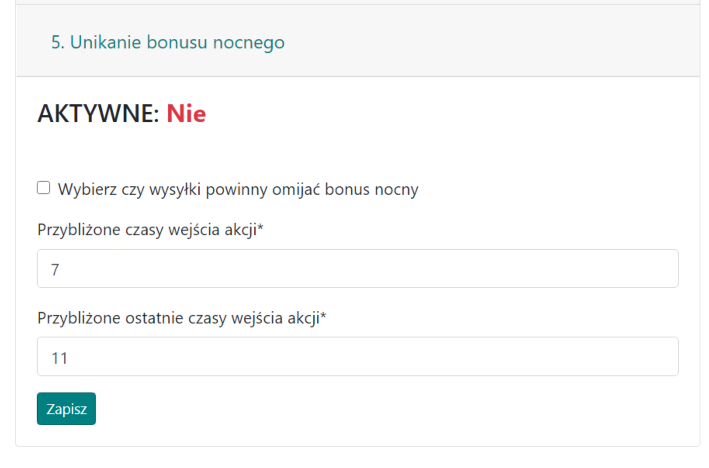
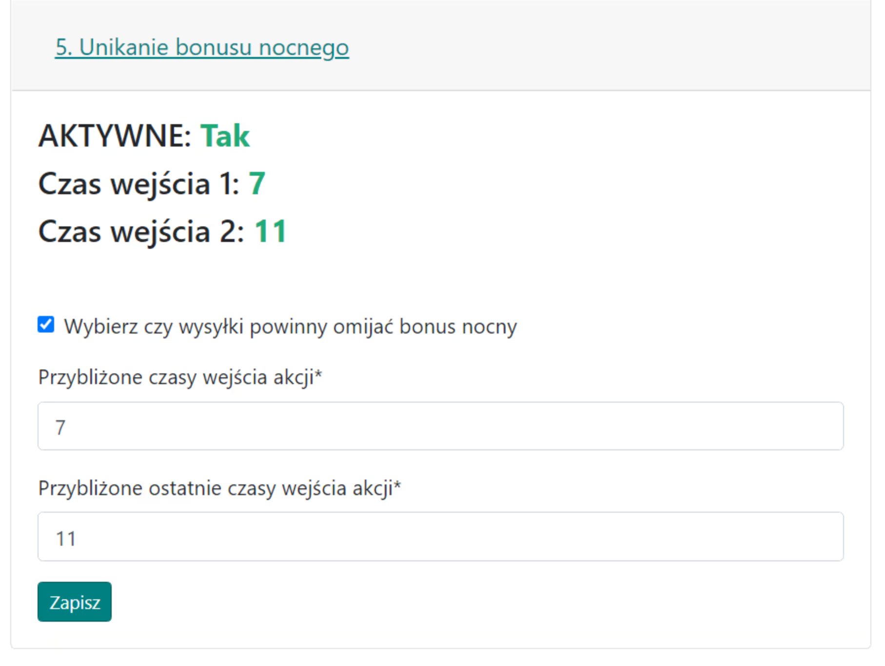

# 5. Éjszakai bónusz elkerülése

A fül arra szolgál, hogy opcionálisan beállítsuk az éjszakai bónusz elkerülését a generált parancsoknál a támadásokhoz és hamis támadásokhoz. A nemesek normálisan, egész nap ütemezhetők lesznek! Ez nem jelenti az éjszakai küldések lehetőségének teljes kiküszöbölését, csak azok minimalizálását.

Ha aktiválva van, a Tervező elkerüli a {==küldéseket==} (a támadásokat küldő játékos szemszögéből, nem a védőéből) a **00:00-07:00** órák között, és ezeket az órákat a játék jelenlegi verziójában nem lehet megváltoztatni.

A fül megjelenése letiltott állapotban:

{ width="600" }

Alapértelmezés szerint ez az opció le van tiltva; jelölje be az első négyzetet az engedélyezéséhez. Mivel a támadások pontos belépési idejét a legvégén, az Idők fülön határozzuk meg, itt csak hozzávetőleges belépési órákat adunk meg az összes támadáshoz vagy azok többségéhez. Referenciaként a legtöbb támadást reggelre tervezik, pl. a támadások 7-11 között érkeznek, ezért ilyen két órát adunk meg az űrlapon.

A fül megjelenése engedélyezett állapotban:

{ width="600" }
