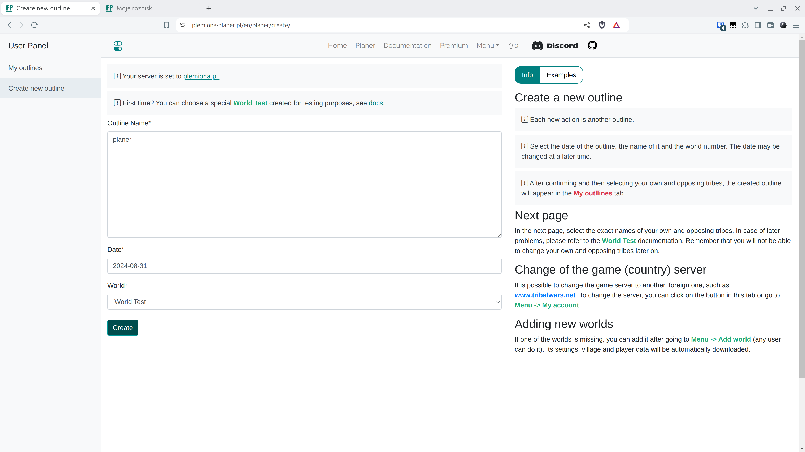

# 1. lépés - Terv létrehozása

Fiók létrehozása vagy bejelentkezés után hozzon létre egy új tervet a {==Új terv létrehozása==} menüpontban, ügyelve arra, hogy a kiválasztott játékvilág a teszt világ legyen. A jelenlegi verzióban a dátum később szabadon módosítható.

<figure markdown="span">
  
  <figcaption>Válassza a Teszt Világot</figcaption>
</figure>

!!! info

    A Létrehozás gombra kattintva közvetlenül a következő oldalra kerül.
