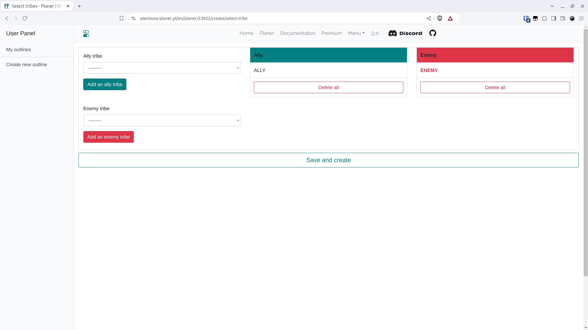

# 2. lépés - Klánok kiválasztása

Minden tervben ki kell választani a pontos klánt vagy klánokat, a miénket (támadó) és az ellenfelet (támadott). Ha több van ezekből, akkor többet választunk. A Teszt Világban pontosan két klán van, {==ALLY==} és {==ENEMY==}, a mi klánunkat ALLY-ként, az ellenfelet pedig ENEMY-ként állítjuk be, ne felejtsük el a HOZZÁADÁS gombra kattintani. Megerősítjük. Érdemes megjegyezni, hogy ha itt nem adjuk meg a klánt, és a következő fülön a Sereggyűjtésbe beillesztjük az áttekintését, akkor egy csomó hibát kapunk - a Tervező mindig ellenőrzi, hogy a felhasználó által beillesztett adatoknak van-e értelme - beleértve azt is, hogy az összes beillesztett falu az egyik megadott klánban van-e.

<figure markdown="span">
  
  <figcaption>Válassza ki a szövetséges és ellenséges klánokat</figcaption>
</figure>
