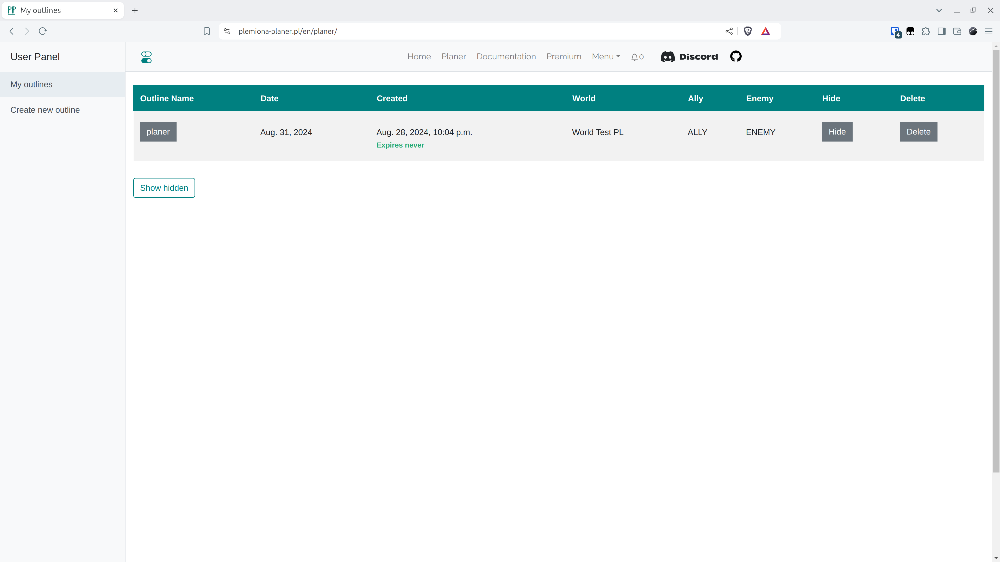

# 3. lépés - A Sereggyűjtés kitöltése

Az újonnan létrehozott tervhez való ugráshoz kattintson a nevére.

<figure markdown="span">
  
  <figcaption>Kattintson a "tervező" gombra</figcaption>
</figure>

Itt illesszük be a szkriptek által generált eredményeket. Ezek összegyűjtik a klánunk minden játékosáról szóló információkat egy szöveges mezőbe, ahonnan másoljuk és beillesztjük a megfelelő mezőbe ezen a fülön. Itt ez a kimenet feldolgozásra kerül, hogy megbizonyosodjunk arról, hogy a beillesztett információknak van értelme. Először is ellenőrzi, hogy az összes falu létezik-e a kiválasztott világban, van-e tulajdonosuk, vagy a tulajdonos az egyik korábban megadott klánban van-e. Ezután a hosszúságot, a vesszők számát minden sorban (a milícia, lovagok, íjászok befolyásolják a sorok hosszát - ha megjelennek, több szám van, stb.), és hogy nincsenek-e üres helyek a közepén. Azonban érdemes tudni, hogy a szkript eredményétől eltérő dolog nem fog átmenni.

!!! warning

    A következő fülekre való továbblépéshez szükséges az adatok beillesztése ezen a fülön, enélkül nem lehet továbbmenni!

A Teszt Világ céljaira illessze be a következő adatokat a Sereggyűjtés mezőbe.

=== "Sereggyűjtés"

    ```title="army.txt"
    --8<-- "army.txt"
    ```

=== "Védelemgyűjtés"

    ```title="defence.txt"
    --8<-- "defence.txt"
    ```

Ezután kattintson a Küldés gombra.

<figure markdown="span">
  
  <figcaption>Beillesztés és küldés</figcaption>
</figure>
