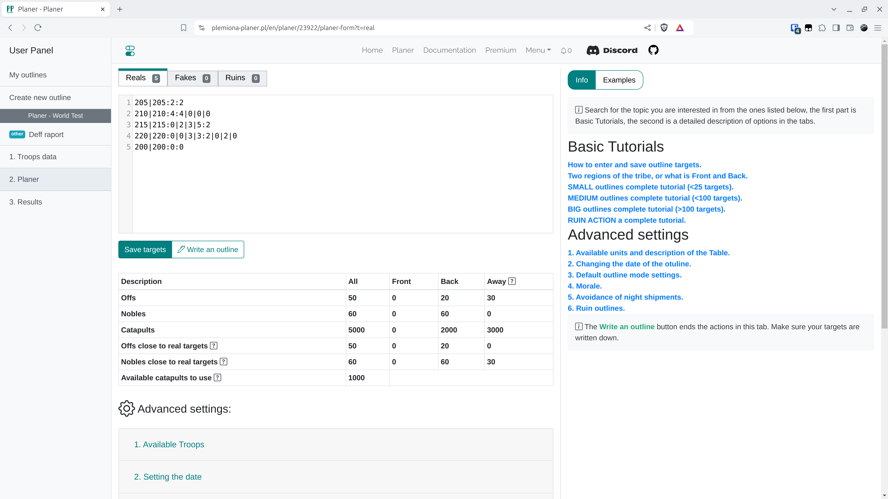

# 4. lépés - Célpontok és beállítások mentése és terv írása

A Tervező fülön helyezze el a terv célpontjait a fülön leírtak szerint, a {==Célpontok mentése==} gombra kattintva frissítjük a célpontokat, amelyekre a tervet írjuk. A {==Terv írása==} gombra kattintva befejezzük ezt a részt, és a következő fülekre lépünk. Mielőtt elkezdené saját terveit írni, olvassa el az Önt érdeklő típus leírását, és a legjobb, ha kísérletezik a Fronttól való különböző távolságok beállításával, a nemesek maximális távolságával, megváltoztatja a terv haladó módjait, majd kattintson a Terv írása gombra, és nem kielégítő eredmények esetén térjen vissza a **Vissza** gombra kattintva.

A Teszt Világon illessze be az alábbi adatokat és mentse el.

=== "Valódi"

    ```title="targets.txt"
    --8<-- "targets.txt"
    ```

!!! info

    A célpontokat többféleképpen lehet beilleszteni, a legegyszerűbb módja a következő sorok beillesztése csak koordinátákként, ekkor alapértelmezés szerint a támadások és a nemesség száma 0-ként lesz kitöltve. A támadások és a nemesség számát a legkönnyebben kódolhatjuk, pl. `koordináták:2:2`, ami azt jelenti, hogy `koordináták:két-támadás:két-nemes`, vagy pontosabban, a `koordináta:2:1|1|1|1` bejegyzés 2 támadást és 1 nemest jelent közelről, 1 közeli hátról, 1 véletlenszerűen, 1 távolról. A Hamis és Rombolás célpontokat ugyanígy adja meg a megfelelő füleken.

Az egész fül főként két célt szolgál, a célpontok megadását és a tervek hozzárendelésének automatikus beállításait. A Teszt Világ megismerése céljából csak a front- és hátországi falvakkal teli táblázatot fogjuk kitölteni, amely a célpontok mentésére és a tervek írására szolgáló gombok alatt látható. Ha érdekli a többi fül, a dokumentáció más részeiben többet is megtudhat róluk.

<figure markdown="span">
  
  <figcaption>Mentett célpontok</figcaption>
</figure>

Bontsa ki az első fület {==1. Elérhető csapatok==}. Hagyja az összes alapértelmezett értéket. A cél az, hogy az összes falunkat három csoportra osszuk, Front, Hátország és Távoli (nagyon távoli) a megadott ellenséges klánoktól függően (a legközelebbi ellenséghez mért távolságot számoljuk minden falunkra). Érvényesítse az űrlapot a Mentés és csapatok újratöltése gombra kattintva.

A következő eredményeket kell látnia a táblázatban:

<figure markdown="span">
  
  <figcaption>Kiszámított támadások és nemesek a célpontok közelében</figcaption>
</figure>

Most kattintson a {==Terv írása==} gombra, itt az ideje a következő fülnek :)

!!! info

    Különböző tervek esetén a felbontásuk kissé eltérő lesz. Kisebb akciók esetén, pl. a világok kezdeti szakaszában, érdemes minden célt külön-külön finomítani egy kényelmes szerkesztésben, de hatalmas akciók esetén ez természetesen lehetetlen, akkor inkább a Tervező fülre és az ott elérhető beállításokra kell összpontosítani.
