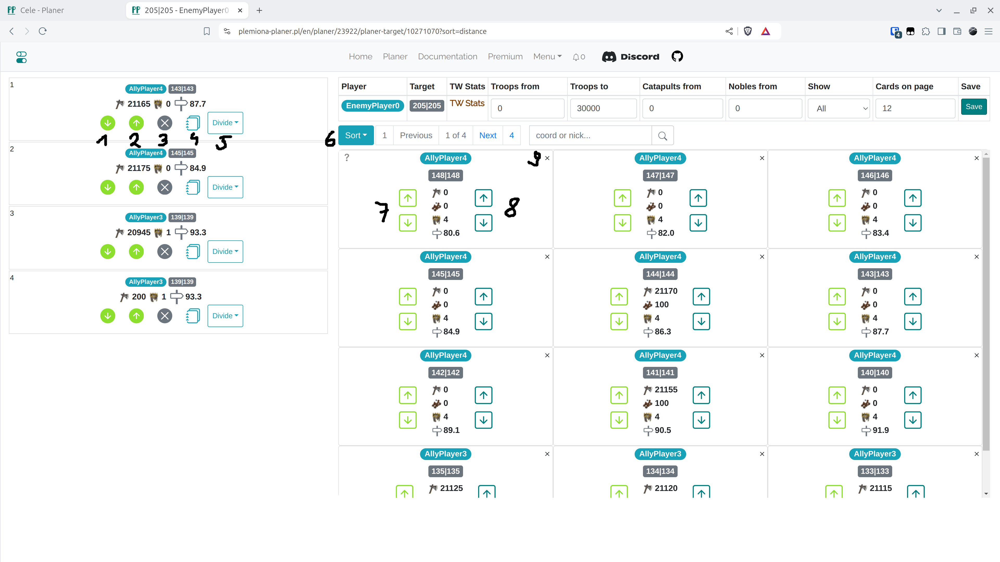

# 5. lépés - Terv szerkesztése

A következő nézet a támadás a korábbi fül beállításai alapján. Lehetőség van az egyes célpontok kézi szerkesztésére, célpontok hozzáadására és keresésre.

<figure markdown="span">
  
  <figcaption>Menü fül</figcaption>
</figure>

| Szám | Leírás                                                                           |
| ---- | -------------------------------------------------------------------------------- |
| 1    | Visszatérés az előző fülre, az ütemterv visszaállítása                           |
| 2    | Új célpontok kézi hozzáadása                                                     |
| 3    | Valódi célpontok megtekintése (aktuális fül)                                     |
| 4    | Hamis célpontok megtekintése                                                     |
| 5    | Rombolási célpontok megtekintése                                                 |
| 6    | Időbeállítási fül, a [következő lépésben](./step_6_set_time_finish.md) tárgyalva |
| 7    | Keresés                                                                          |
| 8    | Navigáció az oldalak között                                                      |
| 9,10 | Egyetlen támadási célpont szerkesztése                                           |

Kattintson a "Szerkesztés" gombra az első célpontnál (9. szám). Az egyetlen célpont szerkesztési nézete **egy új böngészőlapon** nyílik meg.

<figure markdown="span">
  
  <figcaption>Egyetlen célpont szerkesztése</figcaption>
</figure>

| Szám | Leírás                                                                                                                            |
| ---- | --------------------------------------------------------------------------------------------------------------------------------- |
| 1    | A parancs lefelé mozgatása                                                                                                        |
| 2    | A parancs felfelé mozgatása                                                                                                       |
| 3    | A parancs törlése (az egységek automatikusan visszakerülnek a szabad készletbe a képernyő jobb oldalán)                           |
| 4    | Az egységek számának szerkesztése ebben a parancsban                                                                              |
| 5    | Felosztás több parancsra                                                                                                          |
| 6    | Szabad, még elérhető egységek rendezése                                                                                           |
| 7    | Támadások hozzáadása az elejére vagy a végére                                                                                     |
| 8    | Támadások hozzáadása nemesekkel együtt az elejére vagy a végére                                                                   |
| 9    | A falu elrejtése. A képernyő tetején lévő szűrővel is elrejtheti. A "Megjelenítés" opció megváltoztatásával újra láthatóvá teheti |

Bármilyen változtatás után {==zárja be a böngészőfület==}.
