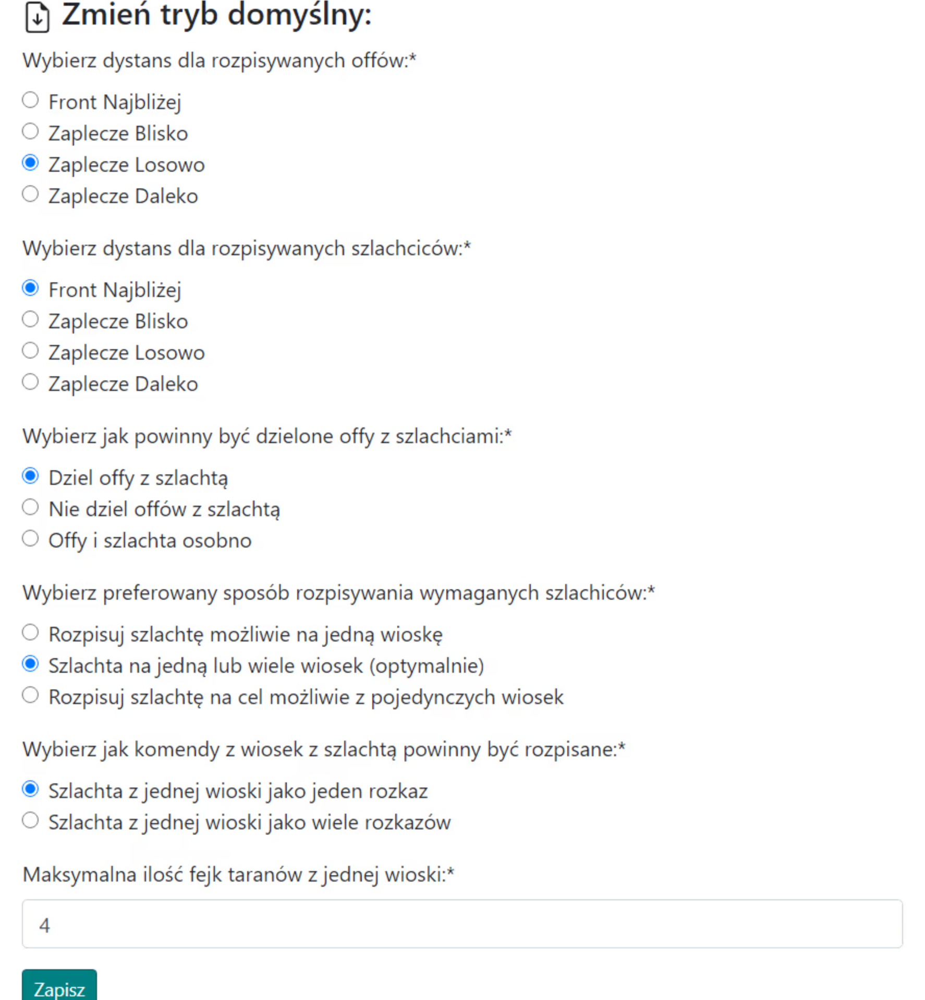

# Nagy tervek - Útmutató

Megjegyzés, az alább bemutatott nagy akciók ötlete nem kötelező, bármilyen módon meg lehet csinálni.

Ebben az útmutatóban megnézzük, hogyan lehet a leghatékonyabban és legeredményesebben megtervezni egy nagy akciót, végső soron a világ késői szakaszában, több/sokkal több mint 100 célpontra, ahol a klánban már csak a teljes támadóseregeket veszik figyelembe az akció során. Megjegyzés, feltételezzük, hogy már minden tudással rendelkezik az [Első lépések a Tervezővel](./../first_steps/index.md) című részből! és ajánlott először elolvasni a két rövid korábbi útmutatót ebben a szakaszban, nevezetesen [Hogyan adjuk meg és mentsük el az akció célpontjait](./write_outline_targets.md) és [A klán két régiója: Mi a front és a hátország](./two_regions_of_the_tribe.md).

!!! hint

    Mindig kezdje bármely akció tervezését ezen az oldalon az összes támadósereg megszámolásával és a Front és Hátország szerinti felosztásával az adott terv szellemében. Ehhez használja az 1. Elérhető egységek fület, és az eredmények a célpontok alatti táblázatban jelennek meg.

Az akciót automatikus tervezéssel fogjuk megtervezni a célpontok száma miatt, és minden rendelkezésre álló haladó opciót használni fogunk. Nem fogunk kézi célpontszerkesztési opciókat használni; az egész akció A-tól Z-ig az első fülön jön létre, majd csak a belépési időket kell beállítani és elküldeni a kész célpontokat.

Egy nagy akcióhoz a kitöltött fül a következőképpen nézhet ki:

{ width="600" }

Állítsa be a minimális számot a támadóseregben egy teljes seregre, körülbelül 19 ezerre vagy valamivel kevesebbre, ha a tervezett küldések néhány nap múlva esedékesek, és a seregeknek lesz idejük teljesen kifejlődni addigra (csak az e feletti seregek jelennek meg a táblázatban), a frontvonaltól való távolságot körülbelül 10-45-re, attól függően, hogy néz ki a front. Ha az ellenfélnek inaktív játékosai vannak a klán területén, zárja ki őket a Nem számít bele a front támadóseregek számításába mezőbe illesztve. Kattintson a Mentés és frissítés gombra. A támadóseregeink számát tartalmazó táblázat kitöltésre kerül.

A kitöltött táblázatnak valahogy így kell kinéznie:

{ width="600" }

Megjegyzés, a táblázat két alsó sora csak akkor jelenik meg, ha kitöltjük a célpontokat, mivel az ott megadott mennyiségek attól függnek, hogy milyen célpontokat mentünk el (a támadóseregek és a nemesek körülöttük kerülnek megszámolásra). Ezért az elején nullák lesznek ott. A rendelkezésre álló támadóseregek és nemesek számától függően folytathatja a célpontok megadását. Ezután újraszámolhatja az Elérhető egységeket.

Példa a megadott célpontokra:

{ width="600" }

Ha néhány célpontnak a alapértelmezettektől eltérő beállításokra van szüksége, használja a támadóseregek és a nemesek kiterjesztett kódolását, amelyet a Hogyan adjuk meg és mentsük el az akció célpontjait című cikkben ismertetünk. Ezután lépjen a 3. Terv paraméterei fülre a terv beállításainak megadásához, a nehézségek esetén az összes opció részletes leírása a neki szentelt témában található, azaz a 3. Terv paraméterei.

Példa beállítások egy nagy akcióhoz:

{ width="600" }

Ezenkívül beállíthatja a morált a [4. fülön](./../advanced/4_morale.md).

Az utolsó dolog, amit figyelembe kell vennie, az [5. fül: Éjszakai bónusz küldések elkerülése](./../advanced/5_avoid_night_bonus.md), valószínűleg előnyös lesz, legalábbis a játékosok és az egészségük szempontjából, a csökkentett számú vagy az éjszaka közepén történő küldések kiküszöbölése miatt :)

Miután megadta az összes célpontot, megváltoztatta az akció beállításait, és esetleg az éjszakai bónuszt, folytassa a terv következő részével a Terv megtervezése gombra kattintva, majd ellenőrizze, hogy minden rendben van-e, és szükség esetén térjen vissza a Vissza gombbal, változtassa meg a beállításokat. Ezután, mint általában, lépjen az Idők fülre, állítsa be a belépési időket, fejezze be a tervet, és küldje el a célpontokat a játékosoknak.
