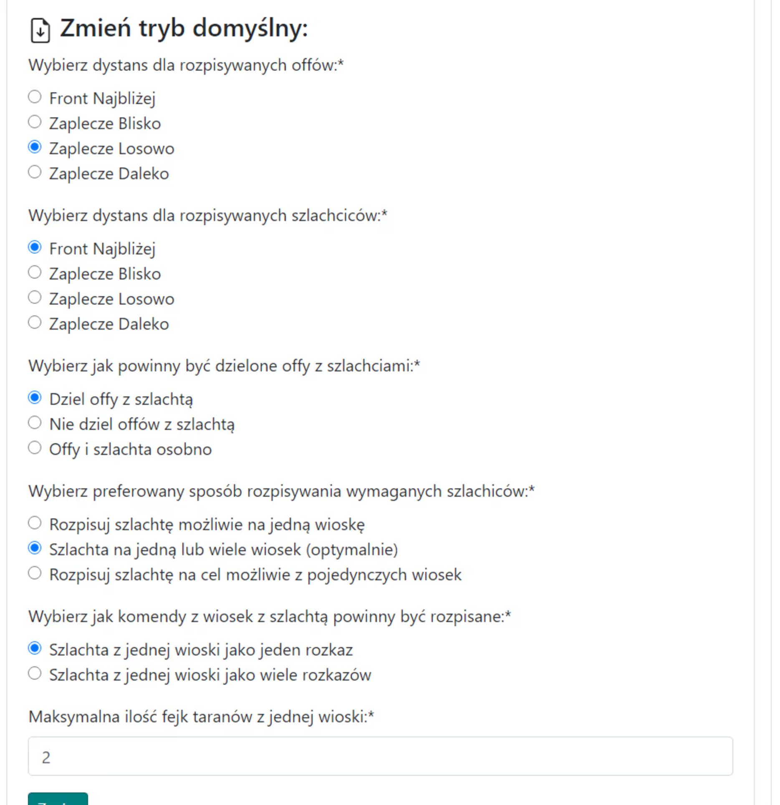

# Közepes tervek - Útmutató

Megjegyzés, az alább bemutatott közepes akciók ötlete nem kötelező, bármilyen módon meg lehet csinálni, akár kis vagy nagy akcióként kezelve őket.

Ebben az útmutatóban megnézzük, hogyan lehet a leghatékonyabban és legeredményesebben megtervezni egy közepes akciót, végső soron a világ egy kicsit későbbi szakaszában, kevesebb mint 100 célpontra, ahol a klánnak már többnyire teljes támadóseregei vagy valamivel kisebbek vannak az akció során. Megjegyzés, feltételezzük, hogy már minden tudással rendelkezik az [Első lépések a Tervezővel](./../first_steps/index.md) című részből! és ajánlott először elolvasni a két rövid korábbi útmutatót ebben a szakaszban, nevezetesen [Hogyan adjuk meg és mentsük el az akció célpontjait](./write_outline_targets.md) és [A klán két régiója: Mi a front és a hátország](./two_regions_of_the_tribe.md).

!!! hint

    Mindig kezdje bármely akció tervezését ezen az oldalon az összes támadósereg megszámolásával és a Front és Hátország szerinti felosztásával az adott terv szellemében. Ehhez használja az 1. Elérhető egységek fület, és az eredmények a célpontok alatti táblázatban jelennek meg.

Az akciót automatikus tervezéssel fogjuk megtervezni a célpontok száma miatt, és minden rendelkezésre álló haladó opciót használni fogunk. Szükség esetén megváltoztathatja a beállításokat egyenként minden célpontra a 4. fülön a tervezési mód megváltoztatásával, vagy végül a terv létrehozása után, a kiválasztott célpontok kézi szerkesztésével, mint a kis akciók esetében.

Egy közepes akcióhoz a kitöltött fül a következőképpen nézhet ki:

{ width="600" }

Állítsa be a minimális számot a támadóseregben egy megfelelő összegre, valószínűleg több mint 10000-re (csak az e feletti támadóseregek jelennek meg a táblázatban), a frontvonaltól való távolságot körülbelül 5-25-re, ha az ellenfélnek inaktív játékosai vannak a klán területén, zárja ki őket a Nem számít bele a front támadóseregek számításába mezőbe illesztve. Kattintson a Mentés és frissítés gombra. A támadóseregeink számát tartalmazó táblázat kitöltésre kerül.

A kitöltött táblázatnak valahogy így kell kinéznie:

{ width="600" }

Megjegyzés, a táblázat két alsó sora csak akkor jelenik meg, ha kitöltjük a célpontokat, mivel az ott megadott mennyiségek attól függnek, hogy milyen célpontokat mentünk el (a támadóseregek és a nemesek körülöttük kerülnek megszámolásra). Ezért az elején nullák lesznek ott. A rendelkezésre álló támadóseregek és nemesek számától függően folytathatja a célpontok megadását. Ezután újraszámolhatja az Elérhető egységeket.

Példa a megadott célpontokra:

{ width="600" }

Szükség esetén használja a támadóseregek és a nemesek kiterjesztett kódolását, amelyet a Hogyan adjuk meg és mentsük el az akció célpontjait című cikkben ismertetünk. Ezután lépjen a [3. Terv paraméterei fülre](./../advanced/3_outline_parameters.md) a terv beállításainak megadásához, vagy használja a fent említett kiterjesztett szintaxist a célpontokhoz.

Példa beállítások egy közepes akcióhoz:

{ width="600" }

Opcionálisan hagyhatja az alapértelmezett Nemesek egy faluból több parancsként, ha azt szeretné, hogy a játékosok külön parancsokat kapjanak a nemesekre. Azonban érdemes megváltoztatni a Hamis támadások maximális számát egy faluból valamivel kevesebbre, mint az alapértelmezett 4, és beállítani a Támadóseregek felosztása nemesekkel opciót, amely jobban teljesít a kissé nagyobb akciókban.

Ezenkívül beállíthatja a morált a [4. fülön](./../advanced/4_morale.md).

Az utolsó dolog, amit figyelembe kell vennie, az [5. fül: Éjszakai bónusz küldések elkerülése](./../advanced/5_avoid_night_bonus.md), valószínűleg előnyös lesz, legalábbis a játékosok és az egészségük szempontjából, a csökkentett számú vagy az éjszaka közepén történő küldések kiküszöbölése miatt :)

Miután megadta az összes célpontot, megváltoztatta az akció beállításait, és esetleg az éjszakai bónuszt, folytassa a terv következő részével a Terv megtervezése gombra kattintva, majd ellenőrizze, hogy minden rendben van-e, és szükség esetén térjen vissza a Vissza gombbal, változtassa meg a beállításokat. Ezután, mint általában, lépjen az Idők fülre, állítsa be a belépési időket, fejezze be a tervet, és küldje el a célpontokat a játékosoknak.
