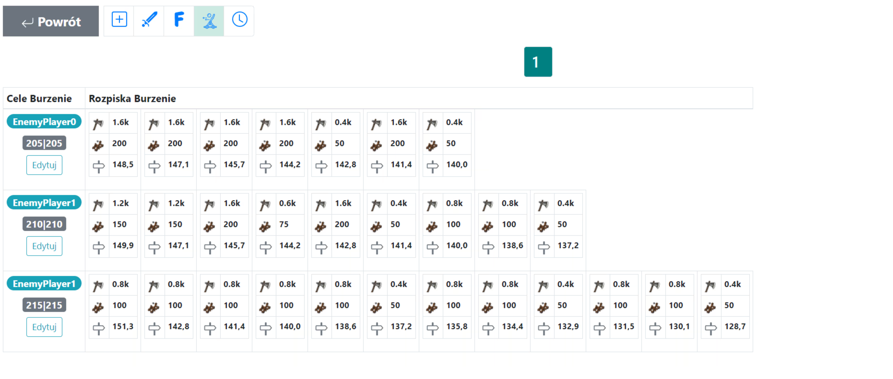

# Rombolási tervek - Útmutató

Ebben az útmutatóban megtanulhatja, hogyan tervezzen rombolási akciókat, kifejezetten a világ későbbi szakaszaira. Megjegyzés: Ez feltételezi a [Kezdő lépések a Tervezővel](./../first_steps/index.md) teljes ismeretét! Ajánlott továbbá először elolvasni a két rövid korábbi útmutatót ebben a szakaszban, nevezetesen [Hogyan adjuk meg és mentsük el az akció céljait](./two_regions_of_the_tribe.md) és [A klán két régiója, azaz mi a front és a hátország](./two_regions_of_the_tribe.md).

!!! hint

    Mindig kezdje bármely akció tervezését ezen az oldalon az összes csapat megszámolásával és a Front és Hátország csapatokra való felosztásával az adott terv jellegének megfelelően. Ehhez használja az 1. Elérhető egységek fület, és az eredmények a célok alatti táblázatban jelennek meg.

Az akció teljes egészében a **Ostromgépek** mezőben jön létre a Célok mellett. A {==6. Ostromgépek==} fül beállításai nagyon egyszerűek, ahol elsősorban a lerombolandó épületek sorrendjét és a rombolási támadásokban részt vevő katapultok maximális számát határozzuk meg (a minimum 50).

Példa a rombolási célokra és a táblázat eredményeire, 3 támadó egységgel és \*50 ostromgéppel:

{ width="600" }

Példa a rombolási akció beállításaira, 3 látható épületet célozva ebben a sorrendben:

{ width="600" }

(Megjegyzés: 50 ostromgép nem feltétlenül jelenti azt, hogy pontosan ennyi lesz beütemezve!)

Az elérhető ostromgépek számát a {==1. Elérhető egységek==} fül és egyszerű matematika segítségével becsülheti meg. Minden frissítés után a táblázatban megtalálhatja a tervezésre kész katapultok teljes számát a **Minden elérhető katapult száma** alatt. Csak el kell döntenie, hogy hány célpontra lesznek elegendőek.

Példa egy megtervezett mini-akcióra, különböző számú katapulttal 200-tól 50-ig:

{ width="600" }

## Optimális katapultválasztás romboláshoz

Nézzük meg, hogyan viselkedik a Tervező MAX 200 katapult esetén. Ha vannak falvak ennyi katapulttal, azok elsőbbséget élveznek (több mint 100 katapult), és ha elfogynak, a többit kisebb mennyiségekkel – 150, 100, 75, 50 – töltik fel. Továbbá, ha például egy épületből 10 szint marad több támadás után, a Tervező az utolsó támadást 50 katapulttal rendeli hozzá a nagyobb mennyiség helyett (még ha rendelkezésre is áll), hogy katapultokat takarítson meg.

## Támadó egységek az ostromgépek előtt

Ami a támadó egységeket illeti, amelyek számát meg lehet adni, hogy a rombolási támadások előtt érkezzenek, szerepük a szabványos támadó egységekére korlátozódik. Nem részei annak az algoritmusnak, amely egy adott számú katapultot és egy lerombolandó épületet rendel hozzájuk – bár elméletileg ugyanaz a falu küldhet támadó egységeket az ostrom előtt és ostromgépeket a tervezett támadásokban. Ezek külön folyamatok, és a jelenlegi verzióban nem lehetséges, hogy a támadó egységek az ostromgépek egyikeként "viselkedjenek".

## Épületrombolási sorrend

A {==6. Rombolás==} beállításokban megváltoztathatjuk a lerombolandó épületek sorrendjét. Fontos megjegyezni, hogy a listán nem szereplő épületek kimaradnak, és az algoritmus két esetben áll le – vagy nincs több tervezhető katapult, vagy az összes felsorolt épület már megsemmisült. Ez azt jelenti, hogy még ha úgy is döntünk, hogy `000|000:0:1000`-et írunk, 1000 ostromgép valószínűleg nem lesz beütemezve – amint a felsorolt épületek megsemmisülnek, a Tervező a következő lépésekre lép (pl. a következő cél, stb.).

## 10 000 elérhető katapultot látok. Ez hány célpontot jelent?

A válasz: attól függ. Főleg a választott épületsorrendtől. Tegyük fel, hogy csak egy épület van kiválasztva, **[ Kovácsműhely ]**. Ebben az esetben 200-250 katapult (pl. 200 és 50 vagy 100, 100, vagy 50, 50, 50, 50, stb.) elegendő egy falu lerombolásához, tehát 40-50 célpontot tervezhet. Ha két épület van kiválasztva, **[ Kovácsműhely, Tanya ]**, akkor 200-250 katapultra lesz szüksége a Kovácsműhelyhez, és 500-700 katapultra a Tanyához (pl. 14x 50, vagy 5x 100, 4x 150, 3x 200 katapult vagy sok más kombináció), ami 700-950 katapultot jelent falunként, vagy 10-14 célpontot. Az alábbiakban egy egyszerű táblázat található a 30 szintes épületekhez (mint a Tanyák, Raktárak, minden gazdasági épület) és a 20 szintes épületekhez (Főhadiszállás, Kovácsműhely), hogy segítsen kiszámítani, hány célpont lehetséges.

|                     | A teljes épületromboláshoz szükséges katapultok száma |
| ------------------- | ----------------------------------------------------- |
| 20 szintes épületek | 200-250                                               |
| 30 szintes épületek | 500-700                                               |

## Összefoglalás

Ne feledje, hogy a tervezés alapvetően egy egyszerű mohó algoritmuson alapul, így a Tervező **MINDIG** véletlenszerűen rendeli hozzá az ostromgépeket, hamis támadásokat vagy támadó egységeket, nagyon hasonló módon. Ha azt szeretné, hogy a támadó egységek vagy az ostromgépek megkülönböztethetetlenek legyenek a hamis támadásoktól, sok hamis támadást kell terveznie. Rombolás tervezésekor érdemes engedélyezni a **Hamis támadások minden faluból** opciót a {==3. fülön. Alapértelmezett akcióbeállítások==}, amely az alapértelmezett beállítással ellentétben minden hátsó faluból hozzárendel hamis támadásokat.

Összefoglalva, vegye figyelembe a katapultok számát (és hogy hány épületet érdemes lerombolni; talán csak a Tanya + főhadiszállás + Kovácsműhely?) és tervezzen sok hamis támadást. Jó rombolást!

---

Szóljon, ha bármilyen más részletre vagy változtatásra van szüksége!
