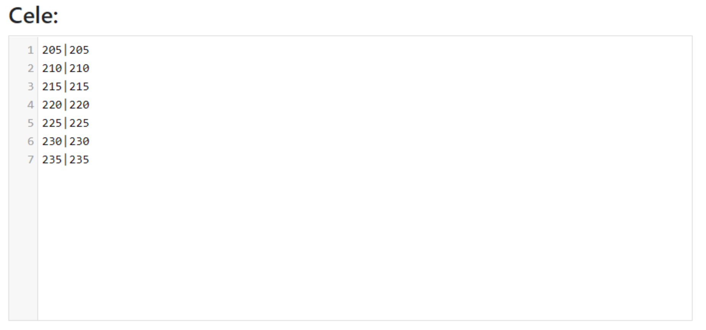

# Kis tervek - Útmutató

Megjegyzés, az alábbi kis akciók ötlete nem kötelező, bármilyen módon meg lehet csinálni, akár közepes akcióként kezelve őket.

Ebben az útmutatóban megnézzük, hogyan lehet a leghatékonyabban és legeredményesebben felvázolni egy kis akciót, ideális esetben a világ kezdeti szakaszában, kevesebb mint 25 célponttal (a gyakorlatban nincs korlát, de a bemutatott módszer egyre időigényesebb lesz a célpontok számának növekedésével). Megjegyzés, minden tudás feltételezett a [Kezdő lépések a Tervezővel](./../first_steps/index.md) című részből!

!!! hint

    Mindig kezdje bármely akció felvázolását ezen az oldalon az összes off megszámolásával és a Front és Hátország szerinti felosztásával az adott vázlat szellemében. Ehhez használja az 1. Elérhető egységek fület, és az eredmények a célpontok alatti táblázatban jelennek meg.

Az ötlet az, hogy manuálisan vázoljuk fel a parancsokat az összes célpontra, és ne használjuk az automatikus felvázolási lehetőséget. Ennek több oka is van: amikor a játékosoknak nincsenek teljes offjaik, sok nehézlovasságuk, és az ellenséghez való távolságok nem ésszerűek (az ellenséggel való keveredés nem ésszerű), az akciók automatikus felvázolása célt téveszt. Manuálisan pontosan és gyorsan meg lehet csinálni - de manuálisan a Tervező segítségével!, ami maximálisan felgyorsítja a vázlat létrehozását és a célpontok elosztását. Eredetileg kis akciókra hozták létre, amelyekben a legjobb. A nagyobb akciókhoz készült teljes fedőréteg egy későbbi kiegészítés.

Egy kis akcióhoz a kitöltött fül a következőképpen nézhet ki:

{ width="600" }

Állítsa be a minimális számot az offban egy megfelelő, **kis értékre, pl. 2000-re**, (csak az e feletti offok jelennek meg a táblázatban), a frontvonaltól való távolságot szintén kicsire, azaz **1-10 mezőre**. Kattintson a Mentés és frissítés gombra. Az offjaink számát tartalmazó táblázat kitöltésre kerül.
A kitöltött táblázatnak valahogy így kell kinéznie:

{ width="600" }

Megjegyzés, a táblázat két alsó sora csak akkor jelenik meg, ha kitöltjük a célpontokat, mivel az ott megadott mennyiségek attól függnek, hogy milyen célpontokat mentünk el (körülöttük számolják ezeket az offokat és nemeseket). Ezért az elején nullák lesznek ott. A rendelkezésre álló offok és nemesek számától függően folytathatja a célpontok megadását. Ezután újraszámolhatja az Elérhető egységeket.

{ width="600" }

A koordináták fenti megadása és mentése után minden sor hasonló lesz a 000|000:0:0-hoz.
Minden más haladó beállítást figyelmen kívül hagyunk, minden sorban 0 offot és 0 nemest hagyunk, és rákattintunk a Vázlat készítése gombra.

A következő fülre lépve észrevesszük, hogy minden célpont üres. Folytatjuk az összes célpont egymás utáni szerkesztését a Szerkesztés gombra kattintva, és a legközelebbi játékosoktól a kiválasztott sorrendben vázoljuk fel a parancsokat, a rendezési lehetőségek a alapértelmezett Növekvő távolság szerint, Legközelebbi teljes offok és Legközelebbi nemesek mellett hasznosak lesznek.

Fent látható, hogyan nézhet ki egy célpont a játék kezdeti szakaszában, 2 off az elején, majd 4 nemes. Ne feledje, hogy a csapatok hozzáadása után állapotuk minden célpontban frissül (más szóval, jól van programozva, nem fog több csapatot felvázolni, mint a játékosok maximális tulajdona). Az összes célpont felvázolása után folytassa az Idők fülre a már ismert módon a Teszt Világból, állítsa be a belépési időket, fejezze be a vázlatot, és küldje el a játékosoknak a célpontjaikat.
