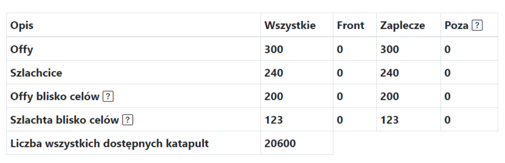
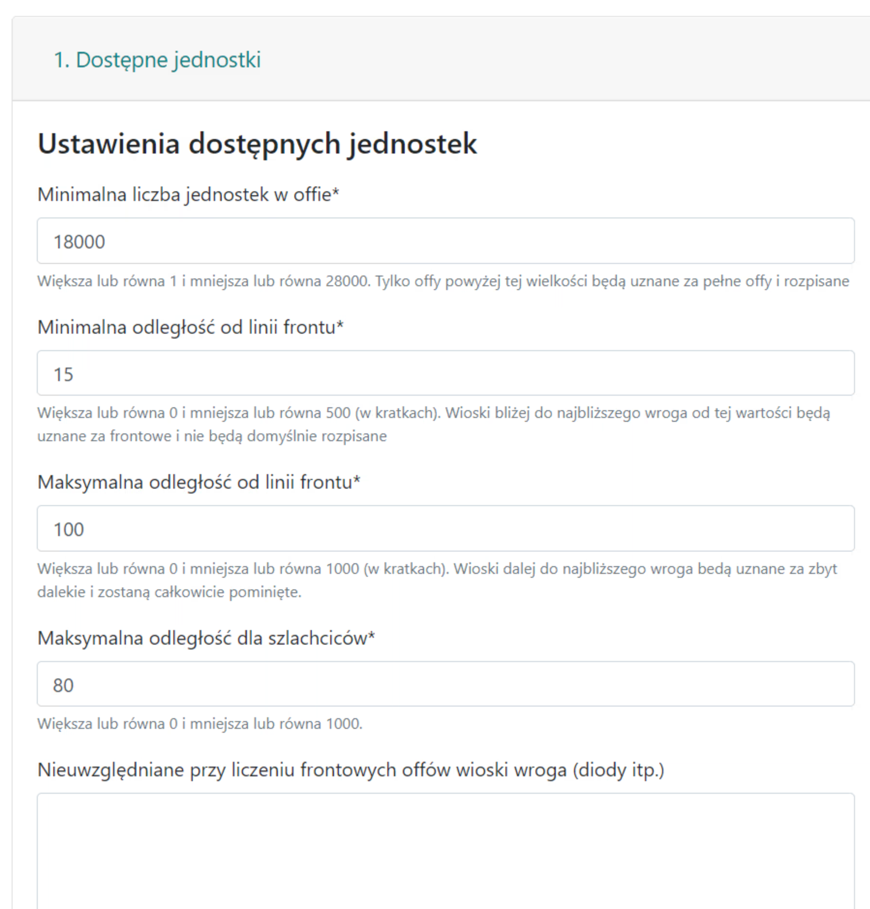
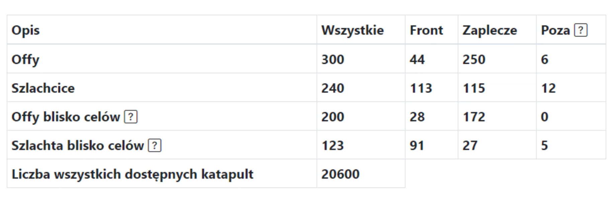

# A klán két régiója - front és hátország

!!! hint

    Mindig kezdje bármely akció leírását ezen az oldalon az összes off megszámolásával és a Front, Hátország és Túloldal szerinti felosztásával az adott lista szellemében. Ehhez használja az 1. Elérhető egységek fület, és az eredmények a célok alatti táblázatban jelennek meg.

## Intuíció

A válasz arra, hogy ne rendeljünk front offokat olyan frontemberekhez, akiknek meg kellene tartaniuk őket közeli befejezésekhez (vagy bármilyen más módon felhasználniuk őket) az akciótervezés során, az, hogy a falvainkat két fő csoportra osztjuk: Front, amely az ellenséghez közeli offokat és nemességet foglalja magában, és Hátország, amely az ellenségtől távoli offokat és nemességet foglalja magában. A 2.1.0 verziótól egy újabb régió, a Túloldal is hozzáadásra került, intuitívan jelezve a nagyon távoli falvakat (de több alkalmazási példa is van), megoldva a nagyon távoli offok problémáját, amelyek nem kívánatosak, de lehetővé téve az akciót például 20-80 mező távolságban lévő offokkal is. Hogy ez pontosan hogyan történik és hogyan lehet irányítani, azt hamarosan elmagyarázzuk.

A felosztással kapcsolatos teljes intuíció a következő képekben foglalható össze:

<figure markdown="span">
  
  <figcaption>1. példa. Felosztás frontra és hátországra, zöld a front és sárga a hátország</figcaption>
</figure>

<figure markdown="span">
  
  <figcaption>2. példa. Felosztás frontra és hátországra, piros az ellenség és körülötte a mi klánunk, zöld a front és sárga a hátország</figcaption>
</figure>

A mi klánjaink (kékkel) körülveszik az ellenséget (pirossal), a bal oldali kép az algoritmus alkalmazása ELŐTTI állapotot mutatja, a jobb oldali pedig az alkalmazása UTÁNI állapotot. Az összes falunkat "szektorokra" osztottuk az ellenségtől való távolság alapján: a piroshoz legközelebb - Front, egy kicsit távolabb, de nem túl messze - Hátország, és a nagyon távoli falvak kékek maradtak és a Túloldalt jelzik.

Hogy az offjaink és a nemességünk hogyan oszlanak meg, az az 1. Elérhető egységek fül beállításaitól függ, nézzünk meg néhány népszerű lehetőséget.

!!! info

    A célokhoz közeli offok és a célokhoz közeli nemesség ugyanúgy működik, mint az Offok és a Nemesség, azzal a különbséggel, hogy ahelyett, hogy "minden" ellenséget figyelembe vennének és ez alapján osztanák fel a régiókat, csak a Felhasználó által a Célokban megadott célokat veszik figyelembe. Ez egy sokkal pontosabb eredmény, mert ismert, hogy hány egységünk van a célok közelében (ez nagyban eltérhet attól, amink az egész klánban van).

## 1. példa

Példa eredmény min. 0 mező és max. 500 mező esetén - vagyis NEM akarunk "Frontokat" és "Túloldalt", minden hátország és minden leírható.

<figure markdown="span">
  { width="600" }
  <figcaption>0 mező front és max. 500 mező hátország</figcaption>
</figure>

<figure markdown="span">
  { width="600" }
  <figcaption>0 mező front és max. 500 mező hátország</figcaption>
</figure>

## 2. példa

Példa eredmény min. 15 mező és max. 100 mező esetén - vagyis azt akarjuk, hogy a 15 mezőnél közelebb lévő játékosok tartsák meg az offokat frontemberként, és nem akarjuk, hogy egyetlen off se legyen távolabb a céltól 100 mezőnél (vagyis tovább repülne, mint 2 nap stb.).

<figure markdown="span">
  { width="600" }
  <figcaption>15 mező front és max. 100 mező hátország</figcaption>
</figure>

<figure markdown="span">
  { width="600" }
  <figcaption>15 mező front és max. 100 mező hátország</figcaption>
</figure>

## 3. példa

Példa eredmény min. 60 mező és max. 120 mező esetén - amikor azt akarjuk, hogy a hátország 60 mezőnél távolabb legyen az ellenségtől és 120 mezőnél közelebb, pl. távoli akcióhoz vagy romboláshoz (és külön csinálunk egyet közelről).

<figure markdown="span">
  { width="600" }
  <figcaption>60 mező front és max. 120 mező hátország</figcaption>
</figure>

<figure markdown="span">
  { width="600" }
  <figcaption>60 mező front és max. 120 mező hátország</figcaption>
</figure>

Csak a kiválasztott minimális egységszámnál nagyobb offok jelennek meg. A jelenlegi verzióban az offokból származó ck-k is felismerésre és megkülönböztetésre kerülnek a védekező falvakból származó ck-któl és megszámolásra kerülnek. Az eredmény főként az Ellenséges klánoktól függ, amelyeket a lista létrehozásakor a legelején választottak ki. Az algoritmus nagyon egyszerű, minden ellenséges falu körül egy régiót számolnak ki a frontvonaltól való távolságként megadott távolságban. Az összes ilyen régió összegét egy egészként véve, minden szövetséges falura meg tudjuk mondani, hogy közel van-e ezekhez az ellenséges falvakhoz (akkor front), vagy sem (akkor hátország). Ezért a Nem számít bele a front offok számításába mezőbe illesszük be az összes ellenséges diódát, hogy ne zavarjuk meg az eredményt.

A két alsó sor figyelembe veszi a nemességre megadott maximális távolságot is, ahol a jelzett mezőszámnál kevesebbről nem írnak le nemest. Ezenkívül megszámolják az offok és a nemesség számát a megadott célok KÖRÜL, tehát ha még nincsenek megadva célok, ott 0-t kapunk.

!!! hint

    Mindig érdemes kiválasztani az összes közeli ellenséges klánunkat a listához, nem csak azt, amelyikre az akciót tervezzük. Ha a klánunknak két frontja van az A és B klánokkal, és az A-ra akarunk akciót tervezni, akkor is meg akarjuk tartani a B-nél lévő front offokat az ottani frontemberek használatára, ezért mindkét klánt hozzáadjuk az ellenséges klánokhoz (különben, ha csak az A klán van ott, kiderülhet, hogy a B-ről származó front offokat leírják az akcióhoz).
